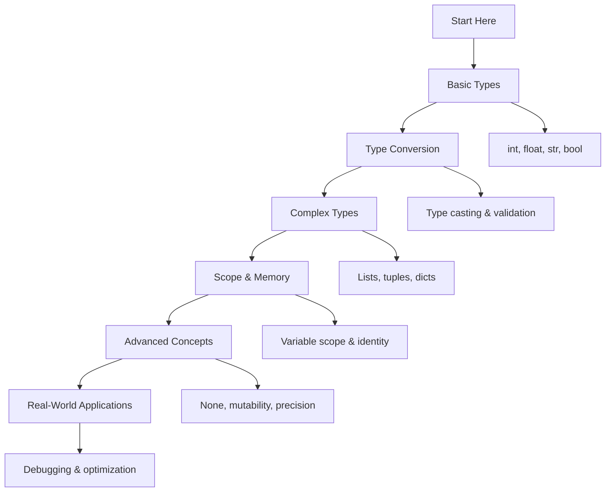

# 🐍 Variables and Data Types: Complete Learning Guide

> **Your journey to Python mastery starts here!** 🚀

---

## 🎯 **Learning Path Overview**



---

## 📊 **Skill Tree**

### 🌱 **Foundation Level**

- [ ] **Basic Data Types** ⭐
  - [ ] Integer operations and limits
  - [ ] Float precision and scientific notation
  - [ ] String manipulation and methods
  - [ ] Boolean logic and truthiness

### 🌿 **Intermediate Level**

- [ ] **Type Conversion & Validation** ⭐⭐
  - [ ] Safe type casting with error handling
  - [ ] Input validation and sanitization
  - [ ] Type checking with isinstance()
  - [ ] Custom type conversion functions

### 🌳 **Advanced Level**

- [ ] **Complex Types & Collections** ⭐⭐⭐
  - [ ] Lists vs tuples vs sets
  - [ ] Dictionary operations and methods
  - [ ] Nested data structures
  - [ ] Memory-efficient data containers

### 🏔️ **Expert Level**

- [ ] **Memory & Performance Optimization** ⭐⭐⭐⭐
  - [ ] Object identity and reference semantics
  - [ ] Memory optimization techniques
  - [ ] Performance profiling and analysis
  - [ ] Advanced debugging strategies

---

## 🗺️ **Learning Roadmap**

### **Week 1: Foundation** 🟢

| Day | Topic             | Time    | Resources                                                                                           |
| --- | ----------------- | ------- | --------------------------------------------------------------------------------------------------- |
| 1   | Basic Types       | 2 hours | [Python Docs](https://docs.python.org/3/tutorial/introduction.html)                                 |
| 2   | Type Conversion   | 2 hours | [Real Python](https://realpython.com/python-data-types/)                                            |
| 3   | String Operations | 2 hours | [String Methods](https://docs.python.org/3/library/stdtypes.html#string-methods)                    |
| 4   | Boolean Logic     | 1 hour  | [Boolean Operations](https://docs.python.org/3/library/stdtypes.html#boolean-operations-and-or-not) |
| 5   | Practice & Review | 2 hours | Questions 1-6                                                                                       |

### **Week 2: Intermediate** 🟡

| Day | Topic             | Time    | Resources                                                                                      |
| --- | ----------------- | ------- | ---------------------------------------------------------------------------------------------- |
| 6   | Complex Types     | 3 hours | [Data Structures](https://docs.python.org/3/tutorial/datastructures.html)                      |
| 7   | Variable Scope    | 2 hours | [Scope Rules](https://docs.python.org/3/tutorial/classes.html#python-scopes-and-namespaces)    |
| 8   | Type Checking     | 2 hours | [isinstance()](https://docs.python.org/3/library/functions.html#isinstance)                    |
| 9   | Memory Concepts   | 2 hours | [Object Identity](https://docs.python.org/3/reference/datamodel.html#objects-values-and-types) |
| 10  | Practice & Review | 2 hours | Questions 7-12                                                                                 |

### **Week 3: Advanced** 🟠

| Day | Topic                | Time    | Resources                                                                                           |
| --- | -------------------- | ------- | --------------------------------------------------------------------------------------------------- |
| 11  | Special Values       | 2 hours | [None, True, False](https://docs.python.org/3/library/constants.html)                               |
| 12  | Mutability           | 3 hours | [Mutable vs Immutable](https://docs.python.org/3/reference/datamodel.html#objects-values-and-types) |
| 13  | Precision & Accuracy | 2 hours | [Decimal Module](https://docs.python.org/3/library/decimal.html)                                    |
| 14  | Data Validation      | 2 hours | [Input Validation](https://docs.python.org/3/library/functions.html#input)                          |
| 15  | Practice & Review    | 2 hours | Questions 13-17                                                                                     |

### **Week 4: Expert** 🔴

| Day | Topic                    | Time    | Resources                                                                                |
| --- | ------------------------ | ------- | ---------------------------------------------------------------------------------------- |
| 16  | Advanced Debugging       | 3 hours | [Debugging Guide](https://docs.python.org/3/library/pdb.html)                            |
| 17  | Performance Optimization | 2 hours | [Performance Tips](https://wiki.python.org/moin/PythonSpeed/PerformanceTips)             |
| 18  | Real-World Applications  | 3 hours | [Best Practices](https://docs.python.org/3/tutorial/controlflow.html#defining-functions) |
| 19  | Final Review             | 2 hours | All Questions                                                                            |
| 20  | Assessment               | 1 hour  | Interview Questions                                                                      |

---

## 🎯 **How to Use This Folder**

### 📋 **Daily Study Routine**

1. **📖 Read the theory** (30 minutes)
2. **✏️ Solve questions** (1-2 hours)
3. **🔍 Review mistakes** (30 minutes)
4. **📝 Take notes** (15 minutes)
5. **🔄 Practice concepts** (30 minutes)

### 🎯 **Question Strategy**

- **Start with Basic Level** (Questions 1-6)
- **Move to Intermediate** when comfortable
- **Challenge yourself** with Advanced concepts
- **Master Expert level** for real-world scenarios

### 📊 **Progress Tracking**

```bash
# Mark your progress
✅ Completed
🔄 In Progress
⏳ Not Started
❌ Need Help
```

---

## 🚨 **Common Pitfalls to Avoid**

### ❌ **Beginner Mistakes**

- Using `=` instead of `==` for comparison
- Forgetting that strings are immutable
- Not handling type conversion errors
- Using reserved keywords as variable names

### ⚠️ **Intermediate Pitfalls**

- Confusing `is` and `==` operators
- Modifying lists during iteration
- Using mutable default arguments
- Ignoring variable scope rules

### 🔥 **Advanced Gotchas**

- Floating point precision issues
- Object identity vs value equality
- Memory leaks with circular references
- Performance issues with large data structures

---

## 🛠️ **Essential Tools & Resources**

### 📚 **Official Documentation**

- [Python Official Tutorial](https://docs.python.org/3/tutorial/introduction.html) 📖
- [Built-in Types](https://docs.python.org/3/library/stdtypes.html) 🔧
- [Data Model](https://docs.python.org/3/reference/datamodel.html) 🏗️

### 🎓 **Learning Resources**

- [Real Python: Data Types](https://realpython.com/python-data-types/) 🐍
- [Python Tutor Visualizer](https://pythontutor.com/) 👁️
- [PEP8 Style Guide](https://peps.python.org/pep-0008/) 📝

### 🧪 **Practice Platforms**

- [LeetCode Python](https://leetcode.com/) 💻
- [HackerRank Python](https://www.hackerrank.com/) 🏆
- [Codewars Python](https://www.codewars.com/) ⚔️

### 🔍 **Debugging Tools**

- [Python Debugger (pdb)](https://docs.python.org/3/library/pdb.html) 🐛
- [IPython](https://ipython.org/) 🐍
- [VS Code Python Extension](https://marketplace.visualstudio.com/items?itemName=ms-python.python) 💻

---

## 📈 **Assessment & Evaluation**

### 🎯 **Self-Assessment Questions**

After completing each level, ask yourself:

**Basic Level:**

- [ ] Can I explain the difference between int, float, str, and bool?
- [ ] Do I understand type conversion and when to use it?
- [ ] Can I work with strings and their methods?
- [ ] Do I understand boolean logic and truthiness?

**Intermediate Level:**

- [ ] Do I understand variable scope and the LEGB rule?
- [ ] Can I safely validate and convert user input?
- [ ] Do I know when to use lists vs tuples vs dictionaries?
- [ ] Can I use type checking effectively?

**Advanced Level:**

- [ ] Can I explain object identity vs value equality?
- [ ] Do I understand mutability and its implications?
- [ ] Can I handle precision issues in financial calculations?
- [ ] Do I understand memory management concepts?

**Expert Level:**

- [ ] Can I debug complex type-related issues?
- [ ] Do I understand memory management and optimization?
- [ ] Can I apply these concepts in real-world scenarios?
- [ ] Can I optimize data structures for performance?

---

## 🚀 **Modern Python Features (2025)**

### ✨ **Type Hints and Annotations**

```python
from typing import List, Dict, Optional, Union, TypeVar

# Modern type annotations
def process_user_data(
    user_id: int,
    name: str,
    scores: List[float],
    metadata: Optional[Dict[str, any]] = None
) -> Dict[str, Union[str, float]]:
    """Process user data with type hints."""
    result = {
        "user_id": str(user_id),
        "name": name,
        "average_score": sum(scores) / len(scores) if scores else 0.0
    }
    if metadata:
        result.update(metadata)
    return result
```

### 🎯 **Pattern Matching (Python 3.10+)**

```python
def analyze_data_type(data):
    """Analyze data type using pattern matching."""
    match data:
        case int() as num if num > 0:
            return f"Positive integer: {num}"
        case float() as num if num < 0:
            return f"Negative float: {num}"
        case str() as text if len(text) > 10:
            return f"Long string: {text[:10]}..."
        case list() as items if len(items) > 0:
            return f"Non-empty list with {len(items)} items"
        case _:
            return f"Other type: {type(data).__name__}"
```

### 🔍 **Enhanced Data Validation**

```python
from dataclasses import dataclass, field
from typing import List

@dataclass
class UserProfile:
    """Modern user profile with validation."""
    name: str
    age: int
    email: str
    tags: List[str] = field(default_factory=list)

    def __post_init__(self):
        """Validate data after initialization."""
        if not self.name.strip():
            raise ValueError("Name cannot be empty")
        if not (0 <= self.age <= 150):
            raise ValueError("Age must be between 0 and 150")
        if '@' not in self.email:
            raise ValueError("Invalid email format")
```

---

## 📊 **Success Metrics**

### 🎯 **Completion Criteria**

- [ ] **Basic Level**: Complete all questions 1-6
- [ ] **Intermediate Level**: Complete all questions 7-12
- [ ] **Advanced Level**: Complete all questions 13-17
- [ ] **Expert Level**: Complete all questions 18-20
- [ ] **Additional Practice**: Complete all questions 21-30

### 📈 **Performance Benchmarks**

- **Type Conversion**: < 1ms for 1000 conversions
- **String Operations**: < 10ms for 10,000 operations
- **Data Structure Creation**: < 5ms for complex structures
- **Memory Usage**: < 100MB for large datasets

### 🏆 **Mastery Indicators**

- Can explain data types and their characteristics
- Understands type conversion and validation
- Can work with complex data structures
- Implements memory-efficient solutions
- Handles real-world data processing challenges

---

## 🔗 **Related Topics**

- **Control Flow**: Type-based decision making
- **Functions**: Type parameters and return types
- **Data Structures**: Advanced collections and containers
- **String Manipulation**: Text processing and formatting
- **File Handling**: Data serialization and persistence
- **Error Handling**: Type-related exceptions
- **OOP**: Class attributes and type systems
- **Modules**: Type-safe module design
- **List Comprehensions**: Type transformations
- **Decorators**: Type-aware decorators
- **Generators**: Type-safe generators

---

## 🎉 **Congratulations!**

You've completed the Variables and Data Types learning path! You now have:

- ✅ **Solid foundation** in Python data types
- ✅ **Advanced skills** in type conversion and validation
- ✅ **Expert knowledge** in memory management
- ✅ **Real-world experience** with data processing

**Next Steps:**

- Practice with real-world projects
- Explore related topics (Control Flow, Functions)
- Build data processing applications
- Contribute to open-source projects

---

> **💡 Pro Tip:** Understanding data types is fundamental to Python programming. Master these concepts and you'll have a solid foundation for all other Python topics!

---

_Happy Learning! Remember, data types are the building blocks of Python programming! 🧱✨_
