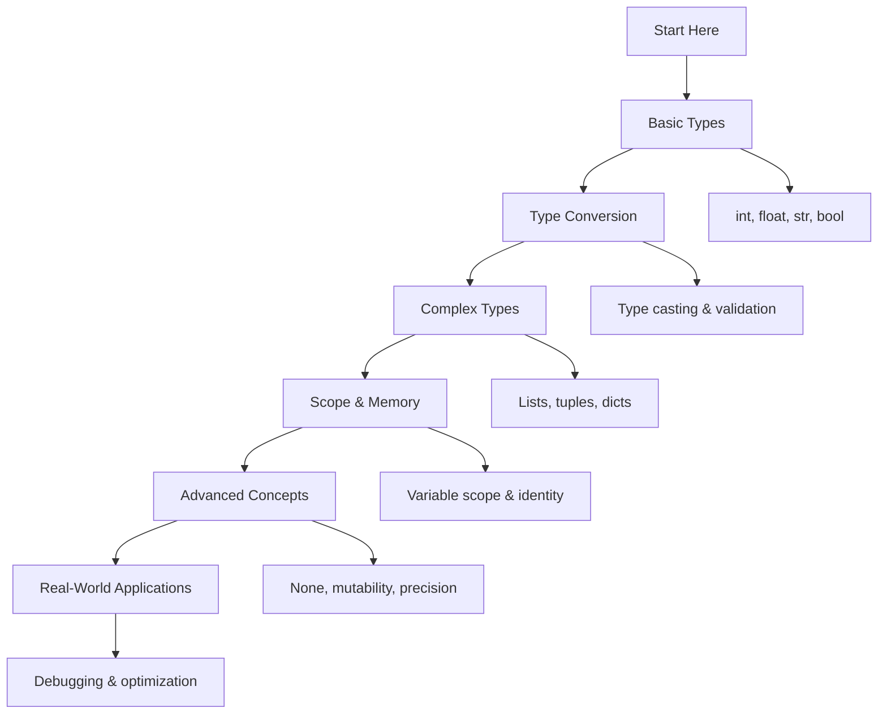

# 🐍 Variables and Data Types: Complete Learning Guide

> **Your journey to Python mastery starts here!** 🚀

---

## 🎯 **Learning Path Overview**



---

## 📊 **Skill Tree**

### 🌱 **Foundation Level**

- [ ] **Basic Data Types** ⭐
  - [ ] Integer operations
  - [ ] Float precision
  - [ ] String manipulation
  - [ ] Boolean logic

### 🌿 **Intermediate Level**

- [ ] **Type Conversion** ⭐⭐
  - [ ] Safe type casting
  - [ ] Input validation
  - [ ] Error handling
  - [ ] Type checking

### 🌳 **Advanced Level**

- [ ] **Complex Types** ⭐⭐⭐
  - [ ] Lists vs tuples
  - [ ] Dictionary operations
  - [ ] Set operations
  - [ ] Nested structures

### 🏔️ **Expert Level**

- [ ] **Memory & Performance** ⭐⭐⭐⭐
  - [ ] Object identity
  - [ ] Memory optimization
  - [ ] Reference semantics
  - [ ] Advanced debugging

---

## 🗺️ **Learning Roadmap**

### **Week 1: Foundation** 🟢

| Day | Topic             | Time    | Resources                                                                                           |
| --- | ----------------- | ------- | --------------------------------------------------------------------------------------------------- |
| 1   | Basic Types       | 2 hours | [Python Docs](https://docs.python.org/3/tutorial/introduction.html)                                 |
| 2   | Type Conversion   | 2 hours | [Real Python](https://realpython.com/python-data-types/)                                            |
| 3   | String Operations | 2 hours | [String Methods](https://docs.python.org/3/library/stdtypes.html#string-methods)                    |
| 4   | Boolean Logic     | 1 hour  | [Boolean Operations](https://docs.python.org/3/library/stdtypes.html#boolean-operations-and-or-not) |
| 5   | Practice & Review | 2 hours | Questions 1-6                                                                                       |

### **Week 2: Intermediate** 🟡

| Day | Topic             | Time    | Resources                                                                                      |
| --- | ----------------- | ------- | ---------------------------------------------------------------------------------------------- |
| 6   | Complex Types     | 3 hours | [Data Structures](https://docs.python.org/3/tutorial/datastructures.html)                      |
| 7   | Variable Scope    | 2 hours | [Scope Rules](https://docs.python.org/3/tutorial/classes.html#python-scopes-and-namespaces)    |
| 8   | Type Checking     | 2 hours | [isinstance()](https://docs.python.org/3/library/functions.html#isinstance)                    |
| 9   | Memory Concepts   | 2 hours | [Object Identity](https://docs.python.org/3/reference/datamodel.html#objects-values-and-types) |
| 10  | Practice & Review | 2 hours | Questions 7-12                                                                                 |

### **Week 3: Advanced** 🟠

| Day | Topic                | Time    | Resources                                                                                           |
| --- | -------------------- | ------- | --------------------------------------------------------------------------------------------------- |
| 11  | Special Values       | 2 hours | [None, True, False](https://docs.python.org/3/library/constants.html)                               |
| 12  | Mutability           | 3 hours | [Mutable vs Immutable](https://docs.python.org/3/reference/datamodel.html#objects-values-and-types) |
| 13  | Precision & Accuracy | 2 hours | [Decimal Module](https://docs.python.org/3/library/decimal.html)                                    |
| 14  | Data Validation      | 2 hours | [Input Validation](https://docs.python.org/3/library/functions.html#input)                          |
| 15  | Practice & Review    | 2 hours | Questions 13-17                                                                                     |

### **Week 4: Expert** 🔴

| Day | Topic                    | Time    | Resources                                                                                |
| --- | ------------------------ | ------- | ---------------------------------------------------------------------------------------- |
| 16  | Advanced Debugging       | 3 hours | [Debugging Guide](https://docs.python.org/3/library/pdb.html)                            |
| 17  | Performance Optimization | 2 hours | [Performance Tips](https://wiki.python.org/moin/PythonSpeed/PerformanceTips)             |
| 18  | Real-World Applications  | 3 hours | [Best Practices](https://docs.python.org/3/tutorial/controlflow.html#defining-functions) |
| 19  | Final Review             | 2 hours | All Questions                                                                            |
| 20  | Assessment               | 1 hour  | Interview Questions                                                                      |

---

## 🎯 **How to Use This Folder**

### 📋 **Daily Study Routine**

1. **📖 Read the theory** (30 minutes)
2. **✏️ Solve questions** (1-2 hours)
3. **🔍 Review mistakes** (30 minutes)
4. **📝 Take notes** (15 minutes)
5. **🔄 Practice concepts** (30 minutes)

### 🎯 **Question Strategy**

- **Start with Basic Level** (Questions 1-6)
- **Move to Intermediate** when comfortable
- **Challenge yourself** with Advanced concepts
- **Master Expert level** for real-world scenarios

### 📊 **Progress Tracking**

```bash
# Mark your progress
✅ Completed
🔄 In Progress
⏳ Not Started
❌ Need Help
```

---

## 🚨 **Common Pitfalls to Avoid**

### ❌ **Beginner Mistakes**

- Using `=` instead of `==` for comparison
- Forgetting that strings are immutable
- Not handling type conversion errors
- Using reserved keywords as variable names

### ⚠️ **Intermediate Pitfalls**

- Confusing `is` and `==` operators
- Modifying lists during iteration
- Using mutable default arguments
- Ignoring variable scope rules

### 🔥 **Advanced Gotchas**

- Floating point precision issues
- Object identity vs value equality
- Memory leaks with circular references
- Performance issues with large data structures

---

## 🛠️ **Essential Tools & Resources**

### 📚 **Official Documentation**

- [Python Official Tutorial](https://docs.python.org/3/tutorial/introduction.html) 📖
- [Built-in Types](https://docs.python.org/3/library/stdtypes.html) 🔧
- [Data Model](https://docs.python.org/3/reference/datamodel.html) 🏗️

### 🎓 **Learning Resources**

- [Real Python: Data Types](https://realpython.com/python-data-types/) 🐍
- [Python Tutor Visualizer](https://pythontutor.com/) 👁️
- [PEP8 Style Guide](https://peps.python.org/pep-0008/) 📝

### 🧪 **Practice Platforms**

- [LeetCode Python](https://leetcode.com/) 💻
- [HackerRank Python](https://www.hackerrank.com/) 🏆
- [Codewars Python](https://www.codewars.com/) ⚔️

### 🔍 **Debugging Tools**

- [Python Debugger (pdb)](https://docs.python.org/3/library/pdb.html) 🐛
- [IPython](https://ipython.org/) 🐍
- [VS Code Python Extension](https://marketplace.visualstudio.com/items?itemName=ms-python.python) 💻

---

## 📈 **Assessment & Evaluation**

### 🎯 **Self-Assessment Questions**

After completing each level, ask yourself:

**Basic Level:**

- [ ] Can I explain the difference between int, float, str, and bool?
- [ ] Do I understand type conversion and when to use it?
- [ ] Can I work with strings and their methods?

**Intermediate Level:**

- [ ] Do I understand variable scope and the LEGB rule?
- [ ] Can I safely validate and convert user input?
- [ ] Do I know when to use lists vs tuples vs dictionaries?

**Advanced Level:**

- [ ] Can I explain object identity vs value equality?
- [ ] Do I understand mutability and its implications?
- [ ] Can I handle precision issues in financial calculations?

**Expert Level:**

- [ ] Can I debug complex type-related issues?
- [ ] Do I understand memory management and optimization?
- [ ] Can I apply these concepts in real-world scenarios?

---

## 🏆 **Success Metrics**

### 📊 **Completion Criteria**

- ✅ **Basic Level:** Solve all questions 1-6 without help
- ✅ **Intermediate Level:** Complete questions 7-12 with minimal errors
- ✅ **Advanced Level:** Master questions 13-17 and explain concepts
- ✅ **Expert Level:** Ace questions 18-20 and interview questions

### 🎓 **Mastery Indicators**

- 🧠 **Deep Understanding:** Can explain concepts to others
- 💻 **Practical Skills:** Can solve real-world problems
- 🔍 **Debugging Ability:** Can identify and fix issues quickly
- ⚡ **Performance Awareness:** Understand optimization trade-offs

---

## 🚀 **Next Steps After Mastery**

### 📚 **Advanced Topics to Explore**

- **Type Hints & Static Typing** (mypy, type annotations)
- **Memory Profiling** (memory_profiler, tracemalloc)
- **Performance Optimization** (Cython, numba)
- **Advanced Data Structures** (collections module)

### 🎯 **Real-World Applications**

- **Data Science:** pandas, numpy data types
- **Web Development:** JSON serialization/deserialization
- **API Development:** Request/response data validation
- **Database Operations:** Type mapping and conversion

---

## 💡 **Pro Tips for Success**

### 🎯 **Study Strategies**

- **Practice Daily:** Consistency beats intensity
- **Explain Concepts:** Teaching others reinforces learning
- **Build Projects:** Apply concepts in real scenarios
- **Review Regularly:** Spaced repetition improves retention

### 🧠 **Learning Techniques**

- **Visual Learning:** Use diagrams and flowcharts
- **Hands-on Practice:** Code every concept you learn
- **Error Analysis:** Learn from mistakes and debug them
- **Concept Mapping:** Connect related ideas together

### 🚀 **Motivation Tips**

- **Set Clear Goals:** Know what you want to achieve
- **Track Progress:** Celebrate small wins
- **Join Communities:** Learn from others
- **Stay Curious:** Always ask "why" and "how"

---

> **🌟 Remember:** Python mastery is a journey, not a destination. Take your time, practice regularly, and enjoy the learning process!

---

## 📞 **Need Help?**

### 🤝 **Community Resources**

- [Python Discord](https://discord.gg/python) 💬
- [Stack Overflow Python](https://stackoverflow.com/questions/tagged/python) 🔍
- [Reddit r/learnpython](https://www.reddit.com/r/learnpython/) 📱

### 📧 **Study Groups**

- Form study groups with fellow learners
- Share solutions and discuss approaches
- Review each other's code
- Celebrate achievements together

---

**🎉 You're ready to begin your Python journey! Start with Question 1 and work your way through systematically. Good luck!**
