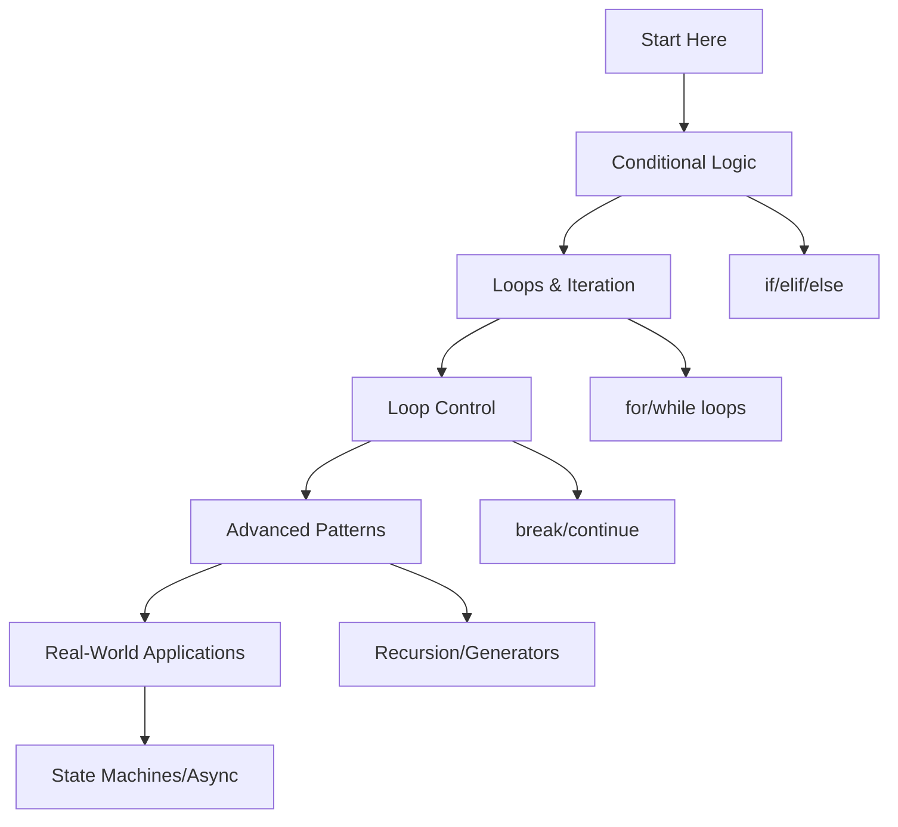

# 🐍 Control Flow: Complete Learning Guide

> **Master Python's decision-making and looping constructs!** 🔄

---

## 🎯 **Learning Path Overview**



---

## 📊 **Skill Tree**

### 🌱 **Foundation Level**

- [ ] **Conditional Logic** ⭐
  - [ ] if/elif/else statements
  - [ ] Logical operators (and, or, not)
  - [ ] Comparison operators
  - [ ] Boolean expressions

### 🌿 **Intermediate Level**

- [ ] **Loops & Iteration** ⭐⭐
  - [ ] for loops with range
  - [ ] while loops
  - [ ] Nested loops
  - [ ] Loop control (break/continue)

### 🌳 **Advanced Level**

- [ ] **Advanced Patterns** ⭐⭐⭐
  - [ ] List comprehensions
  - [ ] Generator functions
  - [ ] Recursion vs iteration
  - [ ] Error handling in loops

### 🏔️ **Expert Level**

- [ ] **Real-World Applications** ⭐⭐⭐⭐
  - [ ] State machines
  - [ ] Asynchronous control flow
  - [ ] Custom iterators
  - [ ] Performance optimization

---

## 🗺️ **Learning Roadmap**

### **Week 1: Foundation** 🟢

| Day | Topic             | Time    | Resources                                                                           |
| --- | ----------------- | ------- | ----------------------------------------------------------------------------------- |
| 1   | Conditional Logic | 2 hours | [Python Docs](https://docs.python.org/3/tutorial/controlflow.html)                  |
| 2   | Logical Operators | 2 hours | [Real Python](https://realpython.com/python-conditional-statements/)                |
| 3   | For Loops         | 2 hours | [Loop Tutorial](https://docs.python.org/3/tutorial/controlflow.html#for-statements) |
| 4   | While Loops       | 2 hours | [While Loops](https://docs.python.org/3/reference/compound_stmts.html#while)        |
| 5   | Practice & Review | 2 hours | Questions 1-6                                                                       |

### **Week 2: Intermediate** 🟡

| Day | Topic               | Time    | Resources                                                                                           |
| --- | ------------------- | ------- | --------------------------------------------------------------------------------------------------- |
| 6   | Nested Loops        | 3 hours | [Nested Loops](https://docs.python.org/3/tutorial/controlflow.html#nested-loops)                    |
| 7   | Loop Control        | 2 hours | [Break/Continue](https://docs.python.org/3/tutorial/controlflow.html#break-and-continue-statements) |
| 8   | List Comprehensions | 2 hours | [List Comprehensions](https://docs.python.org/3/tutorial/datastructures.html#list-comprehensions)   |
| 9   | Error Handling      | 2 hours | [Exception Handling](https://docs.python.org/3/tutorial/errors.html)                                |
| 10  | Practice & Review   | 2 hours | Questions 7-12                                                                                      |

### **Week 3: Advanced** 🟠

| Day | Topic                    | Time    | Resources                                                                           |
| --- | ------------------------ | ------- | ----------------------------------------------------------------------------------- |
| 11  | Generator Functions      | 3 hours | [Generators](https://docs.python.org/3/tutorial/classes.html#generators)            |
| 12  | Recursion                | 2 hours | [Recursion](https://docs.python.org/3/tutorial/controlflow.html#defining-functions) |
| 13  | Performance Optimization | 2 hours | [Performance Tips](https://wiki.python.org/moin/PythonSpeed/PerformanceTips)        |
| 14  | State Machines           | 2 hours | [State Patterns](https://en.wikipedia.org/wiki/State_pattern)                       |
| 15  | Practice & Review        | 2 hours | Questions 13-17                                                                     |

### **Week 4: Expert** 🔴

| Day | Topic                   | Time    | Resources                                                                                |
| --- | ----------------------- | ------- | ---------------------------------------------------------------------------------------- |
| 16  | Custom Iterators        | 3 hours | [Iterator Protocol](https://docs.python.org/3/reference/datamodel.html#object.__iter__)  |
| 17  | Asynchronous Control    | 2 hours | [Async/Await](https://docs.python.org/3/library/asyncio.html)                            |
| 18  | Real-World Applications | 3 hours | [Best Practices](https://docs.python.org/3/tutorial/controlflow.html#defining-functions) |
| 19  | Final Review            | 2 hours | All Questions                                                                            |
| 20  | Assessment              | 1 hour  | Interview Questions                                                                      |

---

## 🎯 **How to Use This Folder**

### 📋 **Daily Study Routine**

1. **📖 Read the theory** (30 minutes)
2. **✏️ Solve questions** (1-2 hours)
3. **🔍 Review mistakes** (30 minutes)
4. **📝 Take notes** (15 minutes)
5. **🔄 Practice concepts** (30 minutes)

### 🎯 **Question Strategy**

- **Start with Basic Level** (Questions 1-6)
- **Move to Intermediate** when comfortable
- **Challenge yourself** with Advanced concepts
- **Master Expert level** for real-world scenarios

### 📊 **Progress Tracking**

```bash
# Mark your progress
✅ Completed
🔄 In Progress
⏳ Not Started
❌ Need Help
```

---

## 🚨 **Common Pitfalls to Avoid**

### ❌ **Beginner Mistakes**

- Forgetting colons after conditional statements
- Using `=` instead of `==` for comparison
- Creating infinite loops without exit conditions
- Not understanding loop variable scope

### ⚠️ **Intermediate Pitfalls**

- Using nested loops when unnecessary
- Forgetting to update loop conditions
- Ignoring loop performance implications
- Not handling exceptions in loops

### 🔥 **Advanced Gotchas**

- Recursion without base cases
- Generator memory leaks
- Async/await misuse
- State machine deadlocks

---

## 🛠️ **Essential Tools & Resources**

### 📚 **Official Documentation**

- [Python Control Flow](https://docs.python.org/3/tutorial/controlflow.html) 📖
- [Compound Statements](https://docs.python.org/3/reference/compound_stmts.html) 🔧
- [Iterator Protocol](https://docs.python.org/3/reference/datamodel.html#object.__iter__) 🏗️

### 🎓 **Learning Resources**

- [Real Python: Control Flow](https://realpython.com/python-conditional-statements/) 🐍
- [Python Loops Tutorial](https://realpython.com/python-for-loop/) 🔄
- [PEP 8: Style Guide](https://peps.python.org/pep-0008/) 📝

### 🧪 **Practice Platforms**

- [LeetCode Python](https://leetcode.com/) 💻
- [HackerRank Python](https://www.hackerrank.com/) 🏆
- [Codewars Python](https://www.codewars.com/) ⚔️

### 🔍 **Debugging Tools**

- [Python Debugger (pdb)](https://docs.python.org/3/library/pdb.html) 🐛
- [IPython](https://ipython.org/) 🐍
- [VS Code Python Extension](https://marketplace.visualstudio.com/items?itemName=ms-python.python) 💻

---

## 📈 **Assessment & Evaluation**

### 🎯 **Self-Assessment Questions**

After completing each level, ask yourself:

**Basic Level:**

- [ ] Can I write clear if/elif/else statements?
- [ ] Do I understand logical operators and precedence?
- [ ] Can I use for and while loops effectively?

**Intermediate Level:**

- [ ] Do I understand nested loops and their performance?
- [ ] Can I use break and continue appropriately?
- [ ] Do I know when to use list comprehensions?

**Advanced Level:**

- [ ] Can I implement recursive and iterative solutions?
- [ ] Do I understand generator functions and their benefits?
- [ ] Can I optimize loop performance?

**Expert Level:**

- [ ] Can I design and implement state machines?
- [ ] Do I understand async/await control flow?
- [ ] Can I create custom iterators?

---

## 🏆 **Success Metrics**

### 📊 **Completion Criteria**

- ✅ **Basic Level:** Solve all questions 1-6 without help
- ✅ **Intermediate Level:** Complete questions 7-12 with minimal errors
- ✅ **Advanced Level:** Master questions 13-17 and explain concepts
- ✅ **Expert Level:** Ace questions 18-20 and interview questions

### 🎓 **Mastery Indicators**

- 🧠 **Deep Understanding:** Can explain concepts to others
- 💻 **Practical Skills:** Can solve real-world problems
- 🔍 **Debugging Ability:** Can identify and fix control flow issues
- ⚡ **Performance Awareness:** Understand optimization trade-offs

---

## 🚀 **Next Steps After Mastery**

### 📚 **Advanced Topics to Explore**

- **Design Patterns** (Strategy, Observer, Command)
- **Functional Programming** (map, filter, reduce)
- **Concurrency** (threading, multiprocessing)
- **Event-Driven Programming** (callbacks, event loops)

### 🎯 **Real-World Applications**

- **Web Development:** Request routing and middleware
- **Data Processing:** ETL pipelines and data transformation
- **Game Development:** Game loops and state management
- **Automation:** Workflow automation and task scheduling

---

## 💡 **Pro Tips for Success**

### 🎯 **Study Strategies**

- **Practice Daily:** Consistency beats intensity
- **Explain Concepts:** Teaching others reinforces learning
- **Build Projects:** Apply concepts in real scenarios
- **Review Regularly:** Spaced repetition improves retention

### 🧠 **Learning Techniques**

- **Visual Learning:** Use flowcharts and diagrams
- **Hands-on Practice:** Code every concept you learn
- **Error Analysis:** Learn from mistakes and debug them
- **Concept Mapping:** Connect related ideas together

### 🚀 **Motivation Tips**

- **Set Clear Goals:** Know what you want to achieve
- **Track Progress:** Celebrate small wins
- **Join Communities:** Learn from others
- **Stay Curious:** Always ask "why" and "how"

---

> **🌟 Remember:** Control flow is the foundation of all programming. Master these concepts and you'll have the tools to solve any programming problem!

---

## 📞 **Need Help?**

### 🤝 **Community Resources**

- [Python Discord](https://discord.gg/python) 💬
- [Stack Overflow Python](https://stackoverflow.com/questions/tagged/python) 🔍
- [Reddit r/learnpython](https://www.reddit.com/r/learnpython/) 📱

### 📧 **Study Groups**

- Form study groups with fellow learners
- Share solutions and discuss approaches
- Review each other's code
- Celebrate achievements together

---

**🎉 You're ready to master Python control flow! Start with Question 1 and work your way through systematically. Good luck!**
