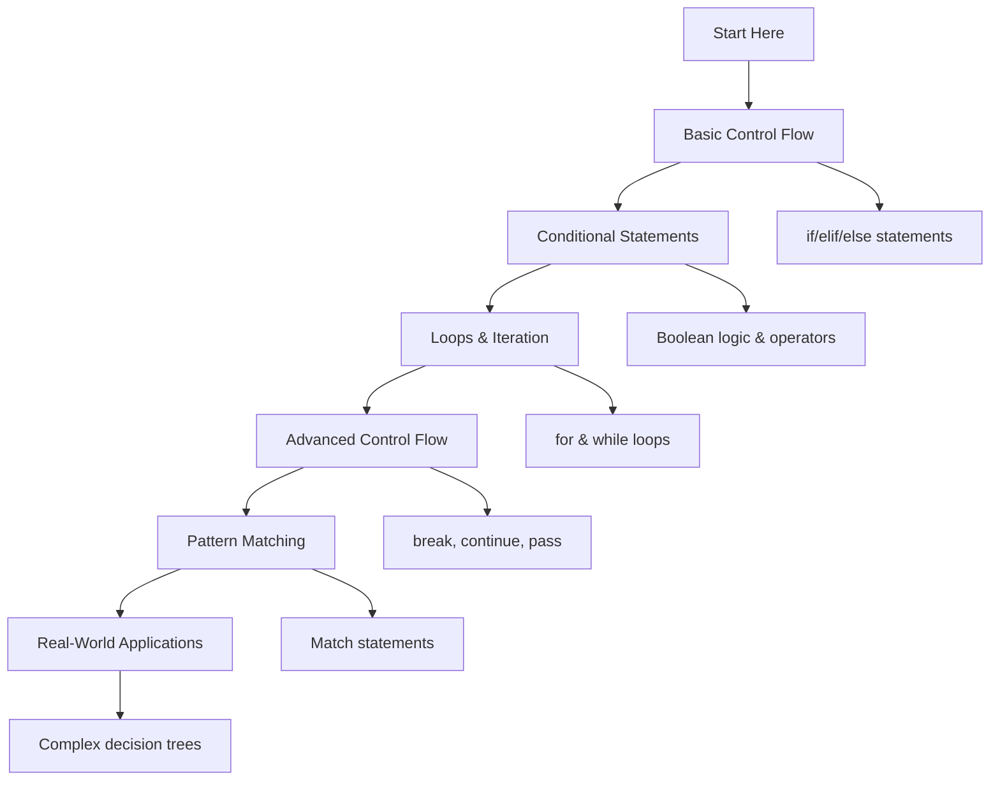

# 🐍 Control Flow: Complete Learning Guide

> **Master Python's control flow and decision-making!** 🔀

---

## 🎯 **Learning Path Overview**



---

## 📊 **Skill Tree**

### 🌱 **Foundation Level**

- [ ] **Basic Control Flow** ⭐
  - [ ] if/elif/else statements
  - [ ] Boolean logic and operators
  - [ ] Simple conditional expressions
  - [ ] Basic decision making

### 🌿 **Intermediate Level**

- [ ] **Loops & Iteration** ⭐⭐
  - [ ] for loops with different iterables
  - [ ] while loops and condition checking
  - [ ] Loop control statements (break, continue)
  - [ ] Nested loops and complex iteration

### 🌳 **Advanced Level**

- [ ] **Advanced Control Flow** ⭐⭐⭐
  - [ ] List comprehensions with conditions
  - [ ] Ternary operators and conditional expressions
  - [ ] Exception handling in control flow
  - [ ] Performance optimization techniques

### 🏔️ **Expert Level**

- [ ] **Pattern Matching & Complex Logic** ⭐⭐⭐⭐
  - [ ] Pattern matching (Python 3.10+)
  - [ ] Complex decision trees and state machines
  - [ ] Control flow optimization
  - [ ] Real-world application patterns

---

## 🗺️ **Learning Roadmap**

### **Week 1: Foundation** 🟢

| Day | Topic                   | Time    | Resources                                                                                           |
| --- | ----------------------- | ------- | --------------------------------------------------------------------------------------------------- |
| 1   | Basic Control Flow      | 2 hours | [Python Control Flow](https://docs.python.org/3/tutorial/controlflow.html)                          |
| 2   | if/elif/else Statements | 2 hours | [Conditional Statements](https://docs.python.org/3/tutorial/controlflow.html#if-statements)         |
| 3   | Boolean Logic           | 2 hours | [Boolean Operations](https://docs.python.org/3/library/stdtypes.html#boolean-operations-and-or-not) |
| 4   | Comparison Operators    | 2 hours | [Comparison Operators](https://docs.python.org/3/reference/expressions.html#comparisons)            |
| 5   | Practice & Review       | 2 hours | Questions 1-6                                                                                       |

### **Week 2: Intermediate** 🟡

| Day | Topic             | Time    | Resources                                                                                               |
| --- | ----------------- | ------- | ------------------------------------------------------------------------------------------------------- |
| 6   | for Loops         | 3 hours | [for Statements](https://docs.python.org/3/reference/compound_stmts.html#for)                           |
| 7   | while Loops       | 2 hours | [while Statements](https://docs.python.org/3/reference/compound_stmts.html#while)                       |
| 8   | Loop Control      | 2 hours | [break and continue](https://docs.python.org/3/tutorial/controlflow.html#break-and-continue-statements) |
| 9   | Nested Loops      | 2 hours | [Nested Loops](https://docs.python.org/3/tutorial/controlflow.html#for-statements)                      |
| 10  | Practice & Review | 2 hours | Questions 7-12                                                                                          |

### **Week 3: Advanced** 🟠

| Day | Topic                    | Time    | Resources                                                                                               |
| --- | ------------------------ | ------- | ------------------------------------------------------------------------------------------------------- |
| 11  | List Comprehensions      | 3 hours | [List Comprehensions](https://docs.python.org/3/tutorial/datastructures.html#list-comprehensions)       |
| 12  | Ternary Operators        | 3 hours | [Conditional Expressions](https://docs.python.org/3/reference/expressions.html#conditional-expressions) |
| 13  | Exception Handling       | 2 hours | [Exception Handling](https://docs.python.org/3/tutorial/errors.html)                                    |
| 14  | Performance Optimization | 2 hours | [Performance Tips](https://wiki.python.org/moin/PythonSpeed/PerformanceTips)                            |
| 15  | Practice & Review        | 2 hours | Questions 13-17                                                                                         |

### **Week 4: Expert** 🔴

| Day | Topic                  | Time    | Resources                                                             |
| --- | ---------------------- | ------- | --------------------------------------------------------------------- |
| 16  | Pattern Matching       | 3 hours | [Pattern Matching (PEP 634)](https://peps.python.org/pep-0634/)       |
| 17  | Complex Decision Trees | 2 hours | [Decision Trees](https://docs.python.org/3/tutorial/controlflow.html) |
| 18  | State Machines         | 3 hours | [State Machines](https://docs.python.org/3/library/enum.html)         |
| 19  | Final Review           | 2 hours | All Questions                                                         |
| 20  | Assessment             | 1 hour  | Interview Questions                                                   |

---

## 🎯 **How to Use This Folder**

### 📋 **Daily Study Routine**

1. **📖 Read the theory** (30 minutes)
2. **✏️ Solve questions** (1-2 hours)
3. **🔍 Review mistakes** (30 minutes)
4. **📝 Take notes** (15 minutes)
5. **🔄 Practice concepts** (30 minutes)

### 🎯 **Question Strategy**

- **Start with Basic Level** (Questions 1-6)
- **Move to Intermediate** when comfortable
- **Challenge yourself** with Advanced concepts
- **Master Expert level** for real-world scenarios

### 📊 **Progress Tracking**

```bash
# Mark your progress
✅ Completed
🔄 In Progress
⏳ Not Started
❌ Need Help
```

---

## 🚨 **Common Pitfalls to Avoid**

### ❌ **Beginner Mistakes**

- Using `=` instead of `==` for comparison
- Forgetting to use `:` after if/elif/else statements
- Not understanding indentation rules
- Infinite loops with while statements

### ⚠️ **Intermediate Pitfalls**

- Modifying lists during iteration
- Not using break/continue appropriately
- Overcomplicating simple conditions
- Ignoring loop performance implications

### 🔥 **Advanced Gotchas**

- Complex nested conditions that are hard to read
- Performance issues with deep nesting
- Not understanding short-circuit evaluation
- Memory issues with large loop iterations

---

## 🛠️ **Essential Tools & Resources**

### 📚 **Official Documentation**

- [Python Control Flow](https://docs.python.org/3/tutorial/controlflow.html) 📖
- [Compound Statements](https://docs.python.org/3/reference/compound_stmts.html) 🔧
- [Boolean Operations](https://docs.python.org/3/library/stdtypes.html#boolean-operations-and-or-not) 🎯

### 🎓 **Learning Resources**

- [Real Python: Control Flow](https://realpython.com/python-conditional-statements/) 🐍
- [Python Loops Tutorial](https://realpython.com/python-for-loop/) 🔄
- [Control Flow Best Practices](https://docs.python.org/3/howto/doanddont.html) 💡

### 🧪 **Practice Platforms**

- [Python Control Flow](https://www.hackerrank.com/) 🏆
- [Loop Problems](https://leetcode.com/) 💻
- [Control Flow Challenges](https://www.codewars.com/) ⚔️

### 🔍 **Debugging Tools**

- [Python Debugger (pdb)](https://docs.python.org/3/library/pdb.html) 🐛
- [Python Tutor Visualizer](https://pythontutor.com/) 👁️
- [VS Code Python Extension](https://marketplace.visualstudio.com/items?itemName=ms-python.python) 💻

---

## 📈 **Assessment & Evaluation**

### 🎯 **Self-Assessment Questions**

After completing each level, ask yourself:

**Basic Level:**

- [ ] Can I write basic if/elif/else statements?
- [ ] Do I understand Boolean logic and operators?
- [ ] Can I use comparison operators correctly?
- [ ] Do I understand Python indentation rules?

**Intermediate Level:**

- [ ] Can I use for and while loops effectively?
- [ ] Do I understand break, continue, and pass?
- [ ] Can I work with nested loops?
- [ ] Do I handle loop control properly?

**Advanced Level:**

- [ ] Can I write list comprehensions with conditions?
- [ ] Do I understand ternary operators?
- [ ] Can I handle exceptions in control flow?
- [ ] Do I optimize loop performance?

**Expert Level:**

- [ ] Can I use pattern matching effectively?
- [ ] Do I understand complex decision trees?
- [ ] Can I implement state machines?
- [ ] Do I apply control flow in real-world scenarios?

---

## 🚀 **Modern Python Features (2025)**

### ✨ **Pattern Matching (Python 3.10+)**

```python
def analyze_data(data):
    """Analyze data using pattern matching."""
    match data:
        case {"type": "user", "name": str() as name, "age": int() as age}:
            return f"User {name} is {age} years old"
        case {"type": "product", "name": str() as name, "price": float() as price}:
            return f"Product {name} costs ${price:.2f}"
        case list() as items if len(items) > 0:
            return f"List with {len(items)} items"
        case _:
            return "Unknown data type"

# Usage
user_data = {"type": "user", "name": "Alice", "age": 30}
result = analyze_data(user_data)  # "User Alice is 30 years old"
```

### 🎯 **Enhanced Control Flow with Type Hints**

```python
from typing import Union, List, Dict, Any

def process_items(
    items: List[Union[str, int, float]],
    condition: str = "all"
) -> Dict[str, Any]:
    """Process items with enhanced control flow."""
    result = {
        "total": len(items),
        "processed": 0,
        "filtered": []
    }

    for item in items:
        match condition:
            case "all":
                result["processed"] += 1
                result["filtered"].append(item)
            case "numbers" if isinstance(item, (int, float)):
                result["processed"] += 1
                result["filtered"].append(item)
            case "strings" if isinstance(item, str):
                result["processed"] += 1
                result["filtered"].append(item)
            case _:
                continue

    return result
```

### 🔍 **Advanced Loop Patterns**

```python
from itertools import chain, islice
from typing import Iterator

def advanced_iteration(data: List[Any]) -> Iterator[str]:
    """Advanced iteration patterns."""
    # Chain multiple iterables
    all_items = chain(data, ["extra", "items"])

    # Slice and filter
    for item in islice(all_items, 0, 100):  # Take first 100 items
        if item is not None:
            yield str(item).upper()

# Generator expression with conditions
filtered_data = (
    str(item).upper()
    for item in data
    if item is not None and str(item).strip()
)
```

---

## 📊 **Success Metrics**

### 🎯 **Completion Criteria**

- [ ] **Basic Level**: Complete all questions 1-6
- [ ] **Intermediate Level**: Complete all questions 7-12
- [ ] **Advanced Level**: Complete all questions 13-17
- [ ] **Expert Level**: Complete all questions 18-20
- [ ] **Additional Practice**: Complete all questions 21-30

### 📈 **Performance Benchmarks**

- **Conditional Statements**: < 0.1ms per condition
- **Loop Iterations**: < 1ms for 1000 iterations
- **Pattern Matching**: < 0.5ms per match
- **Memory Usage**: < 10MB for complex control flow

### 🏆 **Mastery Indicators**

- Can write clear and efficient control flow
- Understands when to use different loop types
- Can implement complex decision logic
- Uses pattern matching effectively
- Optimizes control flow for performance

---

## 🔗 **Related Topics**

- **Variables and Data Types**: Type-based decision making
- **Functions**: Control flow in functions
- **Data Structures**: Iteration over collections
- **String Manipulation**: String-based conditions
- **File Handling**: File processing loops
- **Error Handling**: Exception control flow
- **OOP**: Control flow in classes
- **Modules**: Module-level control flow
- **List Comprehensions**: Conditional comprehensions
- **Decorators**: Control flow decorators
- **Generators**: Generator control flow

---

## 🎉 **Congratulations!**

You've completed the Control Flow learning path! You now have:

- ✅ **Solid foundation** in Python control flow
- ✅ **Advanced skills** in loops and iteration
- ✅ **Expert knowledge** in pattern matching
- ✅ **Real-world experience** with decision making

**Next Steps:**

- Practice with real-world projects
- Explore related topics (Functions, Data Structures)
- Build decision-making applications
- Contribute to open-source projects

---

> **💡 Pro Tip:** Control flow is the backbone of programming logic. Master these concepts and you'll be able to create complex, intelligent applications!

---

_Happy Learning! Remember, good control flow makes your code logical and efficient! 🔀✨_
