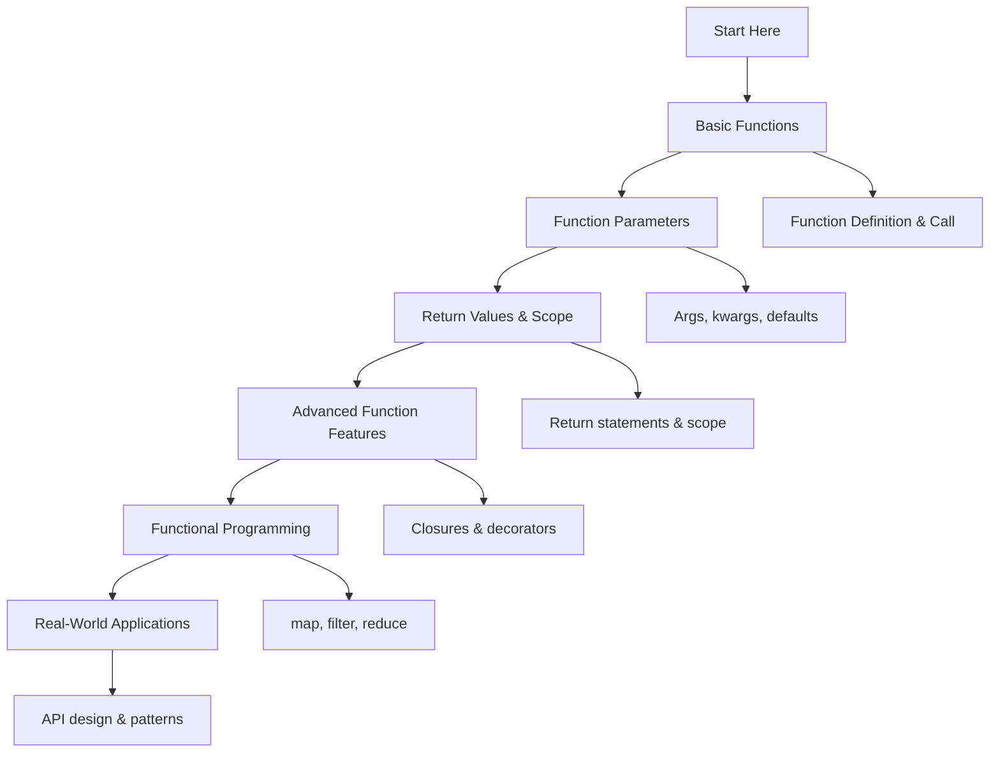

# 🐍 Functions: Complete Learning Guide

> **Master Python's function system and functional programming!** ⚙️

---

## 🎯 **Learning Path Overview**



---

## 📊 **Skill Tree**

### 🌱 **Foundation Level**

- [ ] **Basic Functions** ⭐
  - [ ] Function definition and calling
  - [ ] Basic parameters and arguments
  - [ ] Return statements and values
  - [ ] Function scope and namespaces

### 🌿 **Intermediate Level**

- [ ] **Function Parameters & Arguments** ⭐⭐
  - [ ] Default parameters and keyword arguments
  - [ ] \*args and \*\*kwargs
  - [ ] Parameter validation and type hints
  - [ ] Function overloading patterns

### 🌳 **Advanced Level**

- [ ] **Advanced Function Features** ⭐⭐⭐
  - [ ] Closures and nested functions
  - [ ] Function decorators
  - [ ] Lambda functions and expressions
  - [ ] Function composition and chaining

### 🏔️ **Expert Level**

- [ ] **Functional Programming & Design** ⭐⭐⭐⭐
  - [ ] Pure functions and side effects
  - [ ] Higher-order functions
  - [ ] Function design patterns
  - [ ] Performance optimization

---

## 🗺️ **Learning Roadmap**

### **Week 1: Foundation** 🟢

| Day | Topic               | Time    | Resources                                                                                             |
| --- | ------------------- | ------- | ----------------------------------------------------------------------------------------------------- |
| 1   | Basic Functions     | 2 hours | [Python Functions](https://docs.python.org/3/tutorial/controlflow.html#defining-functions)            |
| 2   | Function Parameters | 2 hours | [Function Parameters](https://docs.python.org/3/tutorial/controlflow.html#more-on-defining-functions) |
| 3   | Return Statements   | 2 hours | [Return Statements](https://docs.python.org/3/reference/simple_stmts.html#return)                     |
| 4   | Function Scope      | 2 hours | [Scope Rules](https://docs.python.org/3/tutorial/classes.html#python-scopes-and-namespaces)           |
| 5   | Practice & Review   | 2 hours | Questions 1-6                                                                                         |

### **Week 2: Intermediate** 🟡

| Day | Topic                 | Time    | Resources                                                                                           |
| --- | --------------------- | ------- | --------------------------------------------------------------------------------------------------- |
| 6   | Default Parameters    | 3 hours | [Default Arguments](https://docs.python.org/3/tutorial/controlflow.html#default-argument-values)    |
| 7   | Keyword Arguments     | 2 hours | [Keyword Arguments](https://docs.python.org/3/tutorial/controlflow.html#keyword-arguments)          |
| 8   | \*args and \*\*kwargs | 2 hours | [Arbitrary Arguments](https://docs.python.org/3/tutorial/controlflow.html#arbitrary-argument-lists) |
| 9   | Type Hints            | 2 hours | [Type Hints](https://docs.python.org/3/library/typing.html)                                         |
| 10  | Practice & Review     | 2 hours | Questions 7-12                                                                                      |

### **Week 3: Advanced** 🟠

| Day | Topic                | Time    | Resources                                                                                    |
| --- | -------------------- | ------- | -------------------------------------------------------------------------------------------- |
| 11  | Closures             | 3 hours | [Closures](https://docs.python.org/3/tutorial/classes.html#python-scopes-and-namespaces)     |
| 12  | Lambda Functions     | 3 hours | [Lambda Expressions](https://docs.python.org/3/tutorial/controlflow.html#lambda-expressions) |
| 13  | Function Decorators  | 2 hours | [Decorators](https://docs.python.org/3/glossary.html#term-decorator)                         |
| 14  | Function Composition | 2 hours | [Function Composition](https://docs.python.org/3/library/functools.html)                     |
| 15  | Practice & Review    | 2 hours | Questions 13-17                                                                              |

### **Week 4: Expert** 🔴

| Day | Topic                    | Time    | Resources                                                                  |
| --- | ------------------------ | ------- | -------------------------------------------------------------------------- |
| 16  | Functional Programming   | 3 hours | [Functional Programming](https://docs.python.org/3/howto/functional.html)  |
| 17  | Higher-Order Functions   | 2 hours | [Higher-Order Functions](https://docs.python.org/3/library/functools.html) |
| 18  | Function Design Patterns | 3 hours | [Design Patterns](https://docs.python.org/3/howto/doanddont.html)          |
| 19  | Final Review             | 2 hours | All Questions                                                              |
| 20  | Assessment               | 1 hour  | Interview Questions                                                        |

---

## 🎯 **How to Use This Folder**

### 📋 **Daily Study Routine**

1. **📖 Read the theory** (30 minutes)
2. **✏️ Solve questions** (1-2 hours)
3. **🔍 Review mistakes** (30 minutes)
4. **📝 Take notes** (15 minutes)
5. **🔄 Practice concepts** (30 minutes)

### 🎯 **Question Strategy**

- **Start with Basic Level** (Questions 1-6)
- **Move to Intermediate** when comfortable
- **Challenge yourself** with Advanced concepts
- **Master Expert level** for real-world scenarios

### 📊 **Progress Tracking**

```bash
# Mark your progress
✅ Completed
🔄 In Progress
⏳ Not Started
❌ Need Help
```

---

## 🚨 **Common Pitfalls to Avoid**

### ❌ **Beginner Mistakes**

- Not using return statements properly
- Confusing parameters with arguments
- Not understanding function scope
- Using mutable default arguments

### ⚠️ **Intermediate Pitfalls**

- Overusing \*args and \*\*kwargs
- Not validating function parameters
- Ignoring function documentation
- Not handling exceptions in functions

### 🔥 **Advanced Gotchas**

- Circular import dependencies
- Memory leaks with closures
- Performance issues with decorators
- Not understanding function composition

---

## 🛠️ **Essential Tools & Resources**

### 📚 **Official Documentation**

- [Python Functions](https://docs.python.org/3/tutorial/controlflow.html#defining-functions) 📖
- [Function Parameters](https://docs.python.org/3/tutorial/controlflow.html#more-on-defining-functions) 🔧
- [Type Hints](https://docs.python.org/3/library/typing.html) 🎯

### 🎓 **Learning Resources**

- [Real Python: Functions](https://realpython.com/defining-your-own-python-function/) 🐍
- [Python Decorators](https://realpython.com/primer-on-python-decorators/) 🎨
- [Functional Programming](https://docs.python.org/3/howto/functional.html) ⚙️

### 🧪 **Practice Platforms**

- [Python Functions](https://www.hackerrank.com/) 🏆
- [Function Problems](https://leetcode.com/) 💻
- [Functional Programming](https://www.codewars.com/) ⚔️

### 🔍 **Debugging Tools**

- [Python Debugger (pdb)](https://docs.python.org/3/library/pdb.html) 🐛
- [Function Inspector](https://docs.python.org/3/library/inspect.html) 🔍
- [VS Code Python Extension](https://marketplace.visualstudio.com/items?itemName=ms-python.python) 💻

---

## 📈 **Assessment & Evaluation**

### 🎯 **Self-Assessment Questions**

After completing each level, ask yourself:

**Basic Level:**

- [ ] Can I define and call functions properly?
- [ ] Do I understand function parameters and arguments?
- [ ] Can I use return statements effectively?
- [ ] Do I understand function scope?

**Intermediate Level:**

- [ ] Can I use default parameters and keyword arguments?
- [ ] Do I understand \*args and \*\*kwargs?
- [ ] Can I implement type hints?
- [ ] Do I validate function parameters?

**Advanced Level:**

- [ ] Can I create closures and nested functions?
- [ ] Do I understand lambda functions?
- [ ] Can I use function decorators?
- [ ] Do I implement function composition?

**Expert Level:**

- [ ] Can I write pure functions?
- [ ] Do I understand higher-order functions?
- [ ] Can I implement function design patterns?
- [ ] Do I optimize function performance?

---

## 🚀 **Modern Python Features (2025)**

### ✨ **Enhanced Type Hints (Python 3.10+)**

```python
from typing import Callable, TypeVar, ParamSpec, Concatenate

P = ParamSpec('P')
T = TypeVar('T')

def with_logging(func: Callable[P, T]) -> Callable[P, T]:
    """Decorator with enhanced type hints."""
    def wrapper(*args: P.args, **kwargs: P.kwargs) -> T:
        print(f"Calling {func.__name__}")
        result = func(*args, **kwargs)
        print(f"Finished {func.__name__}")
        return result
    return wrapper

@with_logging
def process_data(name: str, value: int) -> str:
    return f"Processed {name}: {value}"
```

### 🎯 **Pattern Matching in Functions**

```python
def process_command(command: dict) -> str:
    """Process commands using pattern matching."""
    match command:
        case {"action": "create", "data": data}:
            return f"Creating: {data}"
        case {"action": "update", "id": id, "data": data}:
            return f"Updating {id}: {data}"
        case {"action": "delete", "id": id}:
            return f"Deleting {id}"
        case _:
            return "Unknown command"

# Usage
result = process_command({"action": "create", "data": "user"})
```

### 🔍 **Async Functions and Generators**

```python
import asyncio
from typing import AsyncGenerator, AsyncIterator

async def async_data_processor(data: list) -> AsyncGenerator[str, None]:
    """Async generator function."""
    for item in data:
        await asyncio.sleep(0.1)  # Simulate async processing
        yield f"Processed: {item}"

async def main():
    """Main async function."""
    data = ["item1", "item2", "item3"]
    async for result in async_data_processor(data):
        print(result)

# Run async function
asyncio.run(main())
```

---

## 📊 **Success Metrics**

### 🎯 **Completion Criteria**

- [ ] **Basic Level**: Complete all questions 1-6
- [ ] **Intermediate Level**: Complete all questions 7-12
- [ ] **Advanced Level**: Complete all questions 13-17
- [ ] **Expert Level**: Complete all questions 18-20
- [ ] **Additional Practice**: Complete all questions 21-30

### 📈 **Performance Benchmarks**

- **Function Calls**: < 0.1ms per call
- **Decorator Overhead**: < 1ms per decorated function
- **Lambda Operations**: < 0.05ms per lambda
- **Memory Usage**: < 1KB per function definition

### 🏆 **Mastery Indicators**

- Can design and implement functions effectively
- Understands function parameters and scope
- Can use advanced function features
- Implements functional programming patterns
- Optimizes function performance

---

## 🔗 **Related Topics**

- **Variables and Data Types**: Function parameters and return types
- **Control Flow**: Function execution flow
- **Data Structures**: Function data handling
- **String Manipulation**: String processing functions
- **File Handling**: File operation functions
- **Error Handling**: Exception handling in functions
- **OOP**: Methods and class functions
- **Modules**: Module-level functions
- **List Comprehensions**: Function comprehensions
- **Decorators**: Function decorators
- **Generators**: Generator functions

---

## 🎉 **Congratulations!**

You've completed the Functions learning path! You now have:

- ✅ **Solid foundation** in Python functions
- ✅ **Advanced skills** in function parameters
- ✅ **Expert knowledge** in functional programming
- ✅ **Real-world experience** with function design

**Next Steps:**

- Practice with real-world projects
- Explore related topics (Data Structures, OOP)
- Build function-based applications
- Contribute to open-source projects

---

> **💡 Pro Tip:** Functions are the building blocks of modular, reusable code. Master these concepts and you'll be able to create clean, maintainable applications!

---

_Happy Learning! Remember, good functions make your code modular and reusable! ⚙️✨_
