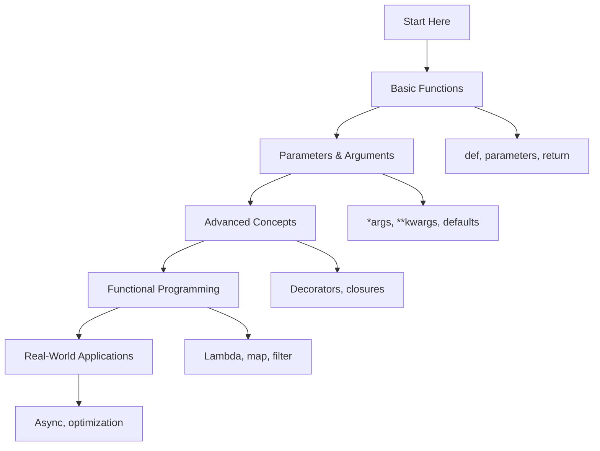

# 🐍 Functions: Complete Learning Guide

> **Master Python's function fundamentals and advanced concepts!** 🔧

---

## 🎯 **Learning Path Overview**



---

## 📊 **Skill Tree**

### 🌱 **Foundation Level**

- [ ] **Basic Functions** ⭐
  - [ ] Function definition (def)
  - [ ] Parameters and arguments
  - [ ] Return statements
  - [ ] Function calls

### 🌿 **Intermediate Level**

- [ ] **Advanced Parameters** ⭐⭐
  - [ ] Default parameters
  - [ ] \*args and \*\*kwargs
  - [ ] Keyword arguments
  - [ ] Parameter unpacking

### 🌳 **Advanced Level**

- [ ] **Functional Programming** ⭐⭐⭐
  - [ ] Lambda functions
  - [ ] Higher-order functions
  - [ ] Decorators
  - [ ] Closures

### 🏔️ **Expert Level**

- [ ] **Advanced Concepts** ⭐⭐⭐⭐
  - [ ] Metaclasses
  - [ ] Async functions
  - [ ] Function optimization
  - [ ] Dynamic function creation

---

## 🗺️ **Learning Roadmap**

### **Week 1: Foundation** 🟢

| Day | Topic                  | Time    | Resources                                                                                   |
| --- | ---------------------- | ------- | ------------------------------------------------------------------------------------------- |
| 1   | Basic Functions        | 2 hours | [Python Docs](https://docs.python.org/3/tutorial/controlflow.html#defining-functions)       |
| 2   | Parameters & Arguments | 2 hours | [Real Python](https://realpython.com/defining-your-own-python-function/)                    |
| 3   | Return Values          | 2 hours | [Function Returns](https://docs.python.org/3/tutorial/controlflow.html#defining-functions)  |
| 4   | Variable Scope         | 2 hours | [Scope Rules](https://docs.python.org/3/tutorial/classes.html#python-scopes-and-namespaces) |
| 5   | Practice & Review      | 2 hours | Questions 1-6                                                                               |

### **Week 2: Intermediate** 🟡

| Day | Topic                 | Time    | Resources                                                                                          |
| --- | --------------------- | ------- | -------------------------------------------------------------------------------------------------- |
| 6   | \*args and \*\*kwargs | 3 hours | [Variable Arguments](https://docs.python.org/3/tutorial/controlflow.html#arbitrary-argument-lists) |
| 7   | Lambda Functions      | 2 hours | [Lambda Expressions](https://docs.python.org/3/tutorial/controlflow.html#lambda-expressions)       |
| 8   | Decorators            | 2 hours | [Decorators](https://docs.python.org/3/glossary.html#term-decorator)                               |
| 9   | Recursion             | 2 hours | [Recursive Functions](https://docs.python.org/3/tutorial/controlflow.html#defining-functions)      |
| 10  | Practice & Review     | 2 hours | Questions 7-12                                                                                     |

### **Week 3: Advanced** 🟠

| Day | Topic                  | Time    | Resources                                                                                |
| --- | ---------------------- | ------- | ---------------------------------------------------------------------------------------- |
| 11  | Closures               | 3 hours | [Closures](https://docs.python.org/3/tutorial/classes.html#python-scopes-and-namespaces) |
| 12  | Higher-Order Functions | 2 hours | [Functional Programming](https://docs.python.org/3/howto/functional.html)                |
| 13  | Function Factories     | 2 hours | [Factory Pattern](https://en.wikipedia.org/wiki/Factory_method_pattern)                  |
| 14  | Memoization            | 2 hours | [Memoization](https://en.wikipedia.org/wiki/Memoization)                                 |
| 15  | Practice & Review      | 2 hours | Questions 13-17                                                                          |

### **Week 4: Expert** 🔴

| Day | Topic                 | Time    | Resources                                                                     |
| --- | --------------------- | ------- | ----------------------------------------------------------------------------- |
| 16  | Metaclasses           | 3 hours | [Metaclasses](https://docs.python.org/3/reference/datamodel.html#metaclasses) |
| 17  | Async Functions       | 2 hours | [Async/Await](https://docs.python.org/3/library/asyncio.html)                 |
| 18  | Function Optimization | 3 hours | [Performance Tips](https://wiki.python.org/moin/PythonSpeed/PerformanceTips)  |
| 19  | Final Review          | 2 hours | All Questions                                                                 |
| 20  | Assessment            | 1 hour  | Interview Questions                                                           |

---

## 🎯 **How to Use This Folder**

### 📋 **Daily Study Routine**

1. **📖 Read the theory** (30 minutes)
2. **✏️ Solve questions** (1-2 hours)
3. **🔍 Review mistakes** (30 minutes)
4. **📝 Take notes** (15 minutes)
5. **🔄 Practice concepts** (30 minutes)

### 🎯 **Question Strategy**

- **Start with Basic Level** (Questions 1-6)
- **Move to Intermediate** when comfortable
- **Challenge yourself** with Advanced concepts
- **Master Expert level** for real-world scenarios

### 📊 **Progress Tracking**

```bash
# Mark your progress
✅ Completed
🔄 In Progress
⏳ Not Started
❌ Need Help
```

---

## 🚨 **Common Pitfalls to Avoid**

### ❌ **Beginner Mistakes**

- Forgetting colons after function definition
- Using print instead of return
- Not understanding parameter order
- Ignoring function documentation

### ⚠️ **Intermediate Pitfalls**

- Confusing \*args and \*\*kwargs
- Using mutable default arguments
- Forgetting to call decorated functions
- Ignoring function scope rules

### 🔥 **Advanced Gotchas**

- Overusing lambda functions
- Creating overly complex decorators
- Ignoring function performance
- Misusing async/await syntax

---

## 🛠️ **Essential Tools & Resources**

### 📚 **Official Documentation**

- [Python Functions](https://docs.python.org/3/tutorial/controlflow.html#defining-functions) 📖
- [Function Objects](https://docs.python.org/3/reference/datamodel.html#the-standard-type-hierarchy) 🔧
- [Decorators](https://docs.python.org/3/glossary.html#term-decorator) 🏗️

### 🎓 **Learning Resources**

- [Real Python: Functions](https://realpython.com/defining-your-own-python-function/) 🐍
- [Python Decorators](https://realpython.com/primer-on-python-decorators/) 🎨
- [Functional Programming](https://docs.python.org/3/howto/functional.html) 🔧

### 🧪 **Practice Platforms**

- [LeetCode Python](https://leetcode.com/) 💻
- [HackerRank Python](https://www.hackerrank.com/) 🏆
- [Codewars Python](https://www.codewars.com/) ⚔️

### 🔍 **Debugging Tools**

- [Python Debugger (pdb)](https://docs.python.org/3/library/pdb.html) 🐛
- [IPython](https://ipython.org/) 🐍
- [VS Code Python Extension](https://marketplace.visualstudio.com/items?itemName=ms-python.python) 💻

---

## 📈 **Assessment & Evaluation**

### 🎯 **Self-Assessment Questions**

After completing each level, ask yourself:

**Basic Level:**

- [ ] Can I define and call functions properly?
- [ ] Do I understand parameter passing?
- [ ] Can I use return statements effectively?

**Intermediate Level:**

- [ ] Do I understand \*args and \*\*kwargs?
- [ ] Can I create and use decorators?
- [ ] Do I know when to use lambda functions?

**Advanced Level:**

- [ ] Can I implement closures and higher-order functions?
- [ ] Do I understand functional programming concepts?
- [ ] Can I optimize function performance?

**Expert Level:**

- [ ] Can I create metaclasses and dynamic functions?
- [ ] Do I understand async/await programming?
- [ ] Can I profile and optimize functions?

---

## 🏆 **Success Metrics**

### 📊 **Completion Criteria**

- ✅ **Basic Level:** Solve all questions 1-6 without help
- ✅ **Intermediate Level:** Complete questions 7-12 with minimal errors
- ✅ **Advanced Level:** Master questions 13-17 and explain concepts
- ✅ **Expert Level:** Ace questions 18-20 and interview questions

### 🎓 **Mastery Indicators**

- 🧠 **Deep Understanding:** Can explain concepts to others
- 💻 **Practical Skills:** Can solve real-world problems
- 🔍 **Debugging Ability:** Can identify and fix function issues
- ⚡ **Performance Awareness:** Understand optimization trade-offs

---

## 🚀 **Next Steps After Mastery**

### 📚 **Advanced Topics to Explore**

- **Design Patterns** (Strategy, Command, Observer)
- **Functional Programming** (monads, functors)
- **Metaprogramming** (code generation, AST manipulation)
- **Performance Optimization** (profiling, benchmarking)

### 🎯 **Real-World Applications**

- **Web Development:** API endpoints and middleware
- **Data Science:** Data processing pipelines
- **Automation:** Script automation and task scheduling
- **Testing:** Test frameworks and mocking

---

## 💡 **Pro Tips for Success**

### 🎯 **Study Strategies**

- **Practice Daily:** Consistency beats intensity
- **Explain Concepts:** Teaching others reinforces learning
- **Build Projects:** Apply concepts in real scenarios
- **Review Regularly:** Spaced repetition improves retention

### 🧠 **Learning Techniques**

- **Visual Learning:** Use flowcharts and diagrams
- **Hands-on Practice:** Code every concept you learn
- **Error Analysis:** Learn from mistakes and debug them
- **Concept Mapping:** Connect related ideas together

### 🚀 **Motivation Tips**

- **Set Clear Goals:** Know what you want to achieve
- **Track Progress:** Celebrate small wins
- **Join Communities:** Learn from others
- **Stay Curious:** Always ask "why" and "how"

---

> **🌟 Remember:** Functions are the foundation of modular, reusable code. Master these concepts and you'll write cleaner, more maintainable programs!

---

## 📞 **Need Help?**

### 🤝 **Community Resources**

- [Python Discord](https://discord.gg/python) 💬
- [Stack Overflow Python](https://stackoverflow.com/questions/tagged/python) 🔍
- [Reddit r/learnpython](https://www.reddit.com/r/learnpython/) 📱

### 📧 **Study Groups**

- Form study groups with fellow learners
- Share solutions and discuss approaches
- Review each other's code
- Celebrate achievements together

---

**🎉 You're ready to master Python functions! Start with Question 1 and work your way through systematically. Good luck!**
