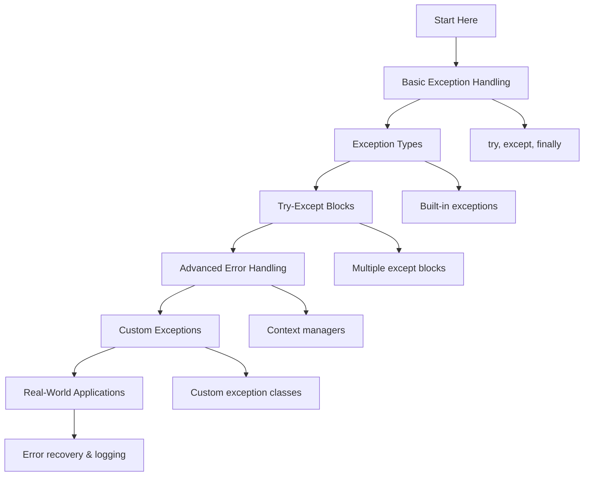

# 🐍 Error Handling: Complete Learning Guide

> **Master Python's exception handling and error management!** 🛡️

---

## 🎯 **Learning Path Overview**



---

## 📊 **Skill Tree**

### 🌱 **Foundation Level**

- [ ] **Basic Exception Handling** ⭐
  - [ ] try-except blocks
  - [ ] Basic exception types
  - [ ] Exception handling flow
  - [ ] Error messages and debugging

### 🌿 **Intermediate Level**

- [ ] **Exception Types & Handling** ⭐⭐
  - [ ] Built-in exception hierarchy
  - [ ] Multiple except clauses
  - [ ] Exception chaining
  - [ ] Error recovery strategies

### 🌳 **Advanced Level**

- [ ] **Advanced Error Handling** ⭐⭐⭐
  - [ ] Context managers and with statements
  - [ ] Exception groups (Python 3.11+)
  - [ ] Performance optimization
  - [ ] Error logging and monitoring

### 🏔️ **Expert Level**

- [ ] **Custom Exceptions & Design** ⭐⭐⭐⭐
  - [ ] Custom exception classes
  - [ ] Exception hierarchies
  - [ ] Error handling patterns
  - [ ] System-wide error management

---

## 🗺️ **Learning Roadmap**

### **Week 1: Foundation** 🟢

| Day | Topic                    | Time    | Resources                                                                        |
| --- | ------------------------ | ------- | -------------------------------------------------------------------------------- |
| 1   | Basic Exception Handling | 2 hours | [Python Exceptions](https://docs.python.org/3/tutorial/errors.html)              |
| 2   | Try-Except Blocks        | 2 hours | [Try-Except](https://docs.python.org/3/tutorial/errors.html#handling-exceptions) |
| 3   | Exception Types          | 2 hours | [Built-in Exceptions](https://docs.python.org/3/library/exceptions.html)         |
| 4   | Error Messages           | 2 hours | [Error Messages](https://docs.python.org/3/tutorial/errors.html#exceptions)      |
| 5   | Practice & Review        | 2 hours | Questions 1-6                                                                    |

### **Week 2: Intermediate** 🟡

| Day | Topic                   | Time    | Resources                                                                                 |
| --- | ----------------------- | ------- | ----------------------------------------------------------------------------------------- |
| 6   | Multiple Except Clauses | 3 hours | [Multiple Exceptions](https://docs.python.org/3/tutorial/errors.html#handling-exceptions) |
| 7   | Exception Chaining      | 2 hours | [Exception Chaining](https://docs.python.org/3/tutorial/errors.html#exception-chaining)   |
| 8   | Finally Blocks          | 2 hours | [Finally](https://docs.python.org/3/tutorial/errors.html#defining-clean-up-actions)       |
| 9   | Error Recovery          | 2 hours | [Error Recovery](https://docs.python.org/3/tutorial/errors.html#handling-exceptions)      |
| 10  | Practice & Review       | 2 hours | Questions 7-12                                                                            |

### **Week 3: Advanced** 🟠

| Day | Topic                    | Time    | Resources                                                                               |
| --- | ------------------------ | ------- | --------------------------------------------------------------------------------------- |
| 11  | Context Managers         | 3 hours | [Context Managers](https://docs.python.org/3/reference/datamodel.html#context-managers) |
| 12  | Exception Groups         | 3 hours | [Exception Groups (PEP 654)](https://peps.python.org/pep-0654/)                         |
| 13  | Error Logging            | 2 hours | [Logging](https://docs.python.org/3/library/logging.html)                               |
| 14  | Performance Optimization | 2 hours | [Performance](https://wiki.python.org/moin/PythonSpeed/PerformanceTips)                 |
| 15  | Practice & Review        | 2 hours | Questions 13-17                                                                         |

### **Week 4: Expert** 🔴

| Day | Topic                   | Time    | Resources                                                                                   |
| --- | ----------------------- | ------- | ------------------------------------------------------------------------------------------- |
| 16  | Custom Exceptions       | 3 hours | [Custom Exceptions](https://docs.python.org/3/tutorial/errors.html#user-defined-exceptions) |
| 17  | Exception Hierarchies   | 2 hours | [Exception Design](https://docs.python.org/3/tutorial/errors.html#user-defined-exceptions)  |
| 18  | Error Handling Patterns | 3 hours | [Error Patterns](https://docs.python.org/3/howto/doanddont.html)                            |
| 19  | Final Review            | 2 hours | All Questions                                                                               |
| 20  | Assessment              | 1 hour  | Interview Questions                                                                         |

---

## 🎯 **How to Use This Folder**

### 📋 **Daily Study Routine**

1. **📖 Read the theory** (30 minutes)
2. **✏️ Solve questions** (1-2 hours)
3. **🔍 Review mistakes** (30 minutes)
4. **📝 Take notes** (15 minutes)
5. **🔄 Practice concepts** (30 minutes)

### 🎯 **Question Strategy**

- **Start with Basic Level** (Questions 1-6)
- **Move to Intermediate** when comfortable
- **Challenge yourself** with Advanced concepts
- **Master Expert level** for real-world scenarios

### 📊 **Progress Tracking**

```bash
# Mark your progress
✅ Completed
🔄 In Progress
⏳ Not Started
❌ Need Help
```

---

## 🚨 **Common Pitfalls to Avoid**

### ❌ **Beginner Mistakes**

- Catching all exceptions with bare except
- Not handling specific exception types
- Forgetting to close resources in finally
- Ignoring exception messages

### ⚠️ **Intermediate Pitfalls**

- Over-catching exceptions
- Not using exception chaining
- Ignoring context managers
- Not logging errors properly

### 🔥 **Advanced Gotchas**

- Performance issues with exception handling
- Memory leaks from unhandled exceptions
- Not understanding exception groups
- Poor exception hierarchy design

---

## 🛠️ **Essential Tools & Resources**

### 📚 **Official Documentation**

- [Python Exceptions](https://docs.python.org/3/tutorial/errors.html) 📖
- [Built-in Exceptions](https://docs.python.org/3/library/exceptions.html) 🔧
- [Logging](https://docs.python.org/3/library/logging.html) 🎯

### 🎓 **Learning Resources**

- [Real Python: Exceptions](https://realpython.com/python-exceptions/) 🐍
- [Exception Handling](https://realpython.com/python-exceptions/) 🛡️
- [Logging Tutorial](https://realpython.com/python-logging/) 📝

### 🧪 **Practice Platforms**

- [Python Exceptions](https://www.hackerrank.com/) 🏆
- [Error Handling](https://leetcode.com/) 💻
- [Exception Problems](https://www.codewars.com/) ⚔️

### 🔍 **Debugging Tools**

- [Python Debugger (pdb)](https://docs.python.org/3/library/pdb.html) 🐛
- [Traceback Module](https://docs.python.org/3/library/traceback.html) 🔍
- [VS Code Python Extension](https://marketplace.visualstudio.com/items?itemName=ms-python.python) 💻

---

## 📈 **Assessment & Evaluation**

### 🎯 **Self-Assessment Questions**

After completing each level, ask yourself:

**Basic Level:**

- [ ] Can I write basic try-except blocks?
- [ ] Do I understand common exception types?
- [ ] Can I handle exceptions properly?
- [ ] Do I understand error messages?

**Intermediate Level:**

- [ ] Can I handle multiple exception types?
- [ ] Do I understand exception chaining?
- [ ] Can I use finally blocks?
- [ ] Do I implement error recovery?

**Advanced Level:**

- [ ] Can I use context managers?
- [ ] Do I understand exception groups?
- [ ] Can I implement error logging?
- [ ] Do I optimize exception handling?

**Expert Level:**

- [ ] Can I create custom exceptions?
- [ ] Do I design exception hierarchies?
- [ ] Can I implement error patterns?
- [ ] Do I manage system-wide errors?

---

## 🚀 **Modern Python Features (2025)**

### ✨ **Exception Groups (Python 3.11+)**

```python
def process_multiple_operations():
    """Process multiple operations with exception groups."""
    errors = []

    try:
        # Multiple operations that might fail
        result1 = risky_operation_1()
        result2 = risky_operation_2()
        result3 = risky_operation_3()

    except* ValueError as eg:
        print(f"Value errors: {len(eg.exceptions)}")
        for exc in eg.exceptions:
            print(f"  - {exc}")

    except* TypeError as eg:
        print(f"Type errors: {len(eg.exceptions)}")
        for exc in eg.exceptions:
            print(f"  - {exc}")

    except ExceptionGroup as eg:
        print(f"Other errors: {len(eg.exceptions)}")
        for exc in eg.exceptions:
            print(f"  - {exc}")

# Usage
process_multiple_operations()
```

### 🎯 **Enhanced Error Handling with Type Hints**

```python
from typing import Union, Optional, TypeVar, Callable
from contextlib import contextmanager

T = TypeVar('T')

def safe_operation(
    operation: Callable[[], T],
    fallback: Optional[T] = None
) -> Union[T, None]:
    """Safely execute an operation with fallback."""
    try:
        return operation()
    except Exception as e:
        print(f"Operation failed: {e}")
        return fallback

@contextmanager
def error_context(operation_name: str):
    """Context manager for error handling."""
    try:
        yield
    except Exception as e:
        print(f"Error in {operation_name}: {e}")
        raise

# Usage
result = safe_operation(lambda: 10 / 0, fallback=0)
print(result)  # 0

with error_context("data processing"):
    # Your code here
    pass
```

### 🔍 **Advanced Error Logging and Monitoring**

```python
import logging
import traceback
from typing import Any, Dict, Optional
from functools import wraps

# Configure logging
logging.basicConfig(
    level=logging.INFO,
    format='%(asctime)s - %(name)s - %(levelname)s - %(message)s'
)
logger = logging.getLogger(__name__)

def error_handler(func: Callable) -> Callable:
    """Decorator for comprehensive error handling."""
    @wraps(func)
    def wrapper(*args, **kwargs) -> Optional[Any]:
        try:
            return func(*args, **kwargs)
        except Exception as e:
            logger.error(f"Error in {func.__name__}: {e}")
            logger.debug(f"Traceback: {traceback.format_exc()}")
            return None
    return wrapper

class ErrorTracker:
    """Track and analyze errors."""

    def __init__(self):
        self.errors: Dict[str, int] = {}

    def track_error(self, error_type: str) -> None:
        """Track error occurrence."""
        self.errors[error_type] = self.errors.get(error_type, 0) + 1

    def get_error_summary(self) -> Dict[str, int]:
        """Get error summary."""
        return dict(self.errors)

# Usage
@error_handler
def risky_function():
    raise ValueError("Something went wrong")

tracker = ErrorTracker()
try:
    risky_function()
except Exception as e:
    tracker.track_error(type(e).__name__)
```

---

## 📊 **Success Metrics**

### 🎯 **Completion Criteria**

- [ ] **Basic Level**: Complete all questions 1-6
- [ ] **Intermediate Level**: Complete all questions 7-12
- [ ] **Advanced Level**: Complete all questions 13-17
- [ ] **Expert Level**: Complete all questions 18-20
- [ ] **Additional Practice**: Complete all questions 21-30

### 📈 **Performance Benchmarks**

- **Exception Handling**: < 0.1ms per exception
- **Error Logging**: < 1ms per log entry
- **Context Managers**: < 0.05ms overhead
- **Memory Usage**: < 1KB per exception

### 🏆 **Mastery Indicators**

- Can handle exceptions gracefully and efficiently
- Understands exception types and hierarchies
- Implements proper error recovery strategies
- Uses context managers and modern features
- Designs robust error handling systems

---

## 🔗 **Related Topics**

- **Variables and Data Types**: Error data types
- **Control Flow**: Exception control flow
- **Functions**: Error handling in functions
- **Data Structures**: Error data structures
- **String Manipulation**: Error messages
- **File Handling**: File operation errors
- **OOP**: Exception classes
- **Modules**: Error handling modules
- **List Comprehensions**: Error filtering
- **Decorators**: Error handling decorators
- **Generators**: Error handling in generators

---

## 🎉 **Congratulations!**

You've completed the Error Handling learning path! You now have:

- ✅ **Solid foundation** in Python exception handling
- ✅ **Advanced skills** in error management
- ✅ **Expert knowledge** in custom exceptions
- ✅ **Real-world experience** with error handling

**Next Steps:**

- Practice with real-world projects
- Explore related topics (OOP, Modules)
- Build robust applications
- Contribute to open-source projects

---

> **💡 Pro Tip:** Error handling is crucial for building robust applications. Master these concepts and you'll create reliable, production-ready code!

---

_Happy Learning! Remember, good error handling makes your applications resilient and trustworthy! 🛡️✨_
