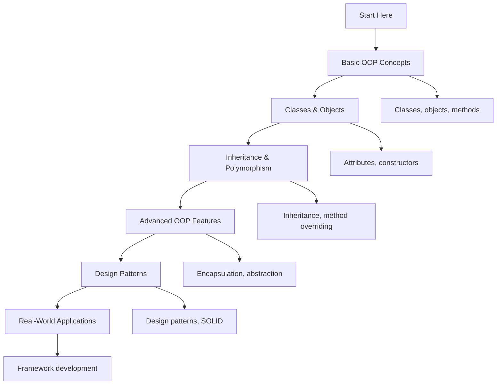

# 🐍 Object-Oriented Programming: Complete Learning Guide

> **Master Python's object-oriented programming paradigm!** 🏗️

---

## 🎯 **Learning Path Overview**



---

## 📊 **Skill Tree**

### 🌱 **Foundation Level**

- [ ] **Basic OOP Concepts** ⭐
  - [ ] Classes and objects
  - [ ] Methods and attributes
  - [ ] Constructors and initialization
  - [ ] Instance vs class attributes

### 🌿 **Intermediate Level**

- [ ] **Inheritance & Polymorphism** ⭐⭐
  - [ ] Single and multiple inheritance
  - [ ] Method overriding and overloading
  - [ ] Polymorphism and dynamic dispatch
  - [ ] Abstract classes and interfaces

### 🌳 **Advanced Level**

- [ ] **Advanced OOP Features** ⭐⭐⭐
  - [ ] Encapsulation and data hiding
  - [ ] Property decorators
  - [ ] Static and class methods
  - [ ] Metaclasses and descriptors

### 🏔️ **Expert Level**

- [ ] **Design Patterns & Architecture** ⭐⭐⭐⭐
  - [ ] Design patterns (Singleton, Factory, etc.)
  - [ ] SOLID principles
  - [ ] Framework development
  - [ ] Performance optimization

---

## 🗺️ **Learning Roadmap**

### **Week 1: Foundation** 🟢

| Day | Topic                  | Time    | Resources                                                                                   |
| --- | ---------------------- | ------- | ------------------------------------------------------------------------------------------- |
| 1   | Basic OOP Concepts     | 2 hours | [Python Classes](https://docs.python.org/3/tutorial/classes.html)                           |
| 2   | Classes and Objects    | 2 hours | [Class Definition](https://docs.python.org/3/tutorial/classes.html#class-definition-syntax) |
| 3   | Methods and Attributes | 2 hours | [Class Objects](https://docs.python.org/3/tutorial/classes.html#class-objects)              |
| 4   | Constructors           | 2 hours | [Instance Objects](https://docs.python.org/3/tutorial/classes.html#instance-objects)        |
| 5   | Practice & Review      | 2 hours | Questions 1-6                                                                               |

### **Week 2: Intermediate** 🟡

| Day | Topic                | Time    | Resources                                                                                    |
| --- | -------------------- | ------- | -------------------------------------------------------------------------------------------- |
| 6   | Inheritance          | 3 hours | [Inheritance](https://docs.python.org/3/tutorial/classes.html#inheritance)                   |
| 7   | Method Overriding    | 2 hours | [Method Overriding](https://docs.python.org/3/tutorial/classes.html#inheritance)             |
| 8   | Multiple Inheritance | 2 hours | [Multiple Inheritance](https://docs.python.org/3/tutorial/classes.html#multiple-inheritance) |
| 9   | Polymorphism         | 2 hours | [Polymorphism](https://docs.python.org/3/tutorial/classes.html#inheritance)                  |
| 10  | Practice & Review    | 2 hours | Questions 7-12                                                                               |

### **Week 3: Advanced** 🟠

| Day | Topic                    | Time    | Resources                                                                              |
| --- | ------------------------ | ------- | -------------------------------------------------------------------------------------- |
| 11  | Encapsulation            | 3 hours | [Private Variables](https://docs.python.org/3/tutorial/classes.html#private-variables) |
| 12  | Property Decorators      | 3 hours | [Property Decorators](https://docs.python.org/3/library/functions.html#property)       |
| 13  | Static and Class Methods | 2 hours | [Static Methods](https://docs.python.org/3/library/functions.html#staticmethod)        |
| 14  | Abstract Classes         | 2 hours | [Abstract Base Classes](https://docs.python.org/3/library/abc.html)                    |
| 15  | Practice & Review        | 2 hours | Questions 13-17                                                                        |

### **Week 4: Expert** 🔴

| Day | Topic            | Time    | Resources                                                                     |
| --- | ---------------- | ------- | ----------------------------------------------------------------------------- |
| 16  | Design Patterns  | 3 hours | [Design Patterns](https://docs.python.org/3/howto/doanddont.html)             |
| 17  | SOLID Principles | 2 hours | [SOLID Principles](https://docs.python.org/3/tutorial/classes.html)           |
| 18  | Metaclasses      | 3 hours | [Metaclasses](https://docs.python.org/3/reference/datamodel.html#metaclasses) |
| 19  | Final Review     | 2 hours | All Questions                                                                 |
| 20  | Assessment       | 1 hour  | Interview Questions                                                           |

---

## 🎯 **How to Use This Folder**

### 📋 **Daily Study Routine**

1. **📖 Read the theory** (30 minutes)
2. **✏️ Solve questions** (1-2 hours)
3. **🔍 Review mistakes** (30 minutes)
4. **📝 Take notes** (15 minutes)
5. **🔄 Practice concepts** (30 minutes)

### 🎯 **Question Strategy**

- **Start with Basic Level** (Questions 1-6)
- **Move to Intermediate** when comfortable
- **Challenge yourself** with Advanced concepts
- **Master Expert level** for real-world scenarios

### 📊 **Progress Tracking**

```bash
# Mark your progress
✅ Completed
🔄 In Progress
⏳ Not Started
❌ Need Help
```

---

## 🚨 **Common Pitfalls to Avoid**

### ❌ **Beginner Mistakes**

- Not understanding the difference between classes and objects
- Forgetting to use `self` in instance methods
- Not calling the parent constructor in inheritance
- Using mutable default arguments

### ⚠️ **Intermediate Pitfalls**

- Overusing inheritance when composition is better
- Not understanding method resolution order (MRO)
- Ignoring encapsulation principles
- Not using abstract classes properly

### 🔥 **Advanced Gotchas**

- Circular import dependencies
- Memory leaks with circular references
- Performance issues with deep inheritance
- Not understanding metaclasses

---

## 🛠️ **Essential Tools & Resources**

### 📚 **Official Documentation**

- [Python Classes](https://docs.python.org/3/tutorial/classes.html) 📖
- [Data Model](https://docs.python.org/3/reference/datamodel.html) 🔧
- [Abstract Base Classes](https://docs.python.org/3/library/abc.html) 🎯

### 🎓 **Learning Resources**

- [Real Python: OOP](https://realpython.com/python3-object-oriented-programming/) 🐍
- [Python Classes](https://realpython.com/python-classes/) 🏗️
- [Inheritance](https://realpython.com/inheritance-composition-python/) 🔄

### 🧪 **Practice Platforms**

- [Python OOP](https://www.hackerrank.com/) 🏆
- [OOP Problems](https://leetcode.com/) 💻
- [Class Design](https://www.codewars.com/) ⚔️

### 🔍 **Debugging Tools**

- [Python Debugger (pdb)](https://docs.python.org/3/library/pdb.html) 🐛
- [Class Inspector](https://docs.python.org/3/library/inspect.html) 🔍
- [VS Code Python Extension](https://marketplace.visualstudio.com/items?itemName=ms-python.python) 💻

---

## 📈 **Assessment & Evaluation**

### 🎯 **Self-Assessment Questions**

After completing each level, ask yourself:

**Basic Level:**

- [ ] Can I create classes and objects?
- [ ] Do I understand methods and attributes?
- [ ] Can I use constructors properly?
- [ ] Do I understand instance vs class attributes?

**Intermediate Level:**

- [ ] Can I implement inheritance?
- [ ] Do I understand method overriding?
- [ ] Can I work with multiple inheritance?
- [ ] Do I understand polymorphism?

**Advanced Level:**

- [ ] Can I implement encapsulation?
- [ ] Do I understand property decorators?
- [ ] Can I use static and class methods?
- [ ] Do I work with abstract classes?

**Expert Level:**

- [ ] Can I implement design patterns?
- [ ] Do I understand SOLID principles?
- [ ] Can I create metaclasses?
- [ ] Do I design OOP architectures?

---

## 🚀 **Modern Python Features (2025)**

### ✨ **Dataclasses and Type Hints**

```python
from dataclasses import dataclass, field
from typing import List, Optional, Dict, Any
from datetime import datetime

@dataclass
class User:
    """Modern user class with dataclass."""
    name: str
    email: str
    age: int
    created_at: datetime = field(default_factory=datetime.now)
    preferences: Dict[str, Any] = field(default_factory=dict)

    def __post_init__(self):
        """Validate data after initialization."""
        if not self.name.strip():
            raise ValueError("Name cannot be empty")
        if '@' not in self.email:
            raise ValueError("Invalid email format")
        if self.age < 0:
            raise ValueError("Age cannot be negative")

# Usage
user = User("Alice", "alice@example.com", 30)
print(user)  # User(name='Alice', email='alice@example.com', age=30, ...)
```

### 🎯 **Pattern Matching with Classes**

```python
from typing import Union

class Shape:
    """Base shape class."""
    pass

class Circle(Shape):
    def __init__(self, radius: float):
        self.radius = radius

class Rectangle(Shape):
    def __init__(self, width: float, height: float):
        self.width = width
        self.height = height

def calculate_area(shape: Shape) -> float:
    """Calculate area using pattern matching."""
    match shape:
        case Circle(radius=r):
            return 3.14159 * r * r
        case Rectangle(width=w, height=h):
            return w * h
        case _:
            raise ValueError("Unknown shape")

# Usage
circle = Circle(5.0)
rectangle = Rectangle(4.0, 6.0)
print(calculate_area(circle))     # 78.53975
print(calculate_area(rectangle))  # 24.0
```

### 🔍 **Advanced OOP with Protocols**

```python
from typing import Protocol, runtime_checkable
from abc import ABC, abstractmethod

@runtime_checkable
class Drawable(Protocol):
    """Protocol for drawable objects."""
    def draw(self) -> str:
        ...

class Shape(ABC):
    """Abstract base class for shapes."""

    @abstractmethod
    def area(self) -> float:
        """Calculate area."""
        pass

    @abstractmethod
    def perimeter(self) -> float:
        """Calculate perimeter."""
        pass

class Circle(Shape, Drawable):
    """Circle implementation."""

    def __init__(self, radius: float):
        self.radius = radius

    def area(self) -> float:
        return 3.14159 * self.radius ** 2

    def perimeter(self) -> float:
        return 2 * 3.14159 * self.radius

    def draw(self) -> str:
        return f"Drawing circle with radius {self.radius}"

def process_drawable(obj: Drawable) -> str:
    """Process any drawable object."""
    return obj.draw()

# Usage
circle = Circle(5.0)
print(process_drawable(circle))  # "Drawing circle with radius 5.0"
```

---

## 📊 **Success Metrics**

### 🎯 **Completion Criteria**

- [ ] **Basic Level**: Complete all questions 1-6
- [ ] **Intermediate Level**: Complete all questions 7-12
- [ ] **Advanced Level**: Complete all questions 13-17
- [ ] **Expert Level**: Complete all questions 18-20
- [ ] **Additional Practice**: Complete all questions 21-30

### 📈 **Performance Benchmarks**

- **Object Creation**: < 0.1ms per object
- **Method Calls**: < 0.05ms per method call
- **Inheritance**: < 0.1ms per inheritance level
- **Memory Usage**: < 1KB per object instance

### 🏆 **Mastery Indicators**

- Can design and implement classes effectively
- Understands inheritance and polymorphism
- Implements encapsulation and abstraction
- Uses design patterns and SOLID principles
- Creates maintainable OOP architectures

---

## 🔗 **Related Topics**

- **Variables and Data Types**: Object attributes and types
- **Control Flow**: Object-based decision making
- **Functions**: Methods and class functions
- **Data Structures**: Object data structures
- **String Manipulation**: Object string representation
- **File Handling**: Object serialization
- **Error Handling**: Exception classes
- **Modules**: Class organization
- **List Comprehensions**: Object comprehensions
- **Decorators**: Class decorators
- **Generators**: Object generators

---

## 🎉 **Congratulations!**

You've completed the Object-Oriented Programming learning path! You now have:

- ✅ **Solid foundation** in Python OOP
- ✅ **Advanced skills** in inheritance and polymorphism
- ✅ **Expert knowledge** in design patterns
- ✅ **Real-world experience** with OOP architecture

**Next Steps:**

- Practice with real-world projects
- Explore related topics (Modules, Decorators)
- Build OOP applications
- Contribute to open-source projects

---

> **💡 Pro Tip:** Object-oriented programming is fundamental to building scalable applications. Master these concepts and you'll be able to create maintainable, extensible code!

---

_Happy Learning! Remember, good OOP design makes your code organized and reusable! 🏗️✨_
