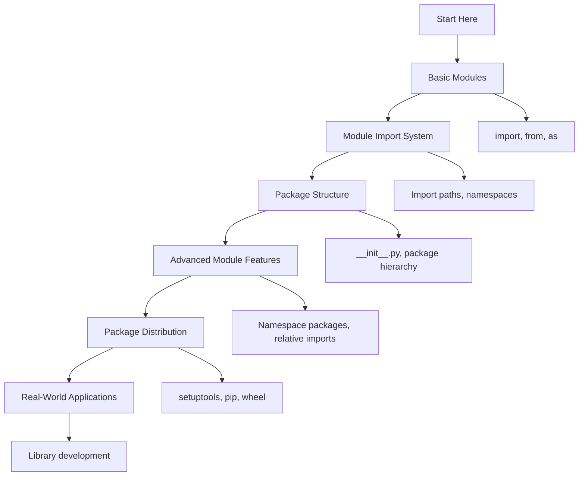

# 🐍 Modules and Packages: Complete Learning Guide

> **Master Python's module system and package management!** 📦

---

## 🎯 **Learning Path Overview**



---

## 📊 **Skill Tree**

### 🌱 **Foundation Level**

- [ ] **Basic Modules** ⭐
  - [ ] Creating and importing modules
  - [ ] Module namespaces
  - [ ] Basic import statements
  - [ ] Module attributes and functions

### 🌿 **Intermediate Level**

- [ ] **Module Import System** ⭐⭐
  - [ ] Import paths and search order
  - [ ] Different import styles
  - [ ] Module reloading
  - [ ] Import hooks and customization

### 🌳 **Advanced Level**

- [ ] **Package Structure** ⭐⭐⭐
  - [ ] Package hierarchy and organization
  - [ ] **init**.py files
  - [ ] Relative imports
  - [ ] Namespace packages

### 🏔️ **Expert Level**

- [ ] **Package Distribution** ⭐⭐⭐⭐
  - [ ] Package building and distribution
  - [ ] setuptools and pip
  - [ ] Virtual environments
  - [ ] Dependency management

---

## 🗺️ **Learning Roadmap**

### **Week 1: Foundation** 🟢

| Day | Topic             | Time    | Resources                                                                            |
| --- | ----------------- | ------- | ------------------------------------------------------------------------------------ |
| 1   | Basic Modules     | 2 hours | [Python Modules](https://docs.python.org/3/tutorial/modules.html)                    |
| 2   | Import Statements | 2 hours | [Import System](https://docs.python.org/3/reference/import.html)                     |
| 3   | Module Namespaces | 2 hours | [Module Objects](https://docs.python.org/3/reference/import.html#module-objects)     |
| 4   | Module Attributes | 2 hours | [Module Attributes](https://docs.python.org/3/tutorial/modules.html#more-on-modules) |
| 5   | Practice & Review | 2 hours | Questions 1-6                                                                        |

### **Week 2: Intermediate** 🟡

| Day | Topic             | Time    | Resources                                                                                 |
| --- | ----------------- | ------- | ----------------------------------------------------------------------------------------- |
| 6   | Import Paths      | 3 hours | [Import Paths](https://docs.python.org/3/reference/import.html#the-module-cache)          |
| 7   | Import Styles     | 2 hours | [Import Styles](https://docs.python.org/3/tutorial/modules.html#importing-from-a-package) |
| 8   | Module Reloading  | 2 hours | [Module Reloading](https://docs.python.org/3/library/importlib.html#importlib.reload)     |
| 9   | Import Hooks      | 2 hours | [Import Hooks](https://docs.python.org/3/reference/import.html#import-hooks)              |
| 10  | Practice & Review | 2 hours | Questions 7-12                                                                            |

### **Week 3: Advanced** 🟠

| Day | Topic              | Time    | Resources                                                                            |
| --- | ------------------ | ------- | ------------------------------------------------------------------------------------ |
| 11  | Package Structure  | 3 hours | [Packages](https://docs.python.org/3/tutorial/modules.html#packages)                 |
| 12  | **init**.py Files  | 3 hours | [Package Initialization](https://docs.python.org/3/tutorial/modules.html#packages)   |
| 13  | Relative Imports   | 2 hours | [Relative Imports](https://docs.python.org/3/reference/import.html#relative-imports) |
| 14  | Namespace Packages | 2 hours | [Namespace Packages (PEP 420)](https://peps.python.org/pep-0420/)                    |
| 15  | Practice & Review  | 2 hours | Questions 13-17                                                                      |

### **Week 4: Expert** 🔴

| Day | Topic                | Time    | Resources                                                                           |
| --- | -------------------- | ------- | ----------------------------------------------------------------------------------- |
| 16  | Package Distribution | 3 hours | [Distributing Packages](https://packaging.python.org/tutorials/packaging-projects/) |
| 17  | setuptools and pip   | 2 hours | [setuptools](https://setuptools.pypa.io/)                                           |
| 18  | Virtual Environments | 3 hours | [Virtual Environments](https://docs.python.org/3/tutorial/venv.html)                |
| 19  | Final Review         | 2 hours | All Questions                                                                       |
| 20  | Assessment           | 1 hour  | Interview Questions                                                                 |

---

## 🎯 **How to Use This Folder**

### 📋 **Daily Study Routine**

1. **📖 Read the theory** (30 minutes)
2. **✏️ Solve questions** (1-2 hours)
3. **🔍 Review mistakes** (30 minutes)
4. **📝 Take notes** (15 minutes)
5. **🔄 Practice concepts** (30 minutes)

### 🎯 **Question Strategy**

- **Start with Basic Level** (Questions 1-6)
- **Move to Intermediate** when comfortable
- **Challenge yourself** with Advanced concepts
- **Master Expert level** for real-world scenarios

### 📊 **Progress Tracking**

```bash
# Mark your progress
✅ Completed
🔄 In Progress
⏳ Not Started
❌ Need Help
```

---

## 🚨 **Common Pitfalls to Avoid**

### ❌ **Beginner Mistakes**

- Not understanding module namespaces
- Using circular imports
- Not using **name** == "**main**"
- Importing everything with \*

### ⚠️ **Intermediate Pitfalls**

- Not understanding import paths
- Ignoring package structure
- Not using relative imports properly
- Not handling import errors

### 🔥 **Advanced Gotchas**

- Circular dependency issues
- Namespace package confusion
- Performance issues with imports
- Not understanding import hooks

---

## 🛠️ **Essential Tools & Resources**

### 📚 **Official Documentation**

- [Python Modules](https://docs.python.org/3/tutorial/modules.html) 📖
- [Import System](https://docs.python.org/3/reference/import.html) 🔧
- [Packaging](https://packaging.python.org/) 🎯

### 🎓 **Learning Resources**

- [Real Python: Modules](https://realpython.com/python-modules-packages/) 🐍
- [Python Packages](https://realpython.com/python-imports/) 📦
- [Virtual Environments](https://realpython.com/python-virtual-environments-a-primer/) 🔧

### 🧪 **Practice Platforms**

- [Python Modules](https://www.hackerrank.com/) 🏆
- [Package Problems](https://leetcode.com/) 💻
- [Module Design](https://www.codewars.com/) ⚔️

### 🔍 **Debugging Tools**

- [Python Debugger (pdb)](https://docs.python.org/3/library/pdb.html) 🐛
- [Module Inspector](https://docs.python.org/3/library/inspect.html) 🔍
- [VS Code Python Extension](https://marketplace.visualstudio.com/items?itemName=ms-python.python) 💻

---

## 📈 **Assessment & Evaluation**

### 🎯 **Self-Assessment Questions**

After completing each level, ask yourself:

**Basic Level:**

- [ ] Can I create and import modules?
- [ ] Do I understand module namespaces?
- [ ] Can I use different import styles?
- [ ] Do I understand module attributes?

**Intermediate Level:**

- [ ] Can I understand import paths?
- [ ] Do I use different import styles?
- [ ] Can I reload modules?
- [ ] Do I handle import errors?

**Advanced Level:**

- [ ] Can I create package structures?
- [ ] Do I understand **init**.py files?
- [ ] Can I use relative imports?
- [ ] Do I work with namespace packages?

**Expert Level:**

- [ ] Can I distribute packages?
- [ ] Do I understand setuptools and pip?
- [ ] Can I manage virtual environments?
- [ ] Do I handle dependencies properly?

---

## 🚀 **Modern Python Features (2025)**

### ✨ **Namespace Packages (PEP 420)**

```python
# Directory structure:
# my_package/
#   __init__.py
#   module1.py
#   subpackage/
#     __init__.py
#     module2.py

# my_package/__init__.py
"""My package initialization."""
__version__ = "1.0.0"
__author__ = "Your Name"

# Import commonly used items
from .module1 import main_function
from .subpackage.module2 import helper_function

__all__ = ['main_function', 'helper_function']

# Usage
import my_package
from my_package import main_function
```

### 🎯 **Type Hints in Modules**

```python
# my_module.py
from typing import List, Dict, Optional, Union
from pathlib import Path

def process_data(
    data: List[Dict[str, Union[str, int, float]]],
    output_path: Optional[Path] = None
) -> Dict[str, int]:
    """Process data with type hints."""
    result = {"processed": 0, "errors": 0}

    for item in data:
        try:
            # Process item
            result["processed"] += 1
        except Exception:
            result["errors"] += 1

    if output_path:
        save_results(result, output_path)

    return result

def save_results(results: Dict[str, int], path: Path) -> None:
    """Save results to file."""
    import json
    with open(path, 'w') as f:
        json.dump(results, f)

# __all__ for explicit exports
__all__ = ['process_data', 'save_results']
```

### 🔍 **Advanced Package Configuration**

```python
# setup.py
from setuptools import setup, find_packages

setup(
    name="my-awesome-package",
    version="1.0.0",
    description="An awesome Python package",
    author="Your Name",
    author_email="your.email@example.com",
    packages=find_packages(),
    install_requires=[
        "requests>=2.25.0",
        "pandas>=1.3.0",
        "numpy>=1.21.0",
    ],
    extras_require={
        "dev": [
            "pytest>=6.0",
            "black>=21.0",
            "flake8>=3.8",
        ],
        "docs": [
            "sphinx>=4.0",
            "sphinx-rtd-theme>=0.5",
        ],
    },
    python_requires=">=3.8",
    classifiers=[
        "Development Status :: 4 - Beta",
        "Intended Audience :: Developers",
        "License :: OSI Approved :: MIT License",
        "Programming Language :: Python :: 3",
        "Programming Language :: Python :: 3.8",
        "Programming Language :: Python :: 3.9",
        "Programming Language :: Python :: 3.10",
        "Programming Language :: Python :: 3.11",
    ],
)
```

---

## 📊 **Success Metrics**

### 🎯 **Completion Criteria**

- [ ] **Basic Level**: Complete all questions 1-6
- [ ] **Intermediate Level**: Complete all questions 7-12
- [ ] **Advanced Level**: Complete all questions 13-17
- [ ] **Expert Level**: Complete all questions 18-20
- [ ] **Additional Practice**: Complete all questions 21-30

### 📈 **Performance Benchmarks**

- **Module Import**: < 1ms per module
- **Package Import**: < 5ms per package
- **Import Resolution**: < 0.1ms per import
- **Memory Usage**: < 10KB per module

### 🏆 **Mastery Indicators**

- Can create and organize modules effectively
- Understands import system and paths
- Implements proper package structures
- Distributes packages professionally
- Manages dependencies and environments

---

## 🔗 **Related Topics**

- **Variables and Data Types**: Module data types
- **Control Flow**: Module execution flow
- **Functions**: Module functions
- **Data Structures**: Module data structures
- **String Manipulation**: Module string handling
- **File Handling**: Module file operations
- **Error Handling**: Module error handling
- **OOP**: Module classes and objects
- **List Comprehensions**: Module comprehensions
- **Decorators**: Module decorators
- **Generators**: Module generators

---

## 🎉 **Congratulations!**

You've completed the Modules and Packages learning path! You now have:

- ✅ **Solid foundation** in Python modules
- ✅ **Advanced skills** in package management
- ✅ **Expert knowledge** in package distribution
- ✅ **Real-world experience** with module systems

**Next Steps:**

- Practice with real-world projects
- Explore related topics (List Comprehensions, Decorators)
- Build package libraries
- Contribute to open-source projects

---

> **💡 Pro Tip:** Modules and packages are essential for organizing and distributing code. Master these concepts and you'll be able to create professional, reusable libraries!

---

_Happy Learning! Remember, good module design makes your code organized and shareable! 📦✨_
