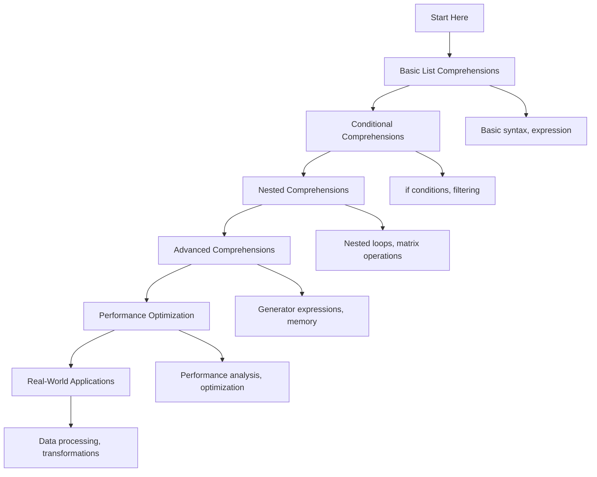

# 🐍 List Comprehensions: Complete Learning Guide

> **Master Python's powerful list comprehension syntax!** 🔄

---

## 🎯 **Learning Path Overview**



---

## 📊 **Skill Tree**

### 🌱 **Foundation Level**

- [ ] **Basic List Comprehensions** ⭐
  - [ ] Basic syntax and structure
  - [ ] Simple expressions
  - [ ] Basic iteration
  - [ ] Converting loops to comprehensions

### 🌿 **Intermediate Level**

- [ ] **Conditional Comprehensions** ⭐⭐
  - [ ] if conditions and filtering
  - [ ] Multiple conditions
  - [ ] Conditional expressions
  - [ ] Complex filtering logic

### 🌳 **Advanced Level**

- [ ] **Nested and Advanced Comprehensions** ⭐⭐⭐
  - [ ] Nested comprehensions
  - [ ] Matrix operations
  - [ ] Dictionary and set comprehensions
  - [ ] Generator expressions

### 🏔️ **Expert Level**

- [ ] **Performance and Optimization** ⭐⭐⭐⭐
  - [ ] Performance analysis
  - [ ] Memory optimization
  - [ ] Alternative approaches
  - [ ] Real-world optimization

---

## 🗺️ **Learning Roadmap**

### **Week 1: Foundation** 🟢

| Day | Topic                     | Time    | Resources                                                                                                             |
| --- | ------------------------- | ------- | --------------------------------------------------------------------------------------------------------------------- |
| 1   | Basic List Comprehensions | 2 hours | [List Comprehensions](https://docs.python.org/3/tutorial/datastructures.html#list-comprehensions)                     |
| 2   | Basic Syntax              | 2 hours | [Comprehension Syntax](https://docs.python.org/3/reference/expressions.html#displays-for-lists-sets-and-dictionaries) |
| 3   | Simple Expressions        | 2 hours | [Expressions](https://docs.python.org/3/reference/expressions.html)                                                   |
| 4   | Converting Loops          | 2 hours | [Loop Conversion](https://docs.python.org/3/tutorial/datastructures.html#list-comprehensions)                         |
| 5   | Practice & Review         | 2 hours | Questions 1-6                                                                                                         |

### **Week 2: Intermediate** 🟡

| Day | Topic                      | Time    | Resources                                                                                                |
| --- | -------------------------- | ------- | -------------------------------------------------------------------------------------------------------- |
| 6   | Conditional Comprehensions | 3 hours | [Conditional Comprehensions](https://docs.python.org/3/tutorial/datastructures.html#list-comprehensions) |
| 7   | if Conditions              | 2 hours | [if Conditions](https://docs.python.org/3/reference/expressions.html#conditional-expressions)            |
| 8   | Multiple Conditions        | 2 hours | [Multiple Conditions](https://docs.python.org/3/tutorial/datastructures.html#list-comprehensions)        |
| 9   | Complex Filtering          | 2 hours | [Filtering](https://docs.python.org/3/library/functions.html#filter)                                     |
| 10  | Practice & Review          | 2 hours | Questions 7-12                                                                                           |

### **Week 3: Advanced** 🟠

| Day | Topic                     | Time    | Resources                                                                                                                  |
| --- | ------------------------- | ------- | -------------------------------------------------------------------------------------------------------------------------- |
| 11  | Nested Comprehensions     | 3 hours | [Nested Comprehensions](https://docs.python.org/3/tutorial/datastructures.html#nested-list-comprehensions)                 |
| 12  | Matrix Operations         | 3 hours | [Matrix Operations](https://docs.python.org/3/tutorial/datastructures.html#nested-list-comprehensions)                     |
| 13  | Dictionary Comprehensions | 2 hours | [Dictionary Comprehensions](https://docs.python.org/3/reference/expressions.html#displays-for-lists-sets-and-dictionaries) |
| 14  | Generator Expressions     | 2 hours | [Generator Expressions](https://docs.python.org/3/reference/expressions.html#generator-expressions)                        |
| 15  | Practice & Review         | 2 hours | Questions 13-17                                                                                                            |

### **Week 4: Expert** 🔴

| Day | Topic                  | Time    | Resources                                                                  |
| --- | ---------------------- | ------- | -------------------------------------------------------------------------- |
| 16  | Performance Analysis   | 3 hours | [Performance](https://wiki.python.org/moin/PythonSpeed/PerformanceTips)    |
| 17  | Memory Optimization    | 2 hours | [Memory Management](https://docs.python.org/3/c-api/memory.html)           |
| 18  | Alternative Approaches | 3 hours | [Alternative Approaches](https://docs.python.org/3/library/itertools.html) |
| 19  | Final Review           | 2 hours | All Questions                                                              |
| 20  | Assessment             | 1 hour  | Interview Questions                                                        |

---

## 🎯 **How to Use This Folder**

### 📋 **Daily Study Routine**

1. **📖 Read the theory** (30 minutes)
2. **✏️ Solve questions** (1-2 hours)
3. **🔍 Review mistakes** (30 minutes)
4. **📝 Take notes** (15 minutes)
5. **🔄 Practice concepts** (30 minutes)

### 🎯 **Question Strategy**

- **Start with Basic Level** (Questions 1-6)
- **Move to Intermediate** when comfortable
- **Challenge yourself** with Advanced concepts
- **Master Expert level** for real-world scenarios

### 📊 **Progress Tracking**

```bash
# Mark your progress
✅ Completed
🔄 In Progress
⏳ Not Started
❌ Need Help
```

---

## 🚨 **Common Pitfalls to Avoid**

### ❌ **Beginner Mistakes**

- Not understanding the syntax order
- Forgetting to use square brackets
- Not handling empty lists properly
- Overcomplicating simple expressions

### ⚠️ **Intermediate Pitfalls**

- Creating overly complex comprehensions
- Not using generator expressions for large data
- Ignoring readability for performance
- Not understanding memory implications

### 🔥 **Advanced Gotchas**

- Performance issues with large comprehensions
- Memory problems with nested comprehensions
- Not using appropriate alternatives
- Over-optimizing prematurely

---

## 🛠️ **Essential Tools & Resources**

### 📚 **Official Documentation**

- [List Comprehensions](https://docs.python.org/3/tutorial/datastructures.html#list-comprehensions) 📖
- [Generator Expressions](https://docs.python.org/3/reference/expressions.html#generator-expressions) 🔧
- [itertools](https://docs.python.org/3/library/itertools.html) 🎯

### 🎓 **Learning Resources**

- [Real Python: List Comprehensions](https://realpython.com/list-comprehension-python/) 🐍
- [Python Comprehensions](https://realpython.com/python-list-comprehension/) 🔄
- [Generator Expressions](https://realpython.com/introduction-to-python-generators/) ⚡

### 🧪 **Practice Platforms**

- [Python Comprehensions](https://www.hackerrank.com/) 🏆
- [List Problems](https://leetcode.com/) 💻
- [Comprehension Challenges](https://www.codewars.com/) ⚔️

### 🔍 **Debugging Tools**

- [Python Debugger (pdb)](https://docs.python.org/3/library/pdb.html) 🐛
- [Performance Profiler](https://docs.python.org/3/library/profile.html) 🔍
- [VS Code Python Extension](https://marketplace.visualstudio.com/items?itemName=ms-python.python) 💻

---

## 📈 **Assessment & Evaluation**

### 🎯 **Self-Assessment Questions**

After completing each level, ask yourself:

**Basic Level:**

- [ ] Can I write basic list comprehensions?
- [ ] Do I understand the syntax structure?
- [ ] Can I convert simple loops to comprehensions?
- [ ] Do I understand basic expressions?

**Intermediate Level:**

- [ ] Can I use conditional comprehensions?
- [ ] Do I understand if conditions in comprehensions?
- [ ] Can I handle multiple conditions?
- [ ] Do I implement complex filtering?

**Advanced Level:**

- [ ] Can I write nested comprehensions?
- [ ] Do I understand matrix operations?
- [ ] Can I use dictionary comprehensions?
- [ ] Do I understand generator expressions?

**Expert Level:**

- [ ] Can I analyze comprehension performance?
- [ ] Do I optimize memory usage?
- [ ] Can I choose appropriate alternatives?
- [ ] Do I optimize for real-world scenarios?

---

## 🚀 **Modern Python Features (2025)**

### ✨ **Enhanced List Comprehensions**

```python
from typing import List, Dict, Any
from dataclasses import dataclass

@dataclass
class User:
    name: str
    age: int
    is_active: bool

# Modern list comprehension with type hints
users: List[User] = [
    User("Alice", 25, True),
    User("Bob", 30, False),
    User("Charlie", 35, True)
]

# Enhanced filtering and transformation
active_users: List[str] = [
    user.name.upper()
    for user in users
    if user.is_active and user.age >= 25
]

# Dictionary comprehension with modern syntax
user_stats: Dict[str, int] = {
    user.name: user.age
    for user in users
    if user.is_active
}

print(active_users)  # ['ALICE', 'CHARLIE']
print(user_stats)    # {'Alice': 25, 'Charlie': 35}
```

### 🎯 **Pattern Matching with Comprehensions**

```python
from typing import Union, List

def process_data(data: List[Union[str, int, float]]) -> List[str]:
    """Process data using pattern matching in comprehensions."""
    return [
        match item:
            case str() as s if len(s) > 5:
                f"Long string: {s[:10]}..."
            case int() as n if n > 0:
                f"Positive number: {n}"
            case float() as f if f < 0:
                f"Negative float: {f:.2f}"
            case _:
                f"Other: {item}"
        for item in data
    ]

# Usage
data = ["hello world", 42, -3.14, "short", 0]
result = process_data(data)
print(result)  # ['Long string: hello worl...', 'Positive number: 42', 'Negative float: -3.14', 'Other: short', 'Other: 0']
```

### 🔍 **Advanced Comprehension Patterns**

```python
from itertools import chain, islice
from typing import Iterator, List, Dict

def advanced_comprehensions():
    """Advanced comprehension patterns."""

    # Generator expression for memory efficiency
    large_numbers = (x * x for x in range(1000000))

    # Chained comprehensions
    matrix = [[1, 2, 3], [4, 5, 6], [7, 8, 9]]
    flattened = [item for row in matrix for item in row]

    # Conditional nested comprehension
    filtered_matrix = [
        [cell for cell in row if cell % 2 == 0]
        for row in matrix
        if any(cell % 2 == 0 for cell in row)
    ]

    # Dictionary comprehension with complex logic
    word_counts = {
        word: len([c for c in word if c.isupper()])
        for word in ["Hello", "WORLD", "Python", "programming"]
        if len(word) > 3
    }

    # Set comprehension for unique values
    unique_squares = {x * x for x in range(10) if x % 2 == 0}

    return {
        "flattened": flattened,
        "filtered_matrix": filtered_matrix,
        "word_counts": word_counts,
        "unique_squares": unique_squares
    }

# Usage
results = advanced_comprehensions()
print(results)
```

---

## 📊 **Success Metrics**

### 🎯 **Completion Criteria**

- [ ] **Basic Level**: Complete all questions 1-6
- [ ] **Intermediate Level**: Complete all questions 7-12
- [ ] **Advanced Level**: Complete all questions 13-17
- [ ] **Expert Level**: Complete all questions 18-20
- [ ] **Additional Practice**: Complete all questions 21-30

### 📈 **Performance Benchmarks**

- **Basic Comprehensions**: < 0.1ms per 1000 items
- **Conditional Comprehensions**: < 0.2ms per 1000 items
- **Nested Comprehensions**: < 1ms per 100x100 matrix
- **Memory Usage**: < 1MB per 100,000 items

### 🏆 **Mastery Indicators**

- Can write efficient list comprehensions
- Understands when to use comprehensions vs alternatives
- Implements complex filtering and transformation
- Optimizes performance and memory usage
- Applies comprehensions in real-world scenarios

---

## 🔗 **Related Topics**

- **Variables and Data Types**: List data types
- **Control Flow**: Comprehension control flow
- **Functions**: Comprehension functions
- **Data Structures**: List operations
- **String Manipulation**: String comprehensions
- **File Handling**: File data comprehensions
- **Error Handling**: Comprehension error handling
- **OOP**: Object comprehensions
- **Modules**: Module comprehensions
- **Decorators**: Comprehension decorators
- **Generators**: Generator expressions

---

## 🎉 **Congratulations!**

You've completed the List Comprehensions learning path! You now have:

- ✅ **Solid foundation** in Python list comprehensions
- ✅ **Advanced skills** in conditional comprehensions
- ✅ **Expert knowledge** in performance optimization
- ✅ **Real-world experience** with comprehension patterns

**Next Steps:**

- Practice with real-world projects
- Explore related topics (Decorators, Generators)
- Build data processing applications
- Contribute to open-source projects

---

> **💡 Pro Tip:** List comprehensions are a powerful Python feature for creating readable, efficient code. Master these concepts and you'll write more elegant and performant Python!

---

_Happy Learning! Remember, good comprehensions make your code concise and readable! 🔄✨_
