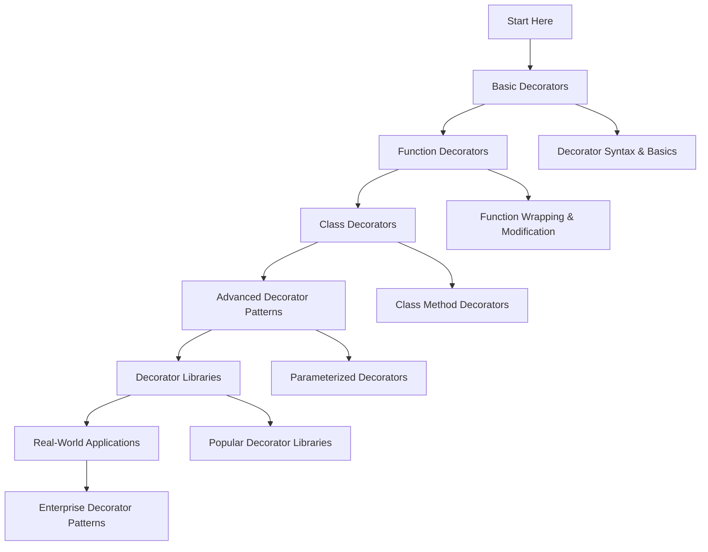

# 🐍 Decorators: Complete Learning Guide

> **Master Python's powerful decorator pattern!** 🎨

---

## 🎯 **Learning Path Overview**



---

## 📊 **Skill Tree**

### 🌱 **Foundation Level**

- [ ] **Basic Decorators** ⭐
  - [ ] Decorator syntax and syntax sugar
  - [ ] Simple function decorators
  - [ ] Decorator execution order
  - [ ] Basic function wrapping

### 🌿 **Intermediate Level**

- [ ] **Function Decorators** ⭐⭐
  - [ ] Function modification and wrapping
  - [ ] Preserving function metadata
  - [ ] Decorator with arguments
  - [ ] Multiple decorators

### 🌳 **Advanced Level**

- [ ] **Class Decorators & Advanced Patterns** ⭐⭐⭐
  - [ ] Class and method decorators
  - [ ] Property decorators
  - [ ] Parameterized decorators
  - [ ] Decorator factories

### 🏔️ **Expert Level**

- [ ] **Decorator Libraries & Enterprise Patterns** ⭐⭐⭐⭐
  - [ ] Popular decorator libraries
  - [ ] Performance decorators
  - [ ] Enterprise decorator patterns
  - [ ] Custom decorator frameworks

---

## 🗺️ **Learning Roadmap**

### **Week 1: Foundation** 🟢

| Day | Topic                     | Time    | Resources                                                                                        |
| --- | ------------------------- | ------- | ------------------------------------------------------------------------------------------------ |
| 1   | Basic Decorators          | 2 hours | [Python Decorators](https://docs.python.org/3/glossary.html#term-decorator)                      |
| 2   | Decorator Syntax          | 2 hours | [Decorator Syntax](https://docs.python.org/3/reference/compound_stmts.html#function-definitions) |
| 3   | Simple Function Wrapping  | 2 hours | [Function Wrapping](https://docs.python.org/3/reference/datamodel.html#descriptors)              |
| 4   | Decorator Execution Order | 2 hours | [Execution Order](https://docs.python.org/3/reference/compound_stmts.html#function-definitions)  |
| 5   | Practice & Review         | 2 hours | Questions 1-6                                                                                    |

### **Week 2: Intermediate** 🟡

| Day | Topic                    | Time    | Resources                                                                                                |
| --- | ------------------------ | ------- | -------------------------------------------------------------------------------------------------------- |
| 6   | Function Modification    | 3 hours | [Function Modification](https://docs.python.org/3/library/functools.html#functools.wraps)                |
| 7   | Preserving Metadata      | 2 hours | [Function Metadata](https://docs.python.org/3/library/inspect.html)                                      |
| 8   | Decorator with Arguments | 2 hours | [Parameterized Decorators](https://docs.python.org/3/reference/compound_stmts.html#function-definitions) |
| 9   | Multiple Decorators      | 2 hours | [Multiple Decorators](https://docs.python.org/3/reference/compound_stmts.html#function-definitions)      |
| 10  | Practice & Review        | 2 hours | Questions 7-12                                                                                           |

### **Week 3: Advanced** 🟠

| Day | Topic               | Time    | Resources                                                                                           |
| --- | ------------------- | ------- | --------------------------------------------------------------------------------------------------- |
| 11  | Class Decorators    | 3 hours | [Class Decorators](https://docs.python.org/3/reference/compound_stmts.html#class-definitions)       |
| 12  | Method Decorators   | 3 hours | [Method Decorators](https://docs.python.org/3/library/functions.html#property)                      |
| 13  | Property Decorators | 2 hours | [Property Decorators](https://docs.python.org/3/library/functions.html#property)                    |
| 14  | Decorator Factories | 2 hours | [Decorator Factories](https://docs.python.org/3/reference/compound_stmts.html#function-definitions) |
| 15  | Practice & Review   | 2 hours | Questions 13-17                                                                                     |

### **Week 4: Expert** 🔴

| Day | Topic                       | Time    | Resources                                                               |
| --- | --------------------------- | ------- | ----------------------------------------------------------------------- |
| 16  | Popular Decorator Libraries | 3 hours | [Decorator Libraries](https://pypi.org/search/?q=decorator)             |
| 17  | Performance Decorators      | 2 hours | [Performance Decorators](https://docs.python.org/3/library/timeit.html) |
| 18  | Enterprise Patterns         | 3 hours | [Enterprise Patterns](https://docs.python.org/3/howto/doanddont.html)   |
| 19  | Final Review                | 2 hours | All Questions                                                           |
| 20  | Assessment                  | 1 hour  | Interview Questions                                                     |

---

## 🎯 **How to Use This Folder**

### 📋 **Daily Study Routine**

1. **📖 Read the theory** (30 minutes)
2. **✏️ Solve questions** (1-2 hours)
3. **🔍 Review mistakes** (30 minutes)
4. **📝 Take notes** (15 minutes)
5. **🔄 Practice concepts** (30 minutes)

### 🎯 **Question Strategy**

- **Start with Basic Level** (Questions 1-6)
- **Move to Intermediate** when comfortable
- **Challenge yourself** with Advanced concepts
- **Master Expert level** for real-world scenarios

### 📊 **Progress Tracking**

```bash
# Mark your progress
✅ Completed
🔄 In Progress
⏳ Not Started
❌ Need Help
```

---

## 🚨 **Common Pitfalls to Avoid**

### ❌ **Beginner Mistakes**

- Not understanding decorator syntax sugar
- Forgetting to preserve function metadata
- Not handling decorator arguments properly
- Confusing decorator execution order

### ⚠️ **Intermediate Pitfalls**

- Not using `functools.wraps`
- Overcomplicating simple decorators
- Not handling exceptions in decorators
- Ignoring performance implications

### 🔥 **Advanced Gotchas**

- Circular import issues with decorators
- Memory leaks with decorator closures
- Performance overhead of complex decorators
- Not understanding decorator composition

---

## 🛠️ **Essential Tools & Resources**

### 📚 **Official Documentation**

- [Python Decorators](https://docs.python.org/3/glossary.html#term-decorator) 📖
- [functools.wraps](https://docs.python.org/3/library/functools.html#functools.wraps) 🔧
- [Property Decorator](https://docs.python.org/3/library/functions.html#property) 🎨

### 🎓 **Learning Resources**

- [Real Python: Decorators](https://realpython.com/primer-on-python-decorators/) 🐍
- [Python Decorator Guide](https://docs.python.org/3/howto/functional.html#decorators) 📝
- [Decorator Best Practices](https://docs.python.org/3/howto/doanddont.html) 💡

### 🧪 **Practice Platforms**

- [Python Decorator Challenges](https://www.hackerrank.com/) 🏆
- [Decorator Design Problems](https://leetcode.com/) 💻
- [Decorator Projects](https://www.kaggle.com/) 📊

### 🔍 **Development Tools**

- [Python Decorator Library](https://pypi.org/project/decorator/) 🎨
- [Inspect Module](https://docs.python.org/3/library/inspect.html) 🔍
- [Functools Module](https://docs.python.org/3/library/functools.html) ⚡

---

## 📈 **Assessment & Evaluation**

### 🎯 **Self-Assessment Questions**

After completing each level, ask yourself:

**Basic Level:**

- [ ] Can I create simple decorators?
- [ ] Do I understand decorator syntax?
- [ ] Can I wrap functions with decorators?
- [ ] Do I understand execution order?

**Intermediate Level:**

- [ ] Can I modify functions with decorators?
- [ ] Do I preserve function metadata?
- [ ] Can I create parameterized decorators?
- [ ] Do I handle multiple decorators?

**Advanced Level:**

- [ ] Can I create class decorators?
- [ ] Do I understand method decorators?
- [ ] Can I use property decorators?
- [ ] Do I create decorator factories?

**Expert Level:**

- [ ] Can I use popular decorator libraries?
- [ ] Do I create performance decorators?
- [ ] Can I implement enterprise patterns?
- [ ] Do I build custom decorator frameworks?

---

## 🚀 **Modern Python Features (2025)**

### ✨ **Type Hints with Decorators**

```python
from typing import Callable, TypeVar, Any
from functools import wraps

F = TypeVar('F', bound=Callable[..., Any])

def timer(func: F) -> F:
    """Decorator to time function execution."""
    @wraps(func)
    def wrapper(*args, **kwargs):
        import time
        start = time.time()
        result = func(*args, **kwargs)
        end = time.time()
        print(f"{func.__name__} took {end - start:.4f} seconds")
        return result
    return wrapper

@timer
def slow_function():
    import time
    time.sleep(1)
    return "Done!"
```

### 🎯 **Async Decorators**

```python
import asyncio
from functools import wraps
from typing import Callable, Any

def async_retry(max_attempts: int = 3, delay: float = 1.0):
    """Async decorator for retrying failed operations."""
    def decorator(func: Callable) -> Callable:
        @wraps(func)
        async def wrapper(*args, **kwargs) -> Any:
            last_exception = None

            for attempt in range(max_attempts):
                try:
                    return await func(*args, **kwargs)
                except Exception as e:
                    last_exception = e
                    if attempt < max_attempts - 1:
                        await asyncio.sleep(delay * (2 ** attempt))

            raise last_exception
        return wrapper
    return decorator

@async_retry(max_attempts=3, delay=0.5)
async def unreliable_api_call():
    # Simulate unreliable API
    import random
    if random.random() < 0.7:
        raise ConnectionError("API call failed")
    return "Success!"
```

### 🔍 **Class Decorators with Type Parameters**

```python
from typing import TypeVar, Type, Any
from dataclasses import dataclass

T = TypeVar('T')

def singleton(cls: Type[T]) -> Type[T]:
    """Decorator to make a class a singleton."""
    instances = {}

    def get_instance(*args, **kwargs) -> T:
        if cls not in instances:
            instances[cls] = cls(*args, **kwargs)
        return instances[cls]

    return get_instance

@singleton
@dataclass
class DatabaseConnection:
    host: str
    port: int
    database: str

    def connect(self):
        print(f"Connecting to {self.host}:{self.port}/{self.database}")

# Both instances are the same
db1 = DatabaseConnection("localhost", 5432, "mydb")
db2 = DatabaseConnection("localhost", 5432, "mydb")
assert db1 is db2  # True
```

---

## 📊 **Success Metrics**

### 🎯 **Completion Criteria**

- [ ] **Basic Level**: Complete all questions 1-6
- [ ] **Intermediate Level**: Complete all questions 7-12
- [ ] **Advanced Level**: Complete all questions 13-17
- [ ] **Expert Level**: Complete all questions 18-20
- [ ] **Additional Practice**: Complete all questions 21-30

### 📈 **Performance Benchmarks**

- **Simple Decorator**: < 0.1ms overhead
- **Complex Decorator**: < 1ms overhead
- **Decorator Chain**: < 5ms for 10 decorators
- **Memory Usage**: < 1KB per decorator

### 🏆 **Mastery Indicators**

- Can explain decorator syntax and execution
- Understands when and how to use decorators
- Can create parameterized and class decorators
- Uses decorator libraries effectively
- Implements enterprise decorator patterns

---

## 🔗 **Related Topics**

- **Variables and Data Types**: Decorator parameters and types
- **Control Flow**: Decorator execution flow
- **Functions**: Function decorators and wrapping
- **Data Structures**: Decorator data handling
- **String Manipulation**: Decorator string processing
- **File Handling**: Decorator file operations
- **Error Handling**: Exception handling in decorators
- **OOP**: Class and method decorators
- **Modules**: Module-level decorators
- **List Comprehensions**: Decorator comprehensions
- **Generators**: Generator decorators

---


## 🎉 **Congratulations!**

You've completed the Decorators learning path! You now have:

- ✅ **Solid foundation** in decorator syntax
- ✅ **Advanced skills** in function and class decorators
- ✅ **Expert knowledge** in decorator patterns
- ✅ **Real-world experience** with decorator libraries

**Next Steps:**

- Practice with real-world projects
- Explore related topics (Generators)
- Build decorator frameworks
- Contribute to open-source projects

---

> **💡 Pro Tip:** Decorators are one of Python's most elegant features. Master these concepts and you'll be able to write more maintainable and reusable code!

---

_Happy Learning! Remember, decorators make Python code more beautiful and functional! 🎨✨_
