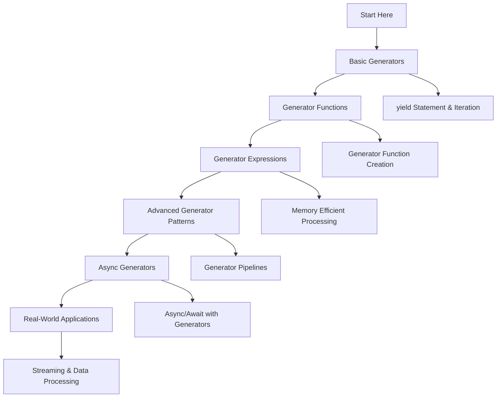

# 🐍 Generators: Complete Learning Guide

> **Master Python's memory-efficient generator functions!** 🔄

---

## 🎯 **Learning Path Overview**



---

## 📊 **Skill Tree**

### 🌱 **Foundation Level**

- [ ] **Basic Generators** ⭐
  - [ ] yield statement and iteration
  - [ ] Basic generator functions
  - [ ] Generator iteration protocol
  - [ ] Memory efficiency concepts

### 🌿 **Intermediate Level**

- [ ] **Generator Functions & Expressions** ⭐⭐
  - [ ] Generator function creation
  - [ ] Generator expressions
  - [ ] Generator methods (send, throw, close)
  - [ ] Generator state management

### 🌳 **Advanced Level**

- [ ] **Advanced Generator Patterns** ⭐⭐⭐
  - [ ] Generator pipelines and chaining
  - [ ] Coroutines and send()
  - [ ] Generator composition
  - [ ] Performance optimization

### 🏔️ **Expert Level**

- [ ] **Async Generators & Real-World Applications** ⭐⭐⭐⭐
  - [ ] Async generators (Python 3.6+)
  - [ ] Streaming data processing
  - [ ] Large-scale data pipelines
  - [ ] Generator-based frameworks

---

## 🗺️ **Learning Roadmap**

### **Week 1: Foundation** 🟢

| Day | Topic               | Time    | Resources                                                                                              |
| --- | ------------------- | ------- | ------------------------------------------------------------------------------------------------------ |
| 1   | Basic Generators    | 2 hours | [Python Generators](https://docs.python.org/3/tutorial/classes.html#generators)                        |
| 2   | yield Statement     | 2 hours | [yield Statement](https://docs.python.org/3/reference/simple_stmts.html#yield)                         |
| 3   | Generator Functions | 2 hours | [Generator Functions](https://docs.python.org/3/tutorial/classes.html#generator-functions)             |
| 4   | Generator Iteration | 2 hours | [Generator Iteration](https://docs.python.org/3/reference/expressions.html#generator-iterator-methods) |
| 5   | Practice & Review   | 2 hours | Questions 1-6                                                                                          |

### **Week 2: Intermediate** 🟡

| Day | Topic                 | Time    | Resources                                                                                            |
| --- | --------------------- | ------- | ---------------------------------------------------------------------------------------------------- |
| 6   | Generator Expressions | 3 hours | [Generator Expressions](https://docs.python.org/3/reference/expressions.html#generator-expressions)  |
| 7   | Generator Methods     | 2 hours | [Generator Methods](https://docs.python.org/3/reference/expressions.html#generator-iterator-methods) |
| 8   | send() and Coroutines | 2 hours | [send() Method](https://docs.python.org/3/reference/expressions.html#generator.send)                 |
| 9   | Generator State       | 2 hours | [Generator State](https://docs.python.org/3/reference/expressions.html#generator-iterator-methods)   |
| 10  | Practice & Review     | 2 hours | Questions 7-12                                                                                       |

### **Week 3: Advanced** 🟠

| Day | Topic                    | Time    | Resources                                                                                 |
| --- | ------------------------ | ------- | ----------------------------------------------------------------------------------------- |
| 11  | Generator Pipelines      | 3 hours | [Generator Pipelines](https://docs.python.org/3/library/itertools.html)                   |
| 12  | Generator Composition    | 3 hours | [Generator Composition](https://docs.python.org/3/library/itertools.html#itertools.chain) |
| 13  | Performance Optimization | 2 hours | [Performance](https://wiki.python.org/moin/PythonSpeed/PerformanceTips)                   |
| 14  | Generator Patterns       | 2 hours | [Generator Patterns](https://docs.python.org/3/howto/functional.html#generators)          |
| 15  | Practice & Review        | 2 hours | Questions 13-17                                                                           |

### **Week 4: Expert** 🔴

| Day | Topic                     | Time    | Resources                                                                   |
| --- | ------------------------- | ------- | --------------------------------------------------------------------------- |
| 16  | Async Generators          | 3 hours | [Async Generators (PEP 525)](https://peps.python.org/pep-0525/)             |
| 17  | Streaming Data Processing | 2 hours | [Streaming Processing](https://docs.python.org/3/library/asyncio.html)      |
| 18  | Large-Scale Pipelines     | 3 hours | [Data Pipelines](https://docs.python.org/3/library/concurrent.futures.html) |
| 19  | Final Review              | 2 hours | All Questions                                                               |
| 20  | Assessment                | 1 hour  | Interview Questions                                                         |

---

## 🎯 **How to Use This Folder**

### 📋 **Daily Study Routine**

1. **📖 Read the theory** (30 minutes)
2. **✏️ Solve questions** (1-2 hours)
3. **🔍 Review mistakes** (30 minutes)
4. **📝 Take notes** (15 minutes)
5. **🔄 Practice concepts** (30 minutes)

### 🎯 **Question Strategy**

- **Start with Basic Level** (Questions 1-6)
- **Move to Intermediate** when comfortable
- **Challenge yourself** with Advanced concepts
- **Master Expert level** for real-world scenarios

### 📊 **Progress Tracking**

```bash
# Mark your progress
✅ Completed
🔄 In Progress
⏳ Not Started
❌ Need Help
```

---

## 🚨 **Common Pitfalls to Avoid**

### ❌ **Beginner Mistakes**

- Not understanding lazy evaluation
- Confusing generators with lists
- Not handling generator exhaustion
- Forgetting to iterate over generators

### ⚠️ **Intermediate Pitfalls**

- Not using generator expressions when appropriate
- Ignoring memory benefits of generators
- Not understanding generator state
- Overcomplicating simple iterations

### 🔥 **Advanced Gotchas**

- Memory leaks with generator references
- Performance issues with complex pipelines
- Not understanding async generator lifecycle
- Generator exhaustion in loops

---

## 🛠️ **Essential Tools & Resources**

### 📚 **Official Documentation**

- [Python Generators](https://docs.python.org/3/tutorial/classes.html#generators) 📖
- [Generator Expressions](https://docs.python.org/3/reference/expressions.html#generator-expressions) 🔧
- [itertools Module](https://docs.python.org/3/library/itertools.html) ⚡

### 🎓 **Learning Resources**

- [Real Python: Generators](https://realpython.com/introduction-to-python-generators/) 🐍
- [Python Generator Guide](https://docs.python.org/3/howto/functional.html#generators) 📝
- [Generator Performance](https://wiki.python.org/moin/PythonSpeed/PerformanceTips) ⚡

### 🧪 **Practice Platforms**

- [Python Generator Challenges](https://www.hackerrank.com/) 🏆
- [Generator Problems](https://leetcode.com/) 💻
- [Data Processing Projects](https://www.kaggle.com/) 📊

### 🔍 **Development Tools**

- [Python Profiler](https://docs.python.org/3/library/profile.html) 📊
- [Memory Profiler](https://pypi.org/project/memory-profiler/) 💾
- [itertools Module](https://docs.python.org/3/library/itertools.html) 🔄

---

## 📈 **Assessment & Evaluation**

### 🎯 **Self-Assessment Questions**

After completing each level, ask yourself:

**Basic Level:**

- [ ] Can I create basic generator functions?
- [ ] Do I understand the yield statement?
- [ ] Can I iterate over generators?
- [ ] Do I understand memory efficiency?

**Intermediate Level:**

- [ ] Can I use generator expressions?
- [ ] Do I understand generator methods?
- [ ] Can I work with send() and coroutines?
- [ ] Do I manage generator state properly?

**Advanced Level:**

- [ ] Can I create generator pipelines?
- [ ] Do I understand generator composition?
- [ ] Can I optimize generator performance?
- [ ] Do I implement generator patterns?

**Expert Level:**

- [ ] Can I use async generators?
- [ ] Do I understand streaming processing?
- [ ] Can I build large-scale pipelines?
- [ ] Do I use generators in real-world scenarios?

---

## 🚀 **Modern Python Features (2025)**

### ✨ **Async Generators (Python 3.6+)**

```python
import asyncio
from typing import AsyncGenerator

async def async_data_stream() -> AsyncGenerator[int, None]:
    """Async generator for streaming data."""
    for i in range(10):
        await asyncio.sleep(0.1)  # Simulate async operation
        yield i

async def process_async_stream():
    """Process async generator stream."""
    async for item in async_data_stream():
        print(f"Processing: {item}")
        await asyncio.sleep(0.05)

# Run async generator
asyncio.run(process_async_stream())
```

### 🎯 **Type Hints with Generators**

```python
from typing import Generator, Iterator, TypeVar, Any
from collections.abc import Iterable

T = TypeVar('T')

def number_generator(start: int, end: int) -> Generator[int, None, None]:
    """Generate numbers with type hints."""
    for i in range(start, end):
        yield i

def process_stream(data: Iterable[T]) -> Generator[str, None, None]:
    """Process data stream with type hints."""
    for item in data:
        yield str(item)

# Type-annotated generator usage
numbers: Generator[int, None, None] = number_generator(1, 10)
processed: Generator[str, None, None] = process_stream(numbers)
```

### 🔍 **Generator Pipelines with Modern Features**

```python
from itertools import chain, islice
from typing import Iterator

def data_source() -> Iterator[int]:
    """Generate infinite data stream."""
    i = 0
    while True:
        yield i
        i += 1

def filter_even(stream: Iterator[int]) -> Iterator[int]:
    """Filter even numbers from stream."""
    for item in stream:
        if item % 2 == 0:
            yield item

def transform_data(stream: Iterator[int]) -> Iterator[str]:
    """Transform data in stream."""
    for item in stream:
        yield f"Processed: {item}"

# Modern generator pipeline
pipeline = transform_data(
    filter_even(
        islice(data_source(), 0, 100)  # Take first 100 items
    )
)

# Process pipeline
for result in pipeline:
    print(result)
```

---

## 📊 **Success Metrics**

### 🎯 **Completion Criteria**

- [ ] **Basic Level**: Complete all questions 1-6
- [ ] **Intermediate Level**: Complete all questions 7-12
- [ ] **Advanced Level**: Complete all questions 13-17
- [ ] **Expert Level**: Complete all questions 18-20
- [ ] **Additional Practice**: Complete all questions 21-30

### 📈 **Performance Benchmarks**

- **Simple Generator**: < 0.1ms per iteration
- **Complex Generator**: < 1ms per iteration
- **Generator Pipeline**: < 5ms for 1000 items
- **Memory Usage**: < 1MB for 1M items

### 🏆 **Mastery Indicators**

- Can explain generator syntax and lazy evaluation
- Understands when to use generators vs lists
- Can create efficient generator pipelines
- Uses async generators for streaming data
- Implements real-world generator patterns

---

## 🔗 **Related Topics**

- **Variables and Data Types**: Generator data types
- **Control Flow**: Generator control flow
- **Functions**: Generator functions and yield
- **Data Structures**: Generator data handling
- **String Manipulation**: String generators
- **File Handling**: File streaming generators
- **Error Handling**: Exception handling in generators
- **OOP**: Generator classes and methods
- **Modules**: Module-level generators
- **List Comprehensions**: Generator expressions
- **Decorators**: Generator decorators

---


## 🎉 **Congratulations!**

You've completed the Generators learning path! You now have:

- ✅ **Solid foundation** in generator syntax
- ✅ **Advanced skills** in generator functions and expressions
- ✅ **Expert knowledge** in async generators
- ✅ **Real-world experience** with streaming data processing

**Next Steps:**

- Practice with real-world projects
- Build data processing applications
- Contribute to open-source projects
- Explore advanced Python topics

---

> **💡 Pro Tip:** Generators are essential for memory-efficient data processing. Master these concepts and you'll be able to handle large datasets without memory issues!

---

_Happy Learning! Remember, generators make Python code more memory-efficient and scalable! 🔄✨_
