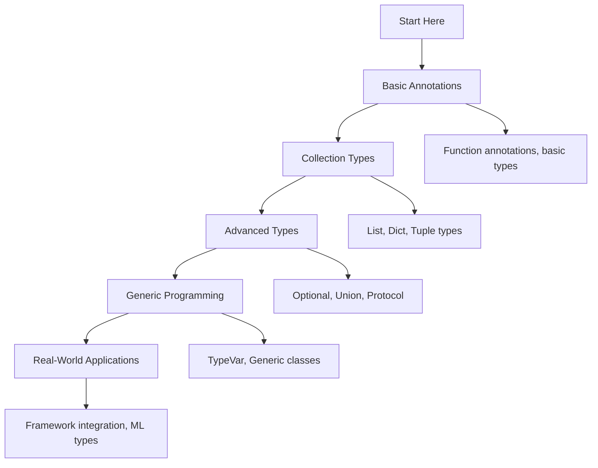

# 🐍 Type Hints and Annotations: Complete Learning Guide

> **Master Python's type system for better code quality and developer experience!** 🎯

---

## 🎯 **Learning Path Overview**



---

## 📊 **Skill Tree**

### 🌱 **Foundation Level**

- [ ] **Basic Type Annotations** ⭐
  - [ ] Function parameter and return type hints
  - [ ] Basic data types (int, float, str, bool)
  - [ ] Type checking tools and IDE support
  - [ ] Common type annotation patterns

### 🌿 **Intermediate Level**

- [ ] **Collection Types** ⭐⭐
  - [ ] List, Dict, Tuple type hints
  - [ ] Optional and Union types
  - [ ] Type aliases and NewType
  - [ ] Generic type variables

### 🌳 **Advanced Level**

- [ ] **Advanced Type System** ⭐⭐⭐
  - [ ] Protocol and structural typing
  - [ ] Callable types and function signatures
  - [ ] Complex nested data structures
  - [ ] Metaclasses and descriptors

### 🏔️ **Expert Level**

- [ ] **Real-World Applications** ⭐⭐⭐⭐
  - [ ] Framework integration (FastAPI, Django)
  - [ ] Machine learning type hints
  - [ ] Distributed systems and microservices
  - [ ] Performance optimization with types

---

## 🗺️ **Learning Roadmap**

### **Week 1: Foundation** 🟢

| Day | Topic             | Time    | Resources                                                                  |
| --- | ----------------- | ------- | -------------------------------------------------------------------------- |
| 1   | Basic Annotations | 2 hours | [PEP 484](https://peps.python.org/pep-0484/)                               |
| 2   | Collection Types  | 2 hours | [typing module](https://docs.python.org/3/library/typing.html)             |
| 3   | Optional/Union    | 2 hours | [Union types](https://docs.python.org/3/library/typing.html#union)         |
| 4   | Type Aliases      | 1 hour  | [Type aliases](https://docs.python.org/3/library/typing.html#type-aliases) |
| 5   | Practice & Review | 2 hours | Questions 1-6                                                              |

### **Week 2: Intermediate** 🟡

| Day | Topic             | Time    | Resources                                                                                    |
| --- | ----------------- | ------- | -------------------------------------------------------------------------------------------- |
| 6   | Generic Types     | 3 hours | [Generic types](https://docs.python.org/3/library/typing.html#generics)                      |
| 7   | Protocol Types    | 2 hours | [Protocol](https://docs.python.org/3/library/typing.html#protocols)                          |
| 8   | Class Annotations | 2 hours | [Class annotations](https://docs.python.org/3/library/typing.html#annotating-classes)        |
| 9   | Context Managers  | 2 hours | [Context manager types](https://docs.python.org/3/library/typing.html#context-manager-types) |
| 10  | Practice & Review | 2 hours | Questions 7-12                                                                               |

### **Week 3: Advanced** 🟠

| Day | Topic              | Time    | Resources                                                                          |
| --- | ------------------ | ------- | ---------------------------------------------------------------------------------- |
| 11  | Complex Structures | 2 hours | [TypedDict](https://docs.python.org/3/library/typing.html#typeddict)               |
| 12  | Metaclasses        | 3 hours | [Metaclass types](https://docs.python.org/3/library/typing.html#metaclasses)       |
| 13  | Descriptors        | 2 hours | [Descriptor types](https://docs.python.org/3/library/typing.html#descriptor-types) |
| 14  | Performance        | 2 hours | [Performance with types](https://mypy.readthedocs.io/en/stable/performance.html)   |
| 15  | Practice & Review  | 2 hours | Questions 13-17                                                                    |

### **Week 4: Expert** 🔴

| Day | Topic                  | Time    | Resources                                                          |
| --- | ---------------------- | ------- | ------------------------------------------------------------------ |
| 16  | Framework Integration  | 3 hours | [FastAPI types](https://fastapi.tiangolo.com/python-types/)        |
| 17  | Machine Learning Types | 2 hours | [numpy.typing](https://numpy.org/doc/stable/reference/typing.html) |
| 18  | Distributed Systems    | 3 hours | [Protocol Buffers](https://developers.google.com/protocol-buffers) |
| 19  | Final Review           | 2 hours | All Questions                                                      |
| 20  | Assessment             | 1 hour  | Interview Questions                                                |

---

## 🎯 **How to Use This Folder**

### 📋 **Daily Study Routine**

1. **📖 Read the theory** (30 minutes)
2. **✏️ Solve questions** (1-2 hours)
3. **🔍 Review mistakes** (30 minutes)
4. **📝 Take notes** (15 minutes)
5. **🔄 Practice concepts** (30 minutes)

### 🎯 **Question Strategy**

- **Start with Basic Level** (Questions 1-6)
- **Move to Intermediate** when comfortable
- **Challenge yourself** with Advanced concepts
- **Master Expert level** for real-world scenarios

### 📊 **Progress Tracking**

```bash
# Mark your progress
✅ Completed
🔄 In Progress
⏳ Not Started
❌ Need Help
```

---

## 🚨 **Common Pitfalls to Avoid**

### ❌ **Beginner Mistakes**

- Using `list[int]` instead of `List[int]` in older Python versions
- Forgetting to import from typing module
- Not specifying return types for functions
- Using `Any` too liberally

### ⚠️ **Intermediate Pitfalls**

- Confusing `Optional[T]` with `Union[T, None]`
- Not using type aliases for complex types
- Ignoring Protocol types for structural typing
- Over-engineering simple type hints

### 🔥 **Advanced Gotchas**

- Circular import issues with type hints
- Performance impact of complex type checking
- Metaclass type hint complexity
- Framework-specific type annotation patterns

---

## 🛠️ **Essential Tools & Resources**

### 📚 **Official Documentation**

- [PEP 484 - Type Hints](https://peps.python.org/pep-0484/) 📖
- [typing module](https://docs.python.org/3/library/typing.html) 🔧
- [PEP 585 - Built-in Generic Types](https://peps.python.org/pep-0585/) 🏗️

### 🎓 **Learning Resources**

- [mypy documentation](https://mypy.readthedocs.io/) 🐍
- [Real Python: Type Hints](https://realpython.com/python-type-checking/) 👁️
- [Type Hints Cheat Sheet](https://mypy.readthedocs.io/en/stable/cheat_sheet_py3.html) 📝

### 🧪 **Practice Platforms**

- [mypy playground](https://mypy-play.net/) 💻
- [Type Checker Comparison](https://github.com/python/typing/wiki) 🏆
- [Python Type Hints Examples](https://github.com/python/typing/tree/master/examples) ⚔️

### 🔍 **Type Checking Tools**

- [mypy](https://mypy.readthedocs.io/) - Static type checker 🐛
- [pyright](https://github.com/microsoft/pyright) - Microsoft's type checker 🐍
- [pyre](https://pyre-check.org/) - Facebook's type checker 💻

---

## 📈 **Assessment & Evaluation**

### 🎯 **Self-Assessment Questions**

After completing each level, ask yourself:

**Basic Level:**

- [ ] Can I add type hints to simple functions?
- [ ] Do I understand the difference between `List` and `list`?
- [ ] Can I use Optional and Union types correctly?

**Intermediate Level:**

- [ ] Can I create generic functions and classes?
- [ ] Do I understand Protocol types and structural typing?
- [ ] Can I add type hints to classes and methods?

**Advanced Level:**

- [ ] Can I handle complex nested data structures?
- [ ] Do I understand metaclass type hints?
- [ ] Can I optimize code with type hints?

**Expert Level:**

- [ ] Can I integrate type hints with web frameworks?
- [ ] Do I understand ML-specific type patterns?
- [ ] Can I design type-safe distributed systems?

---

## 🚀 **Advanced Topics**

### **Type Hints in Modern Python**

- **Python 3.9+**: Built-in generic types (`list[int]`, `dict[str, int]`)
- **Python 3.10+**: Union types with `|` operator (`int | str`)
- **Python 3.11+**: Self type and improved error messages
- **Python 3.12+**: Type parameter syntax improvements

### **Framework Integration**

- **FastAPI**: Automatic request/response validation
- **Django**: Model field type hints
- **SQLAlchemy**: ORM type annotations
- **Pydantic**: Data validation with types

### **Performance Considerations**

- **Runtime overhead**: Type hints are removed at runtime
- **Import time**: Complex type hints can slow imports
- **Memory usage**: Type objects consume memory
- **Development speed**: Faster debugging and refactoring

---

## 🎯 **Real-World Applications**

### **Web Development**

```python
from typing import List, Optional
from pydantic import BaseModel

class User(BaseModel):
    id: int
    name: str
    email: str
    is_active: bool = True

class UserResponse(BaseModel):
    users: List[User]
    total: int
    page: int
```

### **Data Science**

```python
from typing import Union, Dict, Any
import numpy as np
import pandas as pd

def process_data(
    data: Union[np.ndarray, pd.DataFrame],
    config: Dict[str, Any]
) -> pd.DataFrame:
    # Type-safe data processing
    pass
```

### **API Development**

```python
from typing import Optional
from fastapi import FastAPI, HTTPException

app = FastAPI()

@app.get("/users/{user_id}")
async def get_user(user_id: int) -> Optional[User]:
    # Type-safe API endpoint
    pass
```

---

## 🏆 **Success Metrics**

### **Code Quality Improvements**

- **Reduced bugs**: Catch type errors at development time
- **Better documentation**: Types serve as inline documentation
- **Improved IDE support**: Better autocomplete and refactoring
- **Easier maintenance**: Clear interfaces and contracts

### **Team Productivity**

- **Faster onboarding**: New developers understand code faster
- **Safer refactoring**: Type checker catches breaking changes
- **Better collaboration**: Clear interfaces between components
- **Reduced debugging time**: Catch errors before runtime

---

**Ready to master Python's type system? Start with the basic questions and work your way up!** 🚀
