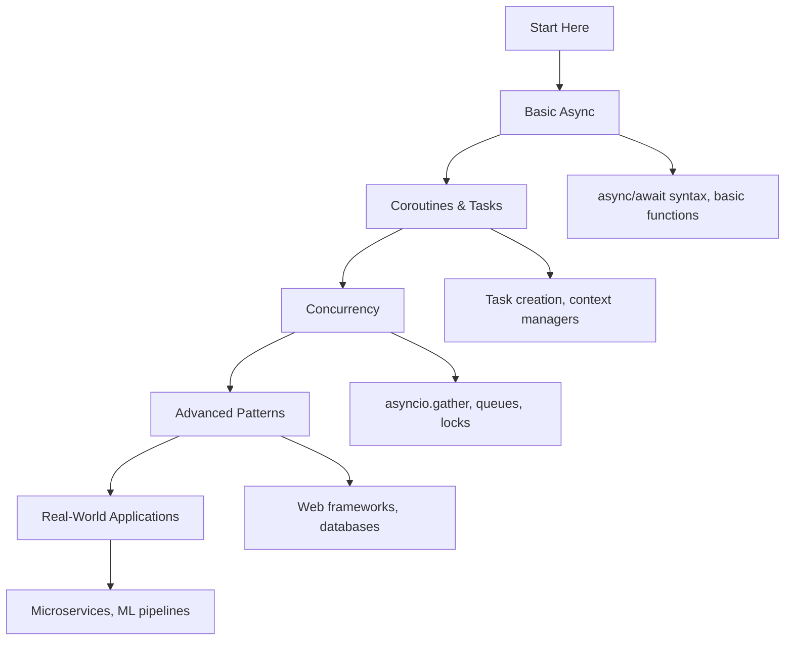

# ⚡ Async/Await Programming: Complete Learning Guide

> **Master asynchronous programming for high-performance Python applications!** 🚀

---

## 🎯 **Learning Path Overview**



---

## 📊 **Skill Tree**

### 🌱 **Foundation Level**

- [ ] **Basic Async Functions** ⭐
  - [ ] async/await syntax and coroutines
  - [ ] Running async functions with asyncio.run()
  - [ ] Understanding event loops
  - [ ] Basic async function patterns

### 🌿 **Intermediate Level**

- [ ] **Async Control Flow** ⭐⭐
  - [ ] Task creation and management
  - [ ] Concurrent execution with asyncio.gather
  - [ ] Async context managers and iterators
  - [ ] Timeout handling and error management

### 🌳 **Advanced Level**

- [ ] **Async Synchronization** ⭐⭐⭐
  - [ ] Locks, semaphores, and queues
  - [ ] Producer-consumer patterns
  - [ ] Event loops and scheduling
  - [ ] Async streams and data processing

### 🏔️ **Expert Level**

- [ ] **Real-World Applications** ⭐⭐⭐⭐
  - [ ] Async web frameworks (FastAPI, aiohttp)
  - [ ] Async database operations
  - [ ] Microservices and distributed systems
  - [ ] Performance optimization and testing

---

## 🗺️ **Learning Roadmap**

### **Week 1: Foundation** 🟢

| Day | Topic             | Time    | Resources                                                                                           |
| --- | ----------------- | ------- | --------------------------------------------------------------------------------------------------- |
| 1   | Basic Async       | 2 hours | [asyncio documentation](https://docs.python.org/3/library/asyncio.html)                             |
| 2   | Coroutines        | 2 hours | [Real Python: Async IO](https://realpython.com/async-io-python/)                                    |
| 3   | Context Managers  | 2 hours | [Async context managers](https://docs.python.org/3/reference/datamodel.html#async-context-managers) |
| 4   | Iterators         | 1 hour  | [Async iterators](https://docs.python.org/3/reference/datamodel.html#async-iterators)               |
| 5   | Practice & Review | 2 hours | Questions 1-6                                                                                       |

### **Week 2: Intermediate** 🟡

| Day | Topic             | Time    | Resources                                                                            |
| --- | ----------------- | ------- | ------------------------------------------------------------------------------------ |
| 6   | Task Management   | 3 hours | [Task creation](https://docs.python.org/3/library/asyncio-task.html)                 |
| 7   | Concurrent Exec   | 2 hours | [asyncio.gather](https://docs.python.org/3/library/asyncio-task.html#asyncio.gather) |
| 8   | Queues & Locks    | 2 hours | [Synchronization primitives](https://docs.python.org/3/library/asyncio-sync.html)    |
| 9   | Error Handling    | 2 hours | [Exception handling](https://docs.python.org/3/library/asyncio-exceptions.html)      |
| 10  | Practice & Review | 2 hours | Questions 7-12                                                                       |

### **Week 3: Advanced** 🟠

| Day | Topic               | Time    | Resources                                                               |
| --- | ------------------- | ------- | ----------------------------------------------------------------------- |
| 11  | Web Frameworks      | 2 hours | [FastAPI documentation](https://fastapi.tiangolo.com/)                  |
| 12  | Database Operations | 3 hours | [asyncpg documentation](https://magicstack.github.io/asyncpg/)          |
| 13  | Testing             | 2 hours | [pytest-asyncio](https://pytest-asyncio.readthedocs.io/)                |
| 14  | Performance         | 2 hours | [Async performance](https://docs.python.org/3/library/asyncio-dev.html) |
| 15  | Practice & Review   | 2 hours | Questions 13-17                                                         |

### **Week 4: Expert** 🔴

| Day | Topic             | Time    | Resources                                                         |
| --- | ----------------- | ------- | ----------------------------------------------------------------- |
| 16  | Microservices     | 3 hours | [Async microservices](https://fastapi.tiangolo.com/tutorial/)     |
| 17  | ML Pipelines      | 2 hours | [Async ML](https://docs.ray.io/en/latest/ray-core/async_api.html) |
| 18  | Real-time Systems | 3 hours | [Real-time async](https://websockets.readthedocs.io/)             |
| 19  | Final Review      | 2 hours | All Questions                                                     |
| 20  | Assessment        | 1 hour  | Interview Questions                                               |

---

## 🎯 **How to Use This Folder**

### 📋 **Daily Study Routine**

1. **📖 Read the theory** (30 minutes)
2. **✏️ Solve questions** (1-2 hours)
3. **🔍 Review mistakes** (30 minutes)
4. **📝 Take notes** (15 minutes)
5. **🔄 Practice concepts** (30 minutes)

### 🎯 **Question Strategy**

- **Start with Basic Level** (Questions 1-6)
- **Move to Intermediate** when comfortable
- **Challenge yourself** with Advanced concepts
- **Master Expert level** for real-world scenarios

### 📊 **Progress Tracking**

```bash
# Mark your progress
✅ Completed
🔄 In Progress
⏳ Not Started
❌ Need Help
```

---

## 🚨 **Common Pitfalls to Avoid**

### ❌ **Beginner Mistakes**

- Forgetting to await coroutines
- Using sync functions in async contexts
- Not understanding event loop basics
- Mixing sync and async code incorrectly

### ⚠️ **Intermediate Pitfalls**

- Creating too many concurrent tasks
- Not handling task cancellation properly
- Ignoring resource cleanup in context managers
- Over-engineering simple async operations

### 🔥 **Advanced Gotchas**

- Blocking the event loop with sync operations
- Not understanding async context switching
- Memory leaks from unclosed resources
- Race conditions in shared state

---

## 🛠️ **Essential Tools & Resources**

### 📚 **Official Documentation**

- [asyncio documentation](https://docs.python.org/3/library/asyncio.html) 📖
- [PEP 492 - Coroutines](https://peps.python.org/pep-0492/) 🔧
- [PEP 525 - Async Generators](https://peps.python.org/pep-0525/) 🏗️

### 🎓 **Learning Resources**

- [Real Python: Async IO](https://realpython.com/async-io-python/) 🐍
- [Async Python Guide](https://docs.python-guide.org/scenarios/async/) 👁️
- [Async Python Cheat Sheet](https://github.com/python/asyncio) 📝

### 🧪 **Practice Platforms**

- [asyncio playground](https://asyncio.readthedocs.io/en/latest/) 💻
- [FastAPI examples](https://fastapi.tiangolo.com/tutorial/) 🏆
- [Async Python examples](https://github.com/python/asyncio/tree/master/examples) ⚔️

### 🔍 **Development Tools**

- [pytest-asyncio](https://pytest-asyncio.readthedocs.io/) - Async testing 🐛
- [aiohttp](https://aiohttp.readthedocs.io/) - Async HTTP client/server 🐍
- [asyncpg](https://magicstack.github.io/asyncpg/) - Async PostgreSQL 💻

---

## 📈 **Assessment & Evaluation**

### 🎯 **Self-Assessment Questions**

After completing each level, ask yourself:

**Basic Level:**

- [ ] Can I create and run async functions?
- [ ] Do I understand the async/await syntax?
- [ ] Can I use async context managers?

**Intermediate Level:**

- [ ] Can I create and manage tasks?
- [ ] Do I understand concurrent execution?
- [ ] Can I handle async errors properly?

**Advanced Level:**

- [ ] Can I build async web applications?
- [ ] Do I understand async database operations?
- [ ] Can I write async tests?

**Expert Level:**

- [ ] Can I design async microservices?
- [ ] Do I understand async ML pipelines?
- [ ] Can I optimize async performance?

---

## 🚀 **Advanced Topics**

### **Async Programming Patterns**

- **Producer-Consumer**: Using queues for data processing
- **Fan-out/Fan-in**: Distributing work across multiple workers
- **Pipeline**: Chaining async operations
- **Circuit Breaker**: Handling external service failures

### **Performance Considerations**

- **I/O-bound vs CPU-bound**: When to use async
- **Event loop blocking**: Avoiding sync operations
- **Memory management**: Proper resource cleanup
- **Concurrency limits**: Managing task pools

### **Framework Integration**

- **FastAPI**: Modern async web framework
- **aiohttp**: Low-level async HTTP
- **SQLAlchemy async**: Async ORM
- **Celery async**: Async task queues

---

## 🎯 **Real-World Applications**

### **Web Development**

```python
from fastapi import FastAPI
import asyncio

app = FastAPI()

@app.get("/users/{user_id}")
async def get_user(user_id: int):
    # Async database query
    user = await database.fetch_user(user_id)
    return user
```

### **Data Processing**

```python
import asyncio
import aiofiles

async def process_files(file_paths):
    tasks = [process_file(path) for path in file_paths]
    results = await asyncio.gather(*tasks)
    return results
```

### **API Integration**

```python
import aiohttp
import asyncio

async def fetch_data(urls):
    async with aiohttp.ClientSession() as session:
        tasks = [fetch_url(session, url) for url in urls]
        return await asyncio.gather(*tasks)
```

---

## 🏆 **Success Metrics**

### **Performance Improvements**

- **Higher throughput**: Handle more concurrent requests
- **Lower latency**: Faster response times
- **Better resource utilization**: Efficient I/O handling
- **Scalability**: Easy horizontal scaling

### **Code Quality**

- **Non-blocking operations**: Better user experience
- **Resource efficiency**: Lower memory usage
- **Error handling**: Robust failure recovery
- **Maintainability**: Clean async patterns

---

**Ready to master async programming? Start with the basic questions and work your way up!** 🚀
