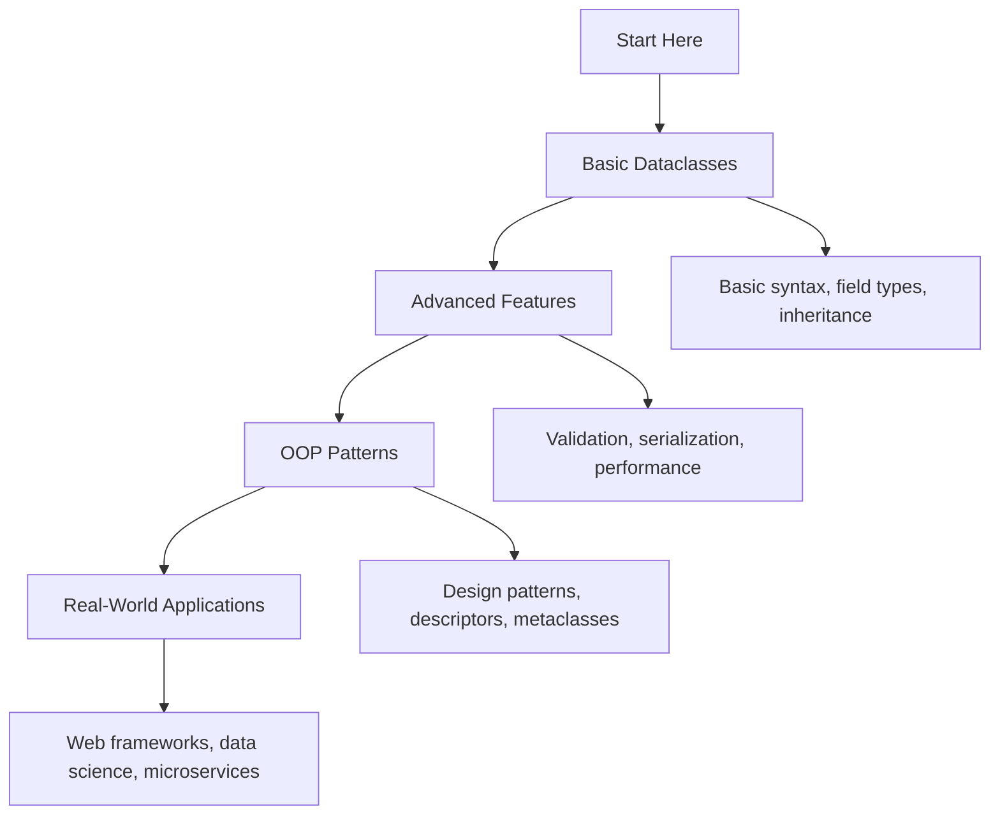

# 🏗️ Dataclasses and Modern OOP: Complete Learning Guide

> **Master modern Python object-oriented programming with dataclasses!** 🚀

---

## 🎯 **Learning Path Overview**



---

## 📊 **Skill Tree**

### 🌱 **Foundation Level**

- [ ] **Basic Dataclasses** ⭐
  - [ ] @dataclass decorator and basic syntax
  - [ ] Field types and type hints
  - [ ] Default values and field options
  - [ ] Basic inheritance patterns

### 🌿 **Intermediate Level**

- [ ] **Advanced Dataclass Features** ⭐⭐
  - [ ] Field configuration and metadata
  - [ ] Post-initialization hooks
  - [ ] Frozen dataclasses and immutability
  - [ ] Comparison and ordering

### 🌳 **Advanced Level**

- [ ] **Modern OOP Patterns** ⭐⭐⭐
  - [ ] Descriptors and property-like behavior
  - [ ] Metaclasses and class customization
  - [ ] Custom decorators and validation
  - [ ] Performance optimization techniques

### 🏔️ **Expert Level**

- [ ] **Real-World Applications** ⭐⭐⭐⭐
  - [ ] Web framework integration
  - [ ] Data science and ML workflows
  - [ ] Microservices and distributed systems
  - [ ] Enterprise application patterns

---

## 🗺️ **Learning Roadmap**

### **Week 1: Foundation** 🟢

| Day | Topic             | Time    | Resources                                                                              |
| --- | ----------------- | ------- | -------------------------------------------------------------------------------------- |
| 1   | Basic Dataclasses | 2 hours | [dataclasses documentation](https://docs.python.org/3/library/dataclasses.html)        |
| 2   | Field Types       | 2 hours | [PEP 557 - Data Classes](https://peps.python.org/pep-0557/)                            |
| 3   | Inheritance       | 2 hours | [Class inheritance](https://docs.python.org/3/tutorial/classes.html#inheritance)       |
| 4   | Field Options     | 1 hour  | [Field function](https://docs.python.org/3/library/dataclasses.html#dataclasses.field) |
| 5   | Practice & Review | 2 hours | Questions 1-6                                                                          |

### **Week 2: Intermediate** 🟡

| Day | Topic             | Time    | Resources                                                                                  |
| --- | ----------------- | ------- | ------------------------------------------------------------------------------------------ |
| 6   | Methods & Props   | 3 hours | [Class methods](https://docs.python.org/3/tutorial/classes.html#method-objects)            |
| 7   | Serialization     | 2 hours | [JSON serialization](https://docs.python.org/3/library/json.html)                          |
| 8   | Validation        | 2 hours | [Data validation](https://docs.python.org/3/library/dataclasses.html#post-init-processing) |
| 9   | Performance       | 2 hours | [Memory optimization](https://docs.python.org/3/reference/datamodel.html#slots)            |
| 10  | Practice & Review | 2 hours | Questions 7-12                                                                             |

### **Week 3: Advanced** 🟠

| Day | Topic             | Time    | Resources                                                                             |
| --- | ----------------- | ------- | ------------------------------------------------------------------------------------- |
| 11  | Descriptors       | 2 hours | [Descriptor protocol](https://docs.python.org/3/reference/datamodel.html#descriptors) |
| 12  | Metaclasses       | 3 hours | [Metaclasses](https://docs.python.org/3/reference/datamodel.html#metaclasses)         |
| 13  | Custom Decorators | 2 hours | [Decorators](https://docs.python.org/3/glossary.html#term-decorator)                  |
| 14  | Design Patterns   | 2 hours | [OOP design patterns](https://en.wikipedia.org/wiki/Design_Patterns)                  |
| 15  | Practice & Review | 2 hours | Questions 13-17                                                                       |

### **Week 4: Expert** 🔴

| Day | Topic          | Time    | Resources                                                              |
| --- | -------------- | ------- | ---------------------------------------------------------------------- |
| 16  | Web Frameworks | 3 hours | [FastAPI with dataclasses](https://fastapi.tiangolo.com/python-types/) |
| 17  | Data Science   | 2 hours | [Pandas with dataclasses](https://pandas.pydata.org/)                  |
| 18  | Microservices  | 3 hours | [Service communication](https://microservices.io/)                     |
| 19  | Final Review   | 2 hours | All Questions                                                          |
| 20  | Assessment     | 1 hour  | Interview Questions                                                    |

---

## 🎯 **How to Use This Folder**

### 📋 **Daily Study Routine**

1. **📖 Read the theory** (30 minutes)
2. **✏️ Solve questions** (1-2 hours)
3. **🔍 Review mistakes** (30 minutes)
4. **📝 Take notes** (15 minutes)
5. **🔄 Practice concepts** (30 minutes)

### 🎯 **Question Strategy**

- **Start with Basic Level** (Questions 1-6)
- **Move to Intermediate** when comfortable
- **Challenge yourself** with Advanced concepts
- **Master Expert level** for real-world scenarios

### 📊 **Progress Tracking**

```bash
# Mark your progress
✅ Completed
🔄 In Progress
⏳ Not Started
❌ Need Help
```

---

## 🚨 **Common Pitfalls to Avoid**

### ❌ **Beginner Mistakes**

- Forgetting to import dataclasses
- Using mutable defaults incorrectly
- Not understanding inheritance behavior
- Mixing dataclasses with regular classes improperly

### ⚠️ **Intermediate Pitfalls**

- Over-engineering simple data structures
- Not handling validation errors properly
- Ignoring performance implications
- Not using type hints effectively

### 🔥 **Advanced Gotchas**

- Creating overly complex metaclasses
- Not understanding descriptor interactions
- Memory leaks with circular references
- Performance bottlenecks with large datasets

---

## 🛠️ **Essential Tools & Resources**

### 📚 **Official Documentation**

- [dataclasses documentation](https://docs.python.org/3/library/dataclasses.html) 📖
- [PEP 557 - Data Classes](https://peps.python.org/pep-0557/) 🔧
- [Type hints documentation](https://docs.python.org/3/library/typing.html) 🏗️

### 🎓 **Learning Resources**

- [Real Python: Data Classes](https://realpython.com/python-data-classes/) 🐍
- [Python Dataclasses Guide](https://docs.python-guide.org/writing/style/#type-hints) 👁️
- [Dataclasses Tutorial](https://www.python.org/dev/peps/pep-0557/) 📝

### 🧪 **Practice Platforms**

- [Python Dataclasses Examples](https://github.com/python/cpython/tree/main/Lib/dataclasses.py) 💻
- [Type Hints Examples](https://github.com/python/typing) 🏆
- [OOP Design Patterns](https://github.com/faif/python-patterns) ⚔️

### 🔍 **Development Tools**

- [mypy](https://mypy.readthedocs.io/) - Static type checker 🐛
- [pydantic](https://pydantic-docs.helpmanual.io/) - Data validation 🐍
- [attrs](https://www.attrs.org/) - Alternative dataclass library 💻

---

## 📈 **Assessment & Evaluation**

### 🎯 **Self-Assessment Questions**

After completing each level, ask yourself:

**Basic Level:**

- [ ] Can I create basic dataclasses?
- [ ] Do I understand field types and defaults?
- [ ] Can I implement dataclass inheritance?

**Intermediate Level:**

- [ ] Can I add methods and properties to dataclasses?
- [ ] Do I understand serialization and validation?
- [ ] Can I optimize dataclass performance?

**Advanced Level:**

- [ ] Can I work with descriptors and metaclasses?
- [ ] Do I understand advanced OOP patterns?
- [ ] Can I create custom dataclass decorators?

**Expert Level:**

- [ ] Can I integrate dataclasses with web frameworks?
- [ ] Do I understand dataclasses in data science?
- [ ] Can I design dataclass-based microservices?

---

## 🚀 **Advanced Topics**

### **Dataclass Design Patterns**

- **Builder Pattern**: Creating complex dataclasses step by step
- **Factory Pattern**: Creating dataclasses based on configuration
- **Observer Pattern**: Implementing event-driven dataclasses
- **Command Pattern**: Using dataclasses for command objects

### **Performance Considerations**

- **Memory usage**: Understanding dataclass memory footprint
- **Creation speed**: Optimizing dataclass instantiation
- **Serialization performance**: Efficient data conversion
- **Large datasets**: Handling millions of dataclass instances

### **Framework Integration**

- **FastAPI**: Using dataclasses for request/response models
- **Django**: Integrating dataclasses with ORM
- **SQLAlchemy**: Using dataclasses with database models
- **Pydantic**: Advanced validation with dataclasses

---

## 🎯 **Real-World Applications**

### **Web Development**

```python
from dataclasses import dataclass
from typing import Optional

@dataclass
class User:
    id: int
    name: str
    email: str
    is_active: bool = True

    def get_display_name(self) -> str:
        return f"{self.name} ({self.email})"
```

### **Data Science**

```python
from dataclasses import dataclass
from typing import List, Dict

@dataclass
class ExperimentConfig:
    model_name: str
    hyperparameters: Dict[str, float]
    metrics: List[str]

    def to_dict(self) -> Dict:
        return {
            'model': self.model_name,
            'params': self.hyperparameters,
            'metrics': self.metrics
        }
```

### **API Development**

```python
from dataclasses import dataclass
from datetime import datetime

@dataclass
class APIResponse:
    success: bool
    data: dict
    timestamp: datetime
    message: str = ""

    def to_json(self) -> dict:
        return {
            'success': self.success,
            'data': self.data,
            'timestamp': self.timestamp.isoformat(),
            'message': self.message
        }
```

---

## 🏆 **Success Metrics**

### **Code Quality Improvements**

- **Cleaner code**: More readable and maintainable
- **Type safety**: Better IDE support and error detection
- **Reduced boilerplate**: Less repetitive code
- **Better documentation**: Self-documenting code

### **Development Efficiency**

- **Faster development**: Quick data structure creation
- **Fewer bugs**: Type hints and validation
- **Better testing**: Easier to test dataclass-based code
- **Improved collaboration**: Clear data contracts

---

**Ready to master modern OOP with dataclasses? Start with the basic questions and work your way up!** 🚀
