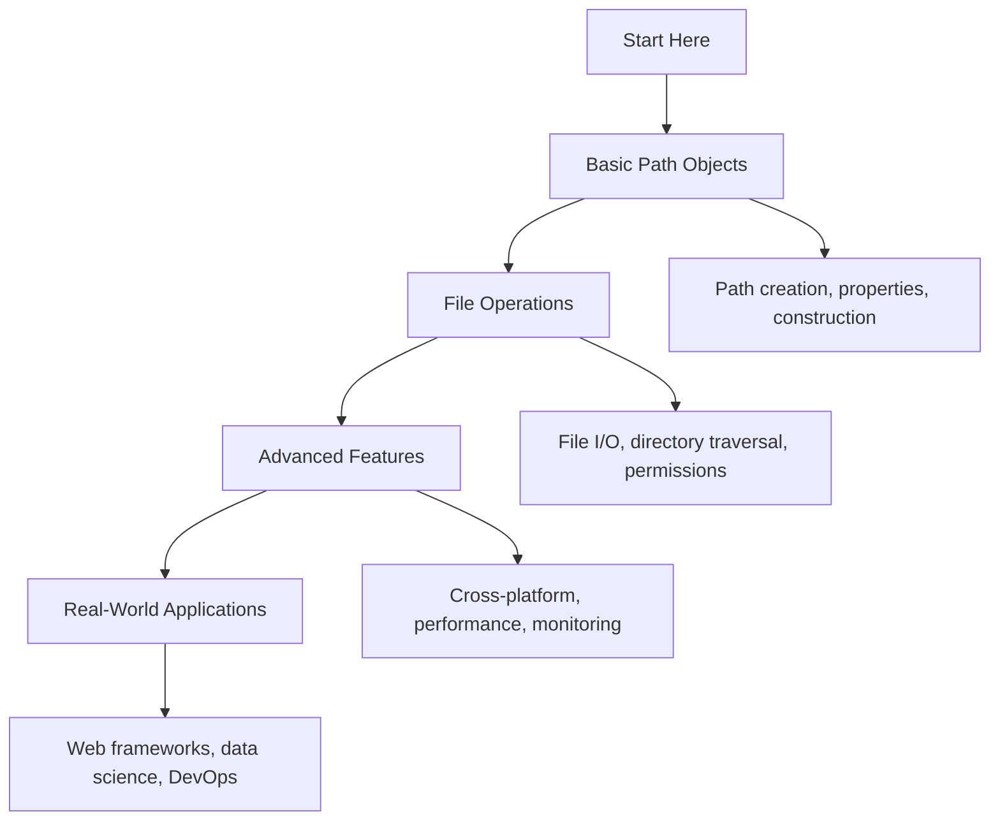

# 📁 Pathlib File Operations: Complete Learning Guide

> **Master modern Python file operations with pathlib!** 🚀

---

## 🎯 **Learning Path Overview**



---

## 📊 **Skill Tree**

### 🌱 **Foundation Level**

- [ ] **Basic Path Objects** ⭐
  - [ ] Path creation and basic operations
  - [ ] Path properties and methods
  - [ ] Path construction and joining
  - [ ] File and directory operations

### 🌿 **Intermediate Level**

- [ ] **File System Operations** ⭐⭐
  - [ ] File reading and writing
  - [ ] Directory traversal and iteration
  - [ ] File permissions and attributes
  - [ ] Path manipulation and transformation

### 🌳 **Advanced Level**

- [ ] **Advanced File Operations** ⭐⭐⭐
  - [ ] Cross-platform path handling
  - [ ] File monitoring and events
  - [ ] Performance optimization
  - [ ] Security and validation

### 🏔️ **Expert Level**

- [ ] **Real-World Applications** ⭐⭐⭐⭐
  - [ ] Web framework integration
  - [ ] Data science workflows
  - [ ] DevOps and automation
  - [ ] Enterprise file management

---

## 🗺️ **Learning Roadmap**

### **Week 1: Foundation** 🟢

| Day | Topic              | Time    | Resources                                                                        |
| --- | ------------------ | ------- | -------------------------------------------------------------------------------- |
| 1   | Basic Path Objects | 2 hours | [pathlib documentation](https://docs.python.org/3/library/pathlib.html)          |
| 2   | Path Properties    | 2 hours | [PEP 428 - pathlib](https://peps.python.org/pep-0428/)                           |
| 3   | Path Construction  | 2 hours | [Path operations](https://docs.python.org/3/library/pathlib.html#methods)        |
| 4   | File Operations    | 1 hour  | [File system operations](https://docs.python.org/3/library/pathlib.html#methods) |
| 5   | Practice & Review  | 2 hours | Questions 1-6                                                                    |

### **Week 2: Intermediate** 🟡

| Day | Topic             | Time    | Resources                                                                          |
| --- | ----------------- | ------- | ---------------------------------------------------------------------------------- |
| 6   | File I/O          | 3 hours | [File reading and writing](https://docs.python.org/3/library/pathlib.html#methods) |
| 7   | Directory Walking | 2 hours | [Directory iteration](https://docs.python.org/3/library/pathlib.html#methods)      |
| 8   | Permissions       | 2 hours | [File permissions](https://docs.python.org/3/library/pathlib.html#methods)         |
| 9   | Path Manipulation | 2 hours | [Path transformation](https://docs.python.org/3/library/pathlib.html#methods)      |
| 10  | Practice & Review | 2 hours | Questions 7-12                                                                     |

### **Week 3: Advanced** 🟠

| Day | Topic             | Time    | Resources                                                                               |
| --- | ----------------- | ------- | --------------------------------------------------------------------------------------- |
| 11  | Cross-Platform    | 2 hours | [Platform differences](https://docs.python.org/3/library/pathlib.html#operating-system) |
| 12  | File Monitoring   | 3 hours | [File system monitoring](https://pypi.org/project/watchdog/)                            |
| 13  | Performance       | 2 hours | [Performance optimization](https://docs.python.org/3/library/pathlib.html#performance)  |
| 14  | Security          | 2 hours | [Path validation](https://docs.python.org/3/library/pathlib.html#security)              |
| 15  | Practice & Review | 2 hours | Questions 13-17                                                                         |

### **Week 4: Expert** 🔴

| Day | Topic               | Time    | Resources                                                                            |
| --- | ------------------- | ------- | ------------------------------------------------------------------------------------ |
| 16  | Web Frameworks      | 3 hours | [FastAPI file handling](https://fastapi.tiangolo.com/tutorial/upload-files/)         |
| 17  | Data Science        | 2 hours | [Pandas file operations](https://pandas.pydata.org/docs/reference/io.html)           |
| 18  | DevOps & Automation | 3 hours | [Automation with pathlib](https://docs.python.org/3/library/pathlib.html#automation) |
| 19  | Final Review        | 2 hours | All Questions                                                                        |
| 20  | Assessment          | 1 hour  | Interview Questions                                                                  |

---

## 🎯 **How to Use This Folder**

### 📋 **Daily Study Routine**

1. **📖 Read the theory** (30 minutes)
2. **✏️ Solve questions** (1-2 hours)
3. **🔍 Review mistakes** (30 minutes)
4. **📝 Take notes** (15 minutes)
5. **🔄 Practice concepts** (30 minutes)

### 🎯 **Question Strategy**

- **Start with Basic Level** (Questions 1-6)
- **Move to Intermediate** when comfortable
- **Challenge yourself** with Advanced concepts
- **Master Expert level** for real-world scenarios

### 📊 **Progress Tracking**

```bash
# Mark your progress
✅ Completed
🔄 In Progress
⏳ Not Started
❌ Need Help
```

---

## 🚨 **Common Pitfalls to Avoid**

### ❌ **Beginner Mistakes**

- Using string concatenation for paths
- Not handling path separators across platforms
- Forgetting to check if files exist before operations
- Not understanding absolute vs relative paths

### ⚠️ **Intermediate Pitfalls**

- Not handling file I/O errors properly
- Creating too many file handles without closing
- Ignoring file permissions and access rights
- Not validating user-provided paths

### 🔥 **Advanced Gotchas**

- Memory issues with large file operations
- Not understanding file system limitations
- Security vulnerabilities with path injection
- Performance bottlenecks with recursive operations

---

## 🛠️ **Essential Tools & Resources**

### 📚 **Official Documentation**

- [pathlib documentation](https://docs.python.org/3/library/pathlib.html) 📖
- [PEP 428 - pathlib](https://peps.python.org/pep-0428/) 🔧
- [File system operations](https://docs.python.org/3/library/os.html) 🏗️

### 🎓 **Learning Resources**

- [Real Python: pathlib](https://realpython.com/python-pathlib/) 🐍
- [Python File Operations Guide](https://docs.python-guide.org/scenarios/fileio/) 👁️
- [Pathlib Tutorial](https://treyhunner.com/2018/12/why-you-should-be-using-pathlib/) 📝

### 🧪 **Practice Platforms**

- [Python pathlib Examples](https://github.com/python/cpython/tree/main/Lib/pathlib.py) 💻
- [File System Examples](https://github.com/python/cpython/tree/main/Lib/test/test_pathlib.py) 🏆
- [Cross-platform Examples](https://github.com/python/cpython/tree/main/Lib/test/test_pathlib.py) ⚔️

### 🔍 **Development Tools**

- [watchdog](https://pypi.org/project/watchdog/) - File system monitoring 🐛
- [shutil](https://docs.python.org/3/library/shutil.html) - High-level file operations 🐍
- [tempfile](https://docs.python.org/3/library/tempfile.html) - Temporary file handling 💻

---

## 📈 **Assessment & Evaluation**

### 🎯 **Self-Assessment Questions**

After completing each level, ask yourself:

**Basic Level:**

- [ ] Can I create and work with Path objects?
- [ ] Do I understand path properties and methods?
- [ ] Can I perform basic file operations?

**Intermediate Level:**

- [ ] Can I read and write files efficiently?
- [ ] Do I understand directory traversal?
- [ ] Can I handle file permissions and attributes?

**Advanced Level:**

- [ ] Can I work with cross-platform paths?
- [ ] Do I understand file monitoring?
- [ ] Can I optimize file operations for performance?

**Expert Level:**

- [ ] Can I integrate pathlib with web frameworks?
- [ ] Do I understand pathlib in data science?
- [ ] Can I use pathlib for automation and DevOps?

---

## 🚀 **Advanced Topics**

### **File System Patterns**

- **Producer-Consumer**: Reading files and processing data
- **Observer Pattern**: Monitoring file system changes
- **Factory Pattern**: Creating different file handlers
- **Strategy Pattern**: Different file processing strategies

### **Performance Considerations**

- **Buffered I/O**: Using appropriate buffer sizes
- **Memory mapping**: Handling large files efficiently
- **Parallel processing**: Processing multiple files concurrently
- **Caching**: Caching frequently accessed file metadata

### **Framework Integration**

- **FastAPI**: Handling file uploads and downloads
- **Django**: Managing static and media files
- **Flask**: File serving and processing
- **Celery**: Background file processing tasks

---

## 🎯 **Real-World Applications**

### **Web Development**

```python
from pathlib import Path
from fastapi import FastAPI, UploadFile

app = FastAPI()

@app.post("/upload/")
async def upload_file(file: UploadFile):
    upload_dir = Path("uploads")
    upload_dir.mkdir(exist_ok=True)

    file_path = upload_dir / file.filename
    with open(file_path, "wb") as buffer:
        content = await file.read()
        buffer.write(content)

    return {"filename": file.filename, "path": str(file_path)}
```

### **Data Science**

```python
from pathlib import Path
import pandas as pd

def process_data_files(data_dir: Path):
    results = []

    for file_path in data_dir.glob("*.csv"):
        df = pd.read_csv(file_path)
        processed_data = df.groupby('category').sum()

        output_path = file_path.parent / f"processed_{file_path.name}"
        processed_data.to_csv(output_path)
        results.append(output_path)

    return results
```

### **DevOps Automation**

```python
from pathlib import Path
import shutil

def backup_project(project_path: Path, backup_dir: Path):
    backup_dir.mkdir(exist_ok=True)

    # Create timestamped backup
    timestamp = datetime.now().strftime("%Y%m%d_%H%M%S")
    backup_path = backup_dir / f"backup_{timestamp}"

    # Copy project files
    shutil.copytree(project_path, backup_path,
                   ignore=shutil.ignore_patterns('__pycache__', '*.pyc'))

    return backup_path
```

---

## 🏆 **Success Metrics**

### **Code Quality Improvements**

- **Cross-platform compatibility**: Works on Windows, macOS, and Linux
- **Type safety**: Better IDE support with Path objects
- **Error handling**: Robust file operation error handling
- **Maintainability**: Cleaner, more readable file operations

### **Development Efficiency**

- **Faster development**: Intuitive path operations
- **Fewer bugs**: Automatic path separator handling
- **Better testing**: Easier to mock file operations
- **Improved collaboration**: Consistent file handling patterns

---

**Ready to master modern file operations with pathlib? Start with the basic questions and work your way up!** 🚀
