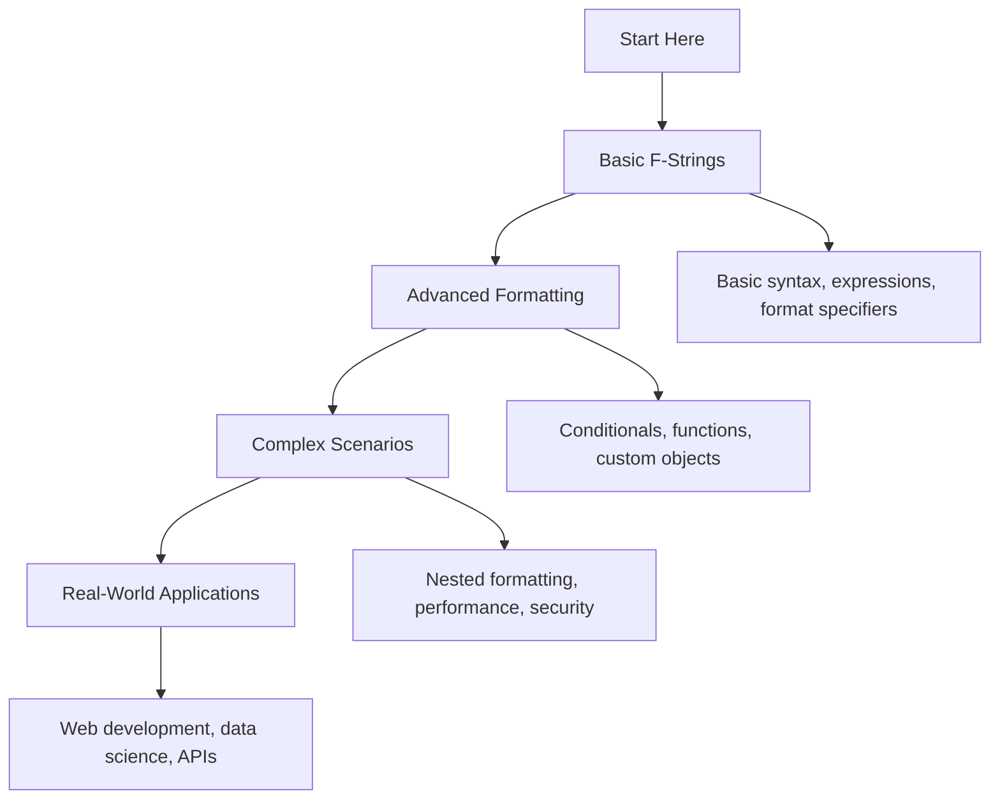

# 📝 Modern String Formatting: Complete Learning Guide

> **Master modern Python string formatting with f-strings and beyond!** 🚀

---

## 🎯 **Learning Path Overview**



---

## 📊 **Skill Tree**

### 🌱 **Foundation Level**

- [ ] **Basic F-Strings** ⭐
  - [ ] f-string syntax and variable interpolation
  - [ ] Expressions and calculations in f-strings
  - [ ] Format specifiers and precision control
  - [ ] Alignment and padding

### 🌿 **Intermediate Level**

- [ ] **Advanced Formatting Features** ⭐⭐
  - [ ] Conditional logic and ternary operators
  - [ ] Function calls and method invocation
  - [ ] Custom objects and data structures
  - [ ] Date and time formatting

### 🌳 **Advanced Level**

- [ ] **Complex Formatting Scenarios** ⭐⭐⭐
  - [ ] Nested f-strings and complex formatting
  - [ ] Custom format specifiers and methods
  - [ ] Performance optimization and benchmarking
  - [ ] Security considerations and validation

### 🏔️ **Expert Level**

- [ ] **Real-World Applications** ⭐⭐⭐⭐
  - [ ] Web development and template systems
  - [ ] Data science and scientific computing
  - [ ] API development and response formatting
  - [ ] Enterprise applications and internationalization

---

## 🗺️ **Learning Roadmap**

### **Week 1: Foundation** 🟢

| Day | Topic             | Time    | Resources                                                                                            |
| --- | ----------------- | ------- | ---------------------------------------------------------------------------------------------------- |
| 1   | Basic F-Strings   | 2 hours | [PEP 498 - Literal String Interpolation](https://peps.python.org/pep-0498/)                          |
| 2   | Expressions       | 2 hours | [F-string expressions](https://docs.python.org/3/reference/lexical_analysis.html#f-strings)          |
| 3   | Format Specifiers | 2 hours | [Format string syntax](https://docs.python.org/3/library/string.html#format-string-syntax)           |
| 4   | Alignment         | 1 hour  | [String alignment](https://docs.python.org/3/library/string.html#format-specification-mini-language) |
| 5   | Practice & Review | 2 hours | Questions 1-6                                                                                        |

### **Week 2: Intermediate** 🟡

| Day | Topic             | Time    | Resources                                                                                               |
| --- | ----------------- | ------- | ------------------------------------------------------------------------------------------------------- |
| 6   | Functions         | 3 hours | [Function calls in f-strings](https://docs.python.org/3/tutorial/controlflow.html#defining-functions)   |
| 7   | Conditionals      | 2 hours | [Conditional expressions](https://docs.python.org/3/reference/expressions.html#conditional-expressions) |
| 8   | Custom Objects    | 2 hours | [Object formatting](https://docs.python.org/3/reference/datamodel.html#object.__format__)               |
| 9   | Date/Time         | 2 hours | [Date formatting](https://docs.python.org/3/library/datetime.html#strftime-and-strptime-format-codes)   |
| 10  | Practice & Review | 2 hours | Questions 7-12                                                                                          |

### **Week 3: Advanced** 🟠

| Day | Topic             | Time    | Resources                                                                                        |
| --- | ----------------- | ------- | ------------------------------------------------------------------------------------------------ |
| 11  | Nested Formatting | 2 hours | [Nested f-strings](https://docs.python.org/3/reference/lexical_analysis.html#f-strings)          |
| 12  | Custom Specifiers | 3 hours | [Custom format specifiers](https://docs.python.org/3/reference/datamodel.html#object.__format__) |
| 13  | Performance       | 2 hours | [String formatting performance](https://docs.python.org/3/library/string.html#performance)       |
| 14  | Security          | 2 hours | [String formatting security](https://docs.python.org/3/library/string.html#security)             |
| 15  | Practice & Review | 2 hours | Questions 13-17                                                                                  |

### **Week 4: Expert** 🔴

| Day | Topic           | Time    | Resources                                                                                                 |
| --- | --------------- | ------- | --------------------------------------------------------------------------------------------------------- |
| 16  | Web Development | 3 hours | [Web template systems](https://docs.python.org/3/library/string.html#template-strings)                    |
| 17  | Data Science    | 2 hours | [Scientific formatting](https://docs.python.org/3/library/string.html#format-specification-mini-language) |
| 18  | API Development | 3 hours | [API response formatting](https://docs.python.org/3/library/json.html)                                    |
| 19  | Final Review    | 2 hours | All Questions                                                                                             |
| 20  | Assessment      | 1 hour  | Interview Questions                                                                                       |

---

## 🎯 **How to Use This Folder**

### 📋 **Daily Study Routine**

1. **📖 Read the theory** (30 minutes)
2. **✏️ Solve questions** (1-2 hours)
3. **🔍 Review mistakes** (30 minutes)
4. **📝 Take notes** (15 minutes)
5. **🔄 Practice concepts** (30 minutes)

### 🎯 **Question Strategy**

- **Start with Basic Level** (Questions 1-6)
- **Move to Intermediate** when comfortable
- **Challenge yourself** with Advanced concepts
- **Master Expert level** for real-world scenarios

### 📊 **Progress Tracking**

```bash
# Mark your progress
✅ Completed
🔄 In Progress
⏳ Not Started
❌ Need Help
```

---

## 🚨 **Common Pitfalls to Avoid**

### ❌ **Beginner Mistakes**

- Using old-style % formatting instead of f-strings
- Forgetting to use f prefix for f-strings
- Not understanding variable scope in f-strings
- Using mutable defaults in f-string expressions

### ⚠️ **Intermediate Pitfalls**

- Over-complicating simple formatting tasks
- Not handling missing variables properly
- Ignoring performance implications of complex expressions
- Not validating user input in f-strings

### 🔥 **Advanced Gotchas**

- Security vulnerabilities with user-provided format strings
- Memory issues with large f-string operations
- Performance bottlenecks with nested f-strings
- Not understanding f-string evaluation order

---

## 🛠️ **Essential Tools & Resources**

### 📚 **Official Documentation**

- [PEP 498 - Literal String Interpolation](https://peps.python.org/pep-0498/) 📖
- [String formatting documentation](https://docs.python.org/3/library/string.html#format-string-syntax) 🔧
- [Format specification mini-language](https://docs.python.org/3/library/string.html#format-specification-mini-language) 🏗️

### 🎓 **Learning Resources**

- [Real Python: f-strings](https://realpython.com/python-f-strings/) 🐍
- [Python String Formatting Guide](https://docs.python-guide.org/writing/style/#string-formatting) 👁️
- [F-String Tutorial](https://www.python.org/dev/peps/pep-0498/) 📝

### 🧪 **Practice Platforms**

- [Python String Examples](https://github.com/python/cpython/tree/main/Lib/test/test_fstring.py) 💻
- [Formatting Examples](https://github.com/python/cpython/tree/main/Lib/string.py) 🏆
- [F-String Examples](https://github.com/python/cpython/tree/main/Lib/test/test_fstring.py) ⚔️

### 🔍 **Development Tools**

- [black](https://black.readthedocs.io/) - Code formatter with f-string support 🐛
- [pylint](https://pylint.pycqa.org/) - Linter with f-string checks 🐍
- [mypy](https://mypy.readthedocs.io/) - Type checker for f-strings 💻

---

## 📈 **Assessment & Evaluation**

### 🎯 **Self-Assessment Questions**

After completing each level, ask yourself:

**Basic Level:**

- [ ] Can I create basic f-strings?
- [ ] Do I understand f-string expressions?
- [ ] Can I use format specifiers?

**Intermediate Level:**

- [ ] Can I use functions and conditionals in f-strings?
- [ ] Do I understand custom object formatting?
- [ ] Can I format dates and times?

**Advanced Level:**

- [ ] Can I create nested f-strings?
- [ ] Do I understand custom format specifiers?
- [ ] Can I optimize f-string performance?

**Expert Level:**

- [ ] Can I use f-strings in web development?
- [ ] Do I understand f-strings in data science?
- [ ] Can I use f-strings in API development?

---

## 🚀 **Advanced Topics**

### **String Formatting Patterns**

- **Template Pattern**: Using f-strings as templates
- **Builder Pattern**: Building complex strings step by step
- **Strategy Pattern**: Different formatting strategies
- **Factory Pattern**: Creating formatted strings dynamically

### **Performance Considerations**

- **String concatenation**: When to use f-strings vs other methods
- **Memory usage**: Understanding f-string memory footprint
- **Evaluation order**: Understanding when expressions are evaluated
- **Caching**: Caching frequently used f-string results

### **Framework Integration**

- **FastAPI**: Using f-strings in API responses
- **Django**: Template formatting with f-strings
- **Flask**: Dynamic content generation
- **Jinja2**: Template engine integration

---

## 🎯 **Real-World Applications**

### **Web Development**

```python
from fastapi import FastAPI

app = FastAPI()

@app.get("/users/{user_id}")
async def get_user(user_id: int, name: str):
    return {
        "message": f"Hello {name}, your user ID is {user_id}",
        "status": "active",
        "timestamp": f"{datetime.now():%Y-%m-%d %H:%M:%S}"
    }
```

### **Data Science**

```python
import pandas as pd
import numpy as np

def format_scientific_results(data: pd.DataFrame):
    results = []

    for _, row in data.iterrows():
        formatted_result = (
            f"Experiment: {row['name']}\n"
            f"Accuracy: {row['accuracy']:.2%}\n"
            f"Precision: {row['precision']:.3f}\n"
            f"Recall: {row['recall']:.3f}"
        )
        results.append(formatted_result)

    return results
```

### **API Development**

```python
def create_api_response(success: bool, data: dict, message: str = ""):
    return {
        "success": success,
        "data": data,
        "message": message,
        "timestamp": f"{datetime.utcnow():%Y-%m-%dT%H:%M:%SZ}",
        "request_id": f"req_{uuid.uuid4().hex[:8]}"
    }
```

---

## 🏆 **Success Metrics**

### **Code Quality Improvements**

- **Readability**: Cleaner, more readable string formatting
- **Maintainability**: Easier to modify and update strings
- **Type safety**: Better IDE support with f-strings
- **Performance**: Faster string formatting operations

### **Development Efficiency**

- **Faster development**: Quick and intuitive string formatting
- **Fewer bugs**: Less error-prone than old formatting methods
- **Better debugging**: Clearer error messages with f-strings
- **Improved collaboration**: Consistent formatting patterns

---

**Ready to master modern string formatting with f-strings? Start with the basic questions and work your way up!** 🚀
