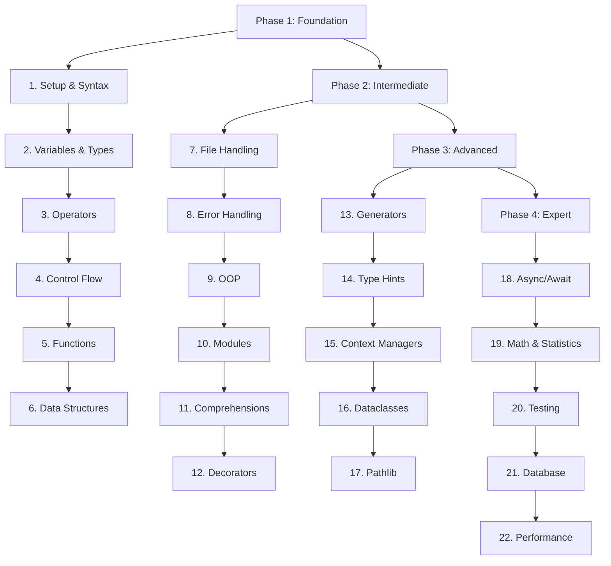

# 🐍 Python Roadmap 2025: Core Python Mastery

> **A step-by-step, table-based guide to mastering core Python, from absolute beginner to expert, with official documentation links and subtopic breakdowns.**

---

## 📋 Table of Contents

- [How to Use This Roadmap](#how-to-use-this-roadmap)
- [Learning Path Overview](#learning-path-overview)
- [Detailed Roadmap Tables](#detailed-roadmap-tables)
- [Official Documentation Links](#official-documentation-links)
- [Progress Tracking & Tips](#progress-tracking--tips)
- [What's Next After Core Python?](#whats-next-after-core-python)

---

## How to Use This Roadmap

- **Follow the order:** Each topic builds on the previous.
- **Master subtopics:** Don't skip subtopics—each is essential.
- **Practice:** Build mini-projects and solve exercises at each step.
- **Read the docs:** Official documentation links are provided for every topic.
- **Stay motivated:** Celebrate each milestone and keep moving forward!

---

## 🚦 Learning Path Overview

### Phase 1: Foundation (Topics 1-6)

**Goal:** Master Python basics and core programming concepts

- Python Setup & Syntax
- Variables & Data Types
- Operators & Expressions
- Control Flow
- Functions
- Data Structures

### Phase 2: Intermediate (Topics 7-12)

**Goal:** Build robust applications with proper error handling

- File Handling
- Error Handling
- Object-Oriented Programming
- Modules & Packages
- Comprehensions
- Decorators

### Phase 3: Advanced (Topics 13-17)

**Goal:** Master modern Python features and patterns

- Generators
- Type Hints & Annotations
- Context Managers
- Dataclasses
- Pathlib & Modern File Operations

### Phase 4: Expert (Topics 18-22)

**Goal:** Build production-ready applications

- Async/Await Programming
- Testing & Debugging
- Database Integration
- Performance & Best Practices

---

## 🎯 Complete Learning Progression

### 🚀 Getting Started

**Prerequisites:** None - this roadmap starts from absolute beginner

### 📈 Learning Milestones

| Phase            | Topics | Duration   | Milestone Project        | Skills Gained                      |
| ---------------- | ------ | ---------- | ------------------------ | ---------------------------------- |
| **Foundation**   | 1-6    | 2-3 months | **Personal Calculator**  | Basic programming, problem-solving |
| **Intermediate** | 7-12   | 2-3 months | **File Manager**         | Robust apps, OOP, modular code     |
| **Advanced**     | 13-17  | 2-3 months | **Data Processing Tool** | Modern Python, efficient code      |
| **Expert**       | 18-22  | 2-3 months | **Async Web API**        | Production-ready applications      |

### 🏆 Project Checkpoints

**After Phase 1:** Build a calculator that handles different data types
**After Phase 2:** Create a file manager with error handling and OOP
**After Phase 3:** Develop a data processing tool using modern Python features
**After Phase 4:** Build a complete async web application with database

---

## 📚 Detailed Roadmap Tables

### 1. Python Setup & Syntax

| 🏷️ Subtopics / Concepts                                                                                       | 🔗 Official Docs                                            | 💡 Practice Ideas                                    |
| ------------------------------------------------------------------------------------------------------------- | ----------------------------------------------------------- | ---------------------------------------------------- |
| - Installing Python - Using the REPL - Running scripts - Python syntax basics - Using IDLE/VSCode | [Setup & Usage](https://docs.python.org/3/using/index.html) | - Hello World - Print your name - Run a script |

### 2. Variables & Data Types

| 🏷️ Subtopics / Concepts                                                                                                              | 🔗 Official Docs                                                  | 💡 Practice Ideas                        |
| ------------------------------------------------------------------------------------------------------------------------------------ | ----------------------------------------------------------------- | ---------------------------------------- |
| - Numbers (int, float, complex) - Strings - Booleans - None - Type conversion - Naming conventions - Memory basics | [Built-in Types](https://docs.python.org/3/library/stdtypes.html) | - Type converter - String manipulator |

### 3. Operators & Expressions

| 🏷️ Subtopics / Concepts                                                                                                    | 🔗 Official Docs                                                    | 💡 Practice Ideas                      |
| -------------------------------------------------------------------------------------------------------------------------- | ------------------------------------------------------------------- | -------------------------------------- |
| - Arithmetic - Comparison - Logical - Assignment - Bitwise - Operator precedence - Expression evaluation | [Expressions](https://docs.python.org/3/reference/expressions.html) | - Calculator - Expression evaluator |

### 4. Control Flow

| 🏷️ Subtopics / Concepts                                                                                                        | 🔗 Official Docs                                                    | 💡 Practice Ideas                       |
| ------------------------------------------------------------------------------------------------------------------------------ | ------------------------------------------------------------------- | --------------------------------------- |
| - if/elif/else - Nested conditionals - Ternary operator - for/while loops - break/continue/pass - Loop patterns | [Control Flow](https://docs.python.org/3/tutorial/controlflow.html) | - Grade calculator - Number patterns |

### 5. Functions

| 🏷️ Subtopics / Concepts                                                                                                          | 🔗 Official Docs                                                                    | 💡 Practice Ideas                     |
| -------------------------------------------------------------------------------------------------------------------------------- | ----------------------------------------------------------------------------------- | ------------------------------------- |
| - Defining/calling - Parameters/arguments - Return values - Scope - Default/keyword args - Lambda - Docstrings | [Functions](https://docs.python.org/3/tutorial/controlflow.html#defining-functions) | - Math utilities - Text processing |

### 6. Data Structures

| 🏷️ Subtopics / Concepts                                                                         | 🔗 Official Docs                                                          | 💡 Practice Ideas              |
| ----------------------------------------------------------------------------------------------- | ------------------------------------------------------------------------- | ------------------------------ |
| - Lists - Tuples - Sets - Dicts - Mutability - Methods - Slicing - Nesting | [Data Structures](https://docs.python.org/3/tutorial/datastructures.html) | - To-do list - Contact book |

### 7. File Handling

| 🏷️ Subtopics / Concepts                                                                         | 🔗 Official Docs                                                                          | 💡 Practice Ideas                  |
| ----------------------------------------------------------------------------------------------- | ----------------------------------------------------------------------------------------- | ---------------------------------- |
| - open/read/write/close - File modes - with statement - Text vs binary - File paths | [File I/O](https://docs.python.org/3/tutorial/inputoutput.html#reading-and-writing-files) | - File processor - Log analyzer |

### 8. Error Handling

| 🏷️ Subtopics / Concepts                                                                                           | 🔗 Official Docs                                                      | 💡 Practice Ideas                     |
| ----------------------------------------------------------------------------------------------------------------- | --------------------------------------------------------------------- | ------------------------------------- |
| - try/except/finally - Exception types - Raising exceptions - Custom exceptions - Exception hierarchy | [Errors & Exceptions](https://docs.python.org/3/tutorial/errors.html) | - Robust calculator - Error logger |

### 9. Object-Oriented Programming (OOP)

| 🏷️ Subtopics / Concepts                                                                                                                      | 🔗 Official Docs                                           | 💡 Practice Ideas                   |
| -------------------------------------------------------------------------------------------------------------------------------------------- | ---------------------------------------------------------- | ----------------------------------- |
| - Classes/objects - **init**, self - Instance/class variables - Inheritance - Polymorphism - Encapsulation - Magic methods | [Classes](https://docs.python.org/3/tutorial/classes.html) | - Bank account - Student manager |

### 10. Modules & Packages

| 🏷️ Subtopics / Concepts                                                                                                 | 🔗 Official Docs                                           | 💡 Practice Ideas                   |
| ----------------------------------------------------------------------------------------------------------------------- | ---------------------------------------------------------- | ----------------------------------- |
| - import/from ... import - **name**, **main** - Creating modules - Package structure - Virtual environments | [Modules](https://docs.python.org/3/tutorial/modules.html) | - Utility library - Math package |

### 11. Comprehensions

| 🏷️ Subtopics / Concepts                                                                           | 🔗 Official Docs                                                                             | 💡 Practice Ideas               |
| ------------------------------------------------------------------------------------------------- | -------------------------------------------------------------------------------------------- | ------------------------------- |
| - List comprehensions - Dict comprehensions - Set comprehensions - Generator expressions | [Comprehensions](https://docs.python.org/3/tutorial/datastructures.html#list-comprehensions) | - Data filter - Flatten list |

### 12. Decorators

| 🏷️ Subtopics / Concepts                                                                     | 🔗 Official Docs                                                     | 💡 Practice Ideas                        |
| ------------------------------------------------------------------------------------------- | -------------------------------------------------------------------- | ---------------------------------------- |
| - Function/class decorators - @ syntax - Decorator factories - Built-in decorators | [Decorators](https://docs.python.org/3/glossary.html#term-decorator) | - Logging decorator - Timer decorator |

### 13. Generators

| 🏷️ Subtopics / Concepts                                                                           | 🔗 Official Docs                                                                         | 💡 Practice Ideas                    |
| ------------------------------------------------------------------------------------------------- | ---------------------------------------------------------------------------------------- | ------------------------------------ |
| - yield - Generator functions - Generator expressions - Iterators - Memory efficiency | [Generators](https://docs.python.org/3/reference/expressions.html#generator-expressions) | - Data stream - Infinite sequence |

### 14. Type Hints & Annotations

| 🏷️ Subtopics / Concepts                                                                                                                                                                                                                                     | 🔗 Official Docs                                            | 💡 Practice Ideas                                                                               |
| ----------------------------------------------------------------------------------------------------------------------------------------------------------------------------------------------------------------------------------------------------------- | ----------------------------------------------------------- | ----------------------------------------------------------------------------------------------- |
| - Function/variable annotations - typing module - Optional/Union - Generics - mypy basics - Type parameter defaults (PEP 696) - typing.TypeIs (type narrowing) - typing.ReadOnly (TypedDict fields) - warnings.deprecated decorator | [Type Hints](https://docs.python.org/3/library/typing.html) | - Type-safe calculator - Annotated API - Practice with TypeVar defaults, TypeIs, ReadOnly |

### 15. Context Managers

| 🏷️ Subtopics / Concepts                                                       | 🔗 Official Docs                                                                        | 💡 Practice Ideas                         |
| ----------------------------------------------------------------------------- | --------------------------------------------------------------------------------------- | ----------------------------------------- |
| - with statement - **enter**/**exit** - contextlib - Custom managers | [Context Managers](https://docs.python.org/3/reference/datamodel.html#context-managers) | - File handler - DB connection manager |

### 16. Dataclasses & Copy

| 🏷️ Subtopics / Concepts                                                                                                                                | 🔗 Official Docs                                                                                                         | 💡 Practice Ideas                                                  |
| ------------------------------------------------------------------------------------------------------------------------------------------------------ | ------------------------------------------------------------------------------------------------------------------------ | ------------------------------------------------------------------ |
| - @dataclass - Fields/defaults - Frozen dataclasses - Post-init - Inheritance - Comparison - copy.replace() and **replace** protocol | [Dataclasses](https://docs.python.org/3/library/dataclasses.html) [copy](https://docs.python.org/3/library/copy.html) | - Config system - Data models - Practice with copy.replace() |

### 17. Pathlib & Modern File Operations

| 🏷️ Subtopics / Concepts                                                                                                                                                                                               | 🔗 Official Docs                                          | 💡 Practice Ideas                                                   |
| --------------------------------------------------------------------------------------------------------------------------------------------------------------------------------------------------------------------- | --------------------------------------------------------- | ------------------------------------------------------------------- |
| - Path objects - File/directory ops - Cross-platform - Globbing - Path validation - Path.from_uri() - PurePath.full_match() - Symlink handling in glob/rglob - UnsupportedOperation exception | [Pathlib](https://docs.python.org/3/library/pathlib.html) | - File organizer - Path utilities - Practice with new methods |

### 18. Async/Await Programming

| 🏷️ Subtopics / Concepts                                                                                    | 🔗 Official Docs                                          | 💡 Practice Ideas                             |
| ---------------------------------------------------------------------------------------------------------- | --------------------------------------------------------- | --------------------------------------------- |
| - async def - await - asyncio - Coroutines - Tasks - Event loop - TaskGroup improvements | [Asyncio](https://docs.python.org/3/library/asyncio.html) | - Async web scraper - Concurrent processor |

### 19. Math & Statistics (Advanced)

| 🏷️ Subtopics / Concepts                                         | 🔗 Official Docs                                                                                                       | 💡 Practice Ideas                                   |
| --------------------------------------------------------------- | ---------------------------------------------------------------------------------------------------------------------- | --------------------------------------------------- |
| - math.fma() - statistics.kde() - statistics.kde_random() | [math](https://docs.python.org/3/library/math.html) [statistics](https://docs.python.org/3/library/statistics.html) | - Fused multiply-add - Kernel density estimation |

### 20. Testing & Debugging

| 🏷️ Subtopics / Concepts                                             | 🔗 Official Docs                                            | 💡 Practice Ideas                |
| ------------------------------------------------------------------- | ----------------------------------------------------------- | -------------------------------- |
| - unittest/pytest - assert - pdb - logging - Code style | [unittest](https://docs.python.org/3/library/unittest.html) | - Test suite - Debugging tool |

### 21. Database Integration (Core)

| 🏷️ Subtopics / Concepts                                                                                     | 🔗 Official Docs                                                                                               | 💡 Practice Ideas                   |
| ----------------------------------------------------------------------------------------------------------- | -------------------------------------------------------------------------------------------------------------- | ----------------------------------- |
| - sqlite3 module - SQL basics - CRUD - Context managers - Transactions - dbm.sqlite3 backend | [sqlite3](https://docs.python.org/3/library/sqlite3.html) [dbm](https://docs.python.org/3/library/dbm.html) | - Personal DB - Data persistence |

### 22. Performance & Best Practices

| 🏷️ Subtopics / Concepts                                                                                                                                                                                                                                | 🔗 Official Docs                                                                                                                                                                                                                                                          | 💡 Practice Ideas                                                                       |
| ------------------------------------------------------------------------------------------------------------------------------------------------------------------------------------------------------------------------------------------------------ | ------------------------------------------------------------------------------------------------------------------------------------------------------------------------------------------------------------------------------------------------------------------------- | --------------------------------------------------------------------------------------- |
| - Profiling - timeit - Memory usage - PEP8 - Code organization - Packaging - JIT basics (PEP 744) - Free-threaded CPython (PEP 703) - Modern best practices (f-strings, pathlib, type hints) - Deprecated modules (PEP 594) | [Performance Tips](https://wiki.python.org/moin/PythonSpeed/PerformanceTips) [PEP8](https://peps.python.org/pep-0008/) [PEP 744](https://peps.python.org/pep-0744/) [PEP 703](https://peps.python.org/pep-0703/) [PEP 594](https://peps.python.org/pep-0594/) | - Optimized algorithms - Code linter - Practice with JIT and free-threaded builds |

---

## 📚 Official Documentation Links

- [Python Docs Home](https://docs.python.org/3/)
- [Python Tutorial](https://docs.python.org/3/tutorial/)
- [Standard Library](https://docs.python.org/3/library/)

---

## ✅ Progress Tracking & Tips

- [ ] Mark each topic as complete
- [ ] Build a mini-project for every 3-4 topics
- [ ] Read the official docs for each topic
- [ ] Practice with exercises (LeetCode, Exercism, etc.)
- [ ] Celebrate your milestones!

> **Tip:** Consistency is key. Practice daily, build projects, and read the docs!

---

## 🚀 What's Next After Core Python?

- Web development (Django, Flask, FastAPI)
- Data science (NumPy, Pandas, Matplotlib)
- Machine learning (scikit-learn, TensorFlow)
- DevOps, scripting, automation, etc.

---

**🎯 Remember: The journey to Python mastery is a marathon, not a sprint. Stay curious, keep building, and enjoy the process!** 🐍✨

---

## 🆕 What's New in Python 3.13 (2025)

> Python 3.13 brings major improvements and new features. Here's what's most relevant for learners:

- **Typing:** Type parameter defaults, TypeIs, ReadOnly, warnings.deprecated
- **Pathlib:** Path.from_uri(), PurePath.full_match(), new symlink handling, UnsupportedOperation
- **Dataclasses & Copy:** copy.replace() and **replace** protocol
- **Math & Statistics:** math.fma(), statistics.kde(), kde_random
- **Random:** Command-line usage (python -m random ...)
- **Error Handling:** PythonFinalizationError, improved error messages, colored tracebacks
- **Standard Library:** dbm.sqlite3 backend, removal of legacy modules (PEP 594)
- **Performance:** Experimental JIT, free-threaded CPython

**Deprecated/Removed:** Avoid using legacy modules like cgi, pipes, imghdr, telnetlib, etc. Use modern alternatives.

---

## 💡 Modern Python Best Practices

- Prefer f-strings for formatting
- Use pathlib for file operations
- Use type hints and static analysis
- Avoid deprecated/removed modules
- Use context managers for resource handling
- Write tests and use linters
- Read official docs and PEPs for new features

---

## ⚠️ Common Pitfalls & Gotchas

- Don't use removed modules (see PEP 594)
- Don't mutate locals() in optimized scopes (see PEP 667)
- Always close files and DB connections
- Use context managers for safety
- Check for deprecations when upgrading Python

---

## 🚀 Real-World Project Ideas (by Phase)

- **Foundation:** Calculator, unit converter, text analyzer
- **Intermediate:** File manager, contact book, note-taking app
- **Advanced:** Data processing tool, config system, async downloader
- **Expert:** Async web API, database-backed app, performance profiler

---

## 📋 Quick Reference: Deprecated Modules & Modern Replacements

| Deprecated Module | Modern Alternative      |
| ----------------- | ----------------------- |
| cgi, cgitb        | urllib, email           |
| pipes             | subprocess, shlex       |
| imghdr, sndhdr    | python-magic, mimetypes |
| telnetlib         | telnetlib3, Exscript    |
| crypt, spwd       | passlib, bcrypt         |
| sunau, aifc       | wave, soundfile         |
| nntplib           | pynntp                  |
| uu, xdrlib        | base64                  |
